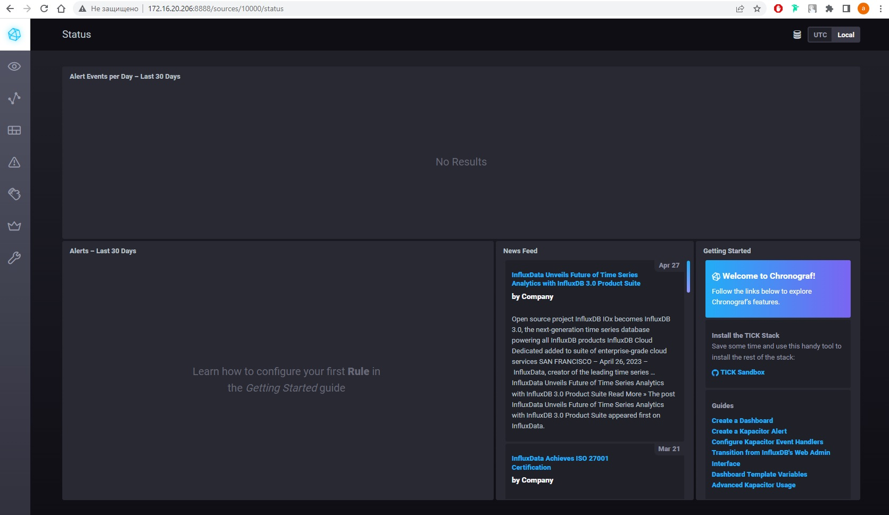
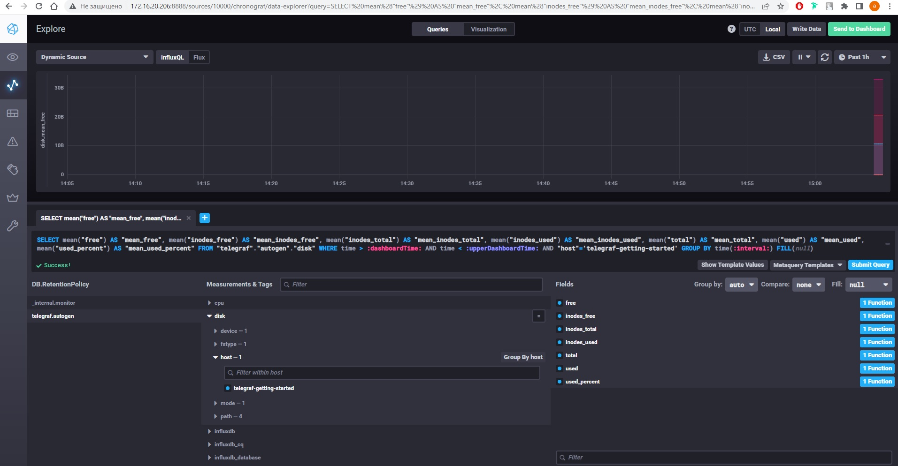
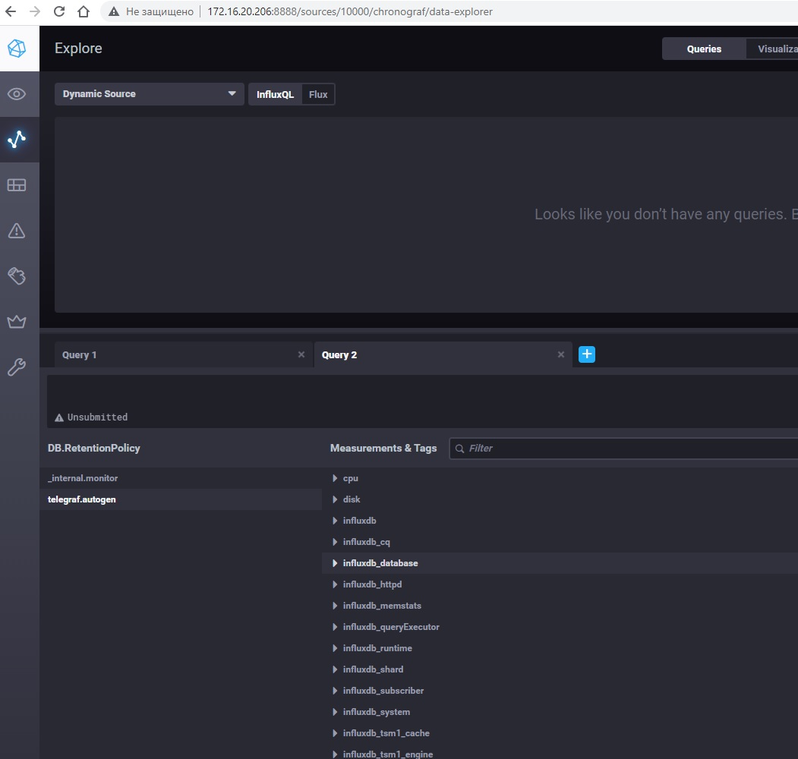

> # Домашнее задание к занятию "13.Системы мониторинга"
> 

# Q/A

> ## Обязательные задания
> 
> 1. Вас пригласили настроить мониторинг на проект. На онбординге вам рассказали, что проект представляет из себя платформу для вычислений с выдачей текстовых отчетов, которые сохраняются на диск. Взаимодействие с платформой осуществляется по протоколу http. Также вам отметили, что вычисления загружают ЦПУ. Какой минимальный набор метрик вы выведите в мониторинг и почему?
> #

* метрики процессора (мониторить агруженность платформы, чтобы иметь возможность предотвратить проблему, связаную с быстродействием приложения)

* метрики дисков (предотвратить заполнение дисков, их деградацию)

* метрики сети (скорость и объемы передаваемой информации)

> #
> 2. Менеджер продукта посмотрев на ваши метрики сказал, что ему непонятно что такое RAM/inodes/CPUla. Также он сказал, что хочет понимать, насколько мы выполняем свои обязанности перед клиентами и какое качество обслуживания. Что вы можете ему предложить?
> #

* Например, предложить ввести цели и соглашения уровней обслуживания (SLA и SLO) с определенными заранее по договоренности процентом успешно обработаных и обработаных с задержкой запросов, время доступности системы и времени реагирования на различные инциденты.

> #
> 3. Вашей DevOps команде в этом году не выделили финансирование на построение системы сбора логов. Разработчики в свою очередь хотят видеть все ошибки, которые выдают их приложения. Какое решение вы можете предпринять в этой ситуации, чтобы разработчики получали ошибки приложения?
> #

* Смотреть в сторону решений с открытым кодом (или просто бесплатных): (Prometheus, elasticsearch, logstash, kibana, grafana, для сбора vector, fluentd)

> #
> 4. Вы, как опытный SRE, сделали мониторинг, куда вывели отображения выполнения SLA=99% по http кодам ответов. Вычисляете этот параметр по следующей формуле: summ_2xx_requests/summ_all_requests. Данный параметр не поднимается выше 70%, но при этом в вашей системе нет кодов ответа 5xx и 4xx. Где у вас ошибка?
> #

* Вероятнее всего не учитываются редиректы (3хх), меняю формулу на (summ_2xx_requests+summ_3xx_requests)/summ_all_requests

> #
> 5. Опишите основные плюсы и минусы pull и push систем мониторинга.
> #

### Push-модель

Плюсы:
* для начала сбора метрик достаточно установить агента
* возможность использовать протокол udp для отдачи метрик

Минусы:
* агент - дополнительная точка отказа. Таким образом есть вероятность, что сервис работает в штатном режиме, а вот агент не работат.
* сложная отладка отправки метрик

### Pull-модель

Плюсы:
* явное определение сервисов, с которых собираются данные, то есть отсутствие данных, получаемых из неожиданных мест
* возможность контролировать периодичность сбора метрик
* возможность защитить методы получения метрик на стороне сервисов различными способами (basic-аутентификация,tls-сертификаты, клиентские сертификаты)
* простая модель получения данных, которая подразумевает упрощённые методы отладки

Минусы:
* необходимость изменять конфигурацию сборщика для добавления новых сервисов либо сконфигурировать autodiscovery
* при нагрузке на сервис есть вероятность, что сборщик не сможет получить метрики

> #
> 6. Какие из ниже перечисленных систем относятся к push модели, а какие к pull? А может есть гибридные?
> 
>     - Prometheus 
>     - TICK
>     - Zabbix
>     - VictoriaMetrics
>     - Nagios
> #

* Prometheus - pull

* TICK - push

* Zabbix - hybrid

* VictoriaMetrics - hybrid

* Nagios - hybrid

> #
> 7. Склонируйте себе [репозиторий](https://github.com/influxdata/sandbox/tree/master) и запустите TICK-стэк, 
используя технологии docker и docker-compose.
> 
> В виде решения на это упражнение приведите скриншот веб-интерфейса ПО chronograf (`http://localhost:8888`). 
> 
> P.S.: если при запуске некоторые контейнеры будут падать с ошибкой - проставьте им режим `Z`, например
> `./data:/var/lib:Z`



> #
> 8. Перейдите в веб-интерфейс Chronograf (`http://localhost:8888`) и откройте вкладку `Data explorer`.
> 
>     - Нажмите на кнопку `Add a query`
>     - Изучите вывод интерфейса и выберите БД `telegraf.autogen`
>     - В `measurments` выберите mem->host->telegraf_container_id , а в `fields` выберите used_percent. 
>     Внизу появится график утилизации оперативной памяти в контейнере telegraf.
>     - Вверху вы можете увидеть запрос, аналогичный SQL-синтаксису. 
>     Поэкспериментируйте с запросом, попробуйте изменить группировку и интервал наблюдений.
> 
> Для выполнения задания приведите скриншот с отображением метрик утилизации места на диске  (disk->host->telegraf_container_id) из веб-интерфейса.



> #
> 9. Изучите список [telegraf inputs](https://github.com/influxdata/telegraf/tree/master/plugins/inputs). 
> Добавьте в конфигурацию telegraf следующий плагин - [docker](https://github.com/influxdata/telegraf/tree/master/plugins/inputs/docker):
> ```
> [[inputs.docker]]
>   endpoint = "unix:///var/run/docker.sock"
> ```
> 
> Дополнительно вам может потребоваться донастройка контейнера telegraf в `docker-compose.yml` дополнительного volume и режима privileged:
> ```
>   telegraf:
>     image: telegraf:1.4.0
>     privileged: true
>     volumes:
>       - ./etc/telegraf.conf:/etc/telegraf/telegraf.conf:Z
>       - /var/run/docker.sock:/var/run/docker.sock:Z
>     links:
>       - influxdb
>     ports:
>       - "8092:8092/udp"
>       - "8094:8094"
>       - "8125:8125/udp"
> ```
> 
> После настройке перезапустите telegraf, обновите веб интерфейс и приведите скриншотом список `measurments` в веб-интерфейсе базы telegraf.autogen . Там должны появиться метрики, связанные с docker.

* Плагин Докера не захотел добавляться, [telegraf.conf](./sandbox/telegraf/telegraf.conf) исправлял, конфигурацию взял из официального репозиторя, контейнер донастраивал. Плагины mem и disk подключились без проблем.



> 
> Факультативно можете изучить какие метрики собирает telegraf после выполнения данного задания.
> 
> ## Дополнительное задание (со звездочкой*) - необязательно к выполнению
> 
> 1. Вы устроились на работу в стартап. На данный момент у вас нет возможности развернуть полноценную систему 
мониторинга, и вы решили самостоятельно написать простой python3-скрипт для сбора основных метрик сервера. Вы, как 
опытный системный-администратор, знаете, что системная информация сервера лежит в директории `/proc`. 
Также, вы знаете, что в системе Linux есть  планировщик задач cron, который может запускать задачи по расписанию.
> 
> Суммировав все, вы спроектировали приложение, которое:
> - является python3 скриптом
> - собирает метрики из папки `/proc`
> - складывает метрики в файл 'YY-MM-DD-awesome-monitoring.log' в директорию /var/log 
> (YY - год, MM - месяц, DD - день)
> - каждый сбор метрик складывается в виде json-строки, в виде:
>   + timestamp (временная метка, int, unixtimestamp)
>   + metric_1 (метрика 1)
>   + metric_2 (метрика 2)
>   
>      ...
>      
>   + metric_N (метрика N)
>   
> - сбор метрик происходит каждую 1 минуту по cron-расписанию
> 
> Для успешного выполнения задания нужно привести:
> 
> а) работающий код python3-скрипта,
> 
> б) конфигурацию cron-расписания,
> 
> в) пример верно сформированного 'YY-MM-DD-awesome-monitoring.log', имеющий не менее 5 записей,
> 
> P.S.: количество собираемых метрик должно быть не менее 4-х.
> P.P.S.: по желанию можно себя не ограничивать только сбором метрик из `/proc`.
> 
> 2. В веб-интерфейсе откройте вкладку `Dashboards`. Попробуйте создать свой dashboard с отображением:
> 
>     - утилизации ЦПУ
>     - количества использованного RAM
>     - утилизации пространства на дисках
>     - количество поднятых контейнеров
>     - аптайм
>     - ...
>     - фантазируйте)
>     
>     ---
> 
> ### Как оформить ДЗ?
> 
> Выполненное домашнее задание пришлите ссылкой на .md-файл в вашем репозитории.
> 
> ---
