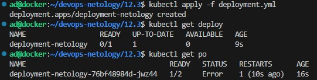
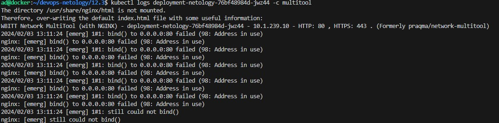
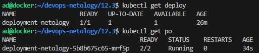
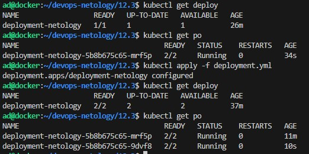
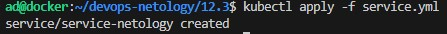
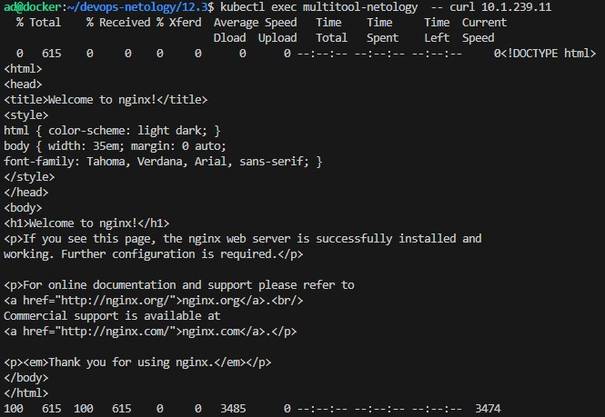
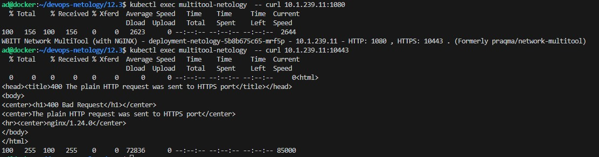
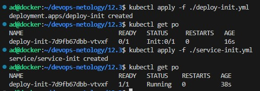

> # Домашнее задание к занятию «Запуск приложений в K8S»

> ### Цель задания

> В тестовой среде для работы с Kubernetes, установленной в предыдущем ДЗ, необходимо развернуть Deployment с приложением, состоящим из нескольких контейнеров, и масштабировать его.

------

> ### Чеклист готовности к домашнему заданию

> 1. Установленное k8s-решение (например, MicroK8S).
> 2. Установленный локальный kubectl.
> 3. Редактор YAML-файлов с подключённым git-репозиторием.

------

> ### Инструменты и дополнительные материалы, которые пригодятся для выполнения задания

> 1. [Описание](https://kubernetes.io/docs/concepts/workloads/controllers/deployment/) Deployment и примеры манифестов.
> 2. [Описание](https://kubernetes.io/docs/concepts/workloads/pods/init-containers/) Init-контейнеров.
> 3. [Описание](https://github.com/wbitt/Network-MultiTool) Multitool.

------

> ### Задание 1. Создать Deployment и обеспечить доступ к репликам приложения из другого Pod

> 1. Создать Deployment приложения, состоящего из двух контейнеров — nginx и multitool. Решить возникшую ошибку.
> 2. После запуска увеличить количество реплик работающего приложения до 2.
> 3. Продемонстрировать количество подов до и после масштабирования.
> 4. Создать Service, который обеспечит доступ до реплик приложений из п.1.
> 5. Создать отдельный Pod с приложением multitool и убедиться с помощью `curl`, что из пода есть доступ до приложений из п.1.

------
### Решение:

[Итоговая версия deployment.yml](./deployment.yml)

<details>
<summary>Первоначальный deployment.yml</summary>

```
apiVersion: apps/v1
kind: Deployment
metadata:
  name: deployment-netology
spec:
  replicas: 1
  selector:
    matchLabels:
      app: deployment-netology
  template:
    metadata:
      labels:
        app: deployment-netology
    spec:
      containers:
        - name: nginx
          image: nginx
          ports:
            - containerPort: 80
        - name: multitool
          image: wbitt/network-multitool
```
</details>



<details>
<summary>kubectl describe po deployment-netology-76bf48984d-jwz44</summary>

```
ad@docker:~/devops-netology/12.3$ kubectl describe po deployment-netology-76bf48984d-jwz44
Name:             deployment-netology-76bf48984d-jwz44
Namespace:        default
Priority:         0
Service Account:  default
Node:             docker/172.16.20.51
Start Time:       Sat, 03 Feb 2024 12:59:42 +0000
Labels:           app=deployment-netology
                  pod-template-hash=76bf48984d
Annotations:      cni.projectcalico.org/containerID: 7cddba9a21719a0613698fa5affe1459ffe82359b3fcd4824ffd43c0efa81a83
                  cni.projectcalico.org/podIP: 10.1.239.10/32
                  cni.projectcalico.org/podIPs: 10.1.239.10/32
Status:           Running
IP:               10.1.239.10
IPs:
  IP:           10.1.239.10
Controlled By:  ReplicaSet/deployment-netology-76bf48984d
Containers:
  nginx:
    Container ID:   containerd://cc494536a91569621a6686c5dfba1094e4fd5813cf819e7dc3a5c6c9863d2b1c
    Image:          nginx
    Image ID:       docker.io/library/nginx@sha256:6eb953446a36ad7aaa1624ff7b0fba5c8f8742e13fbef572cda3cac202fcf4aa
    Port:           80/TCP
    Host Port:      0/TCP
    State:          Running
      Started:      Sat, 03 Feb 2024 12:59:44 +0000
    Ready:          True
    Restart Count:  0
    Environment:    <none>
    Mounts:
      /var/run/secrets/kubernetes.io/serviceaccount from kube-api-access-kpf5f (ro)
  multitool:
    Container ID:   containerd://01bfdcda0b9be3b92ce8b4fda12d3532ec30e5560b4a22717ef916ca15ee005e
    Image:          wbitt/network-multitool
    Image ID:       docker.io/wbitt/network-multitool@sha256:d1137e87af76ee15cd0b3d4c7e2fcd111ffbd510ccd0af076fc98dddfc50a735
    Port:           <none>
    Host Port:      <none>
    State:          Terminated
      Reason:       Error
      Exit Code:    1
      Started:      Sat, 03 Feb 2024 13:01:37 +0000
      Finished:     Sat, 03 Feb 2024 13:01:39 +0000
    Last State:     Terminated
      Reason:       Error
      Exit Code:    1
      Started:      Sat, 03 Feb 2024 13:00:39 +0000
      Finished:     Sat, 03 Feb 2024 13:00:42 +0000
    Ready:          False
    Restart Count:  4
    Environment:    <none>
    Mounts:
      /var/run/secrets/kubernetes.io/serviceaccount from kube-api-access-kpf5f (ro)
Conditions:
  Type              Status
  Initialized       True 
  Ready             False 
  ContainersReady   False 
  PodScheduled      True 
Volumes:
  kube-api-access-kpf5f:
    Type:                    Projected (a volume that contains injected data from multiple sources)
    TokenExpirationSeconds:  3607
    ConfigMapName:           kube-root-ca.crt
    ConfigMapOptional:       <nil>
    DownwardAPI:             true
QoS Class:                   BestEffort
Node-Selectors:              <none>
Tolerations:                 node.kubernetes.io/not-ready:NoExecute op=Exists for 300s
                             node.kubernetes.io/unreachable:NoExecute op=Exists for 300s
Events:
  Type     Reason     Age                 From               Message
  ----     ------     ----                ----               -------
  Normal   Scheduled  2m1s                default-scheduler  Successfully assigned default/deployment-netology-76bf48984d-jwz44 to docker
  Normal   Pulling    2m                  kubelet            Pulling image "nginx"
  Normal   Pulled     119s                kubelet            Successfully pulled image "nginx" in 1.31s (1.31s including waiting)
  Normal   Created    119s                kubelet            Created container nginx
  Normal   Started    119s                kubelet            Started container nginx
  Normal   Pulled     117s                kubelet            Successfully pulled image "wbitt/network-multitool" in 1.132s (1.132s including waiting)
  Normal   Pulled     113s                kubelet            Successfully pulled image "wbitt/network-multitool" in 1.152s (1.152s including waiting)
  Normal   Pulled     94s                 kubelet            Successfully pulled image "wbitt/network-multitool" in 1.267s (1.267s including waiting)
  Normal   Pulling    66s (x4 over 119s)  kubelet            Pulling image "wbitt/network-multitool"
  Normal   Pulled     64s                 kubelet            Successfully pulled image "wbitt/network-multitool" in 1.373s (1.373s including waiting)
  Normal   Created    64s (x4 over 117s)  kubelet            Created container multitool
  Normal   Started    64s (x4 over 117s)  kubelet            Started container multitool
  Warning  BackOff    47s (x5 over 110s)  kubelet            Back-off restarting failed container multitool in pod deployment-netology-76bf48984d-jwz44_default(90d5258a-ce9c-4821-9d47-5e23975151a2)
```
</details>

Проблемы с контейнером multitool.



Строка

```
2024/02/03 13:11:24 [emerg] 1#1: bind() to 0.0.0.0:80 failed (98: Address in use)
```
говорит о том, что порт 80 уже занят.  
Согласно документации порты для прослушивания можно переназначить с помощью переменных окружения.  
Сделаем это, добавив необходимые строчки в наш deployment.yml приведя его к виду: 

<details>
<summary>deployment.yml</summary>

```
apiVersion: apps/v1
kind: Deployment
metadata:
  name: deployment-netology
spec:
  replicas: 1
  selector:
    matchLabels:
      app: deployment-netology
  template:
    metadata:
      labels:
        app: deployment-netology
    spec:
      containers:
        - name: nginx
          image: nginx
          ports:
            - containerPort: 80
        - name: multitool
          image: wbitt/network-multitool
          env:
          - name: HTTP_PORT
            value: "1080"
          - name: HTTPS_PORT
            value: "10443"
``` 
</details>

```
ad@docker:~/devops-netology/12.3$ kubectl apply -f deployment.yml
```



Изменим количество реплик до двух:

```
spec:
  replicas: 2
```

<details>
<summary>deployment.yml</summary>

```
apiVersion: apps/v1
kind: Deployment
metadata:
  name: deployment-netology
spec:
  replicas: 2
  selector:
    matchLabels:
      app: deployment-netology
  template:
    metadata:
      labels:
        app: deployment-netology
    spec:
      containers:
        - name: nginx
          image: nginx
          ports:
            - containerPort: 80
        - name: multitool
          image: wbitt/network-multitool
          env:
          - name: HTTP_PORT
            value: "1080"
          - name: HTTPS_PORT
            value: "10443"
``` 
</details>
Был один под с двумя контейнерами, стало 2 пода с двумя контейнерами



Создаем service.yml

[service.yml](./service.yml)



Создаем pod.yml

[pod.yml](./pod.yml)





------


> ### Задание 2. Создать Deployment и обеспечить старт основного контейнера при выполнении условий

> 1. Создать Deployment приложения nginx и обеспечить старт контейнера только после того, как будет запущен сервис этого приложения.
> 2. Убедиться, что nginx не стартует. В качестве Init-контейнера взять busybox.
> 3. Создать и запустить Service. Убедиться, что Init запустился.
> 4. Продемонстрировать состояние пода до и после запуска сервиса.

------
### Решение:

[deploy-init.yml](./deploy-init.yml)

[service-init.yml](./service-init.yml)



------

> ### Правила приема работы

> 1. Домашняя работа оформляется в своем Git-репозитории в файле README.md. Выполненное домашнее задание пришлите ссылкой на .md-файл в вашем репозитории.
> 2. Файл README.md должен содержать скриншоты вывода необходимых команд `kubectl` и скриншоты результатов.
> 3. Репозиторий должен содержать файлы манифестов и ссылки на них в файле README.md.

------