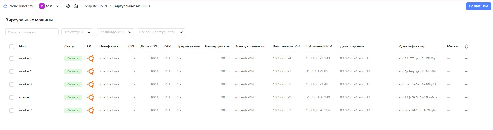
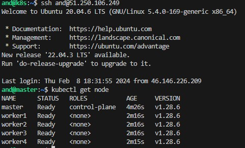
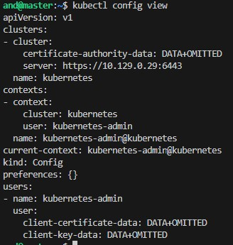
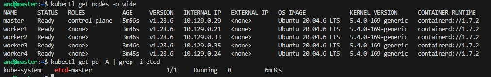

> # Домашнее задание к занятию «Установка Kubernetes»

> ### Цель задания

> Установить кластер K8s.

> ### Чеклист готовности к домашнему заданию

> 1. Развёрнутые ВМ с ОС Ubuntu 20.04-lts.


> ### Инструменты и дополнительные материалы, которые пригодятся для выполнения задания

> 1. [Инструкция по установке kubeadm](https://kubernetes.io/docs/setup/production-environment/tools/kubeadm/create-cluster-kubeadm/).
> 2. [Документация kubespray](https://kubespray.io/).

-----

> ### Задание 1. Установить кластер k8s с 1 master node

> 1. Подготовка работы кластера из 5 нод: 1 мастер и 4 рабочие ноды.
> 2. В качестве CRI — containerd.
> 3. Запуск etcd производить на мастере.
> 4. Способ установки выбрать самостоятельно.

------
### Решение:

[inventory.ini](./inventory.ini)

[install.yml](./install.yml)

[master.yml](./master.yml)

[workers.yml](./workers.yml)


<details>
<summary>ansible-playbook -i inventory.ini install.yml</summary>

```
and@k8s:~/14.2$ ansible-playbook -i inventory.ini install.yml

PLAY [Install kubeadm] ****************************************************************************************************************************************************************************************************

TASK [Gathering Facts] ****************************************************************************************************************************************************************************************************
The authenticity of host '51.250.106.249 (51.250.106.249)' can't be established.
ECDSA key fingerprint is SHA256:1ip4VqmOL1hUvnXd6NquYFmxvn2VpcfMwi54b4NOSws.
The authenticity of host '84.201.179.85 (84.201.179.85)' can't be established.
ECDSA key fingerprint is SHA256:YMtWgQ/0dSH+FM+0PSBz2PREAB7OeYY6I/C3LiakttU.
The authenticity of host '158.160.26.154 (158.160.26.154)' can't be established.
ECDSA key fingerprint is SHA256:M9NCyIr4/5f6+rmA79wfwvRZqQw3K9gYtuOVzrMtE7A.
The authenticity of host '158.160.23.49 (158.160.23.49)' can't be established.
ECDSA key fingerprint is SHA256:jL94OuzWZ56qP3F3ln/S+cCrW/m0yyaY9/7LTL3xvxY.
The authenticity of host '158.160.21.143 (158.160.21.143)' can't be established.
ECDSA key fingerprint is SHA256:zh10brenxqgF9rdcFmwAaRV6vzWqMRnNm7UGwPAU2j8.
Are you sure you want to continue connecting (yes/no/[fingerprint])? yes
yesok: [master]

yeok: [worker1]
yes
Please type 'yes', 'no' or the fingerprint: yes
Please type 'yes', 'no' or the fingerprint: yes
Please type 'yes', 'no' or the fingerprint: yes
Please type 'yes', 'no' or the fingerprint: yes
Please type 'yes', 'no' or the fingerprint: yes
ok: [worker4]
yes
ok: [worker2]
yes
ok: [worker3]

TASK [Install dependences] ************************************************************************************************************************************************************************************************
changed: [worker1]
changed: [worker2]
changed: [master]
changed: [worker4]
changed: [worker3]

TASK [Create dir] *********************************************************************************************************************************************************************************************************
changed: [worker1]
changed: [worker2]
changed: [worker3]
changed: [master]
changed: [worker4]

TASK [Download key] *******************************************************************************************************************************************************************************************************
changed: [worker2]
changed: [worker1]
changed: [worker3]
changed: [master]
changed: [worker4]

TASK [Add repo] ***********************************************************************************************************************************************************************************************************
changed: [master]
changed: [worker1]
changed: [worker2]
changed: [worker3]
changed: [worker4]

TASK [Install kubelet kubeadm kubectl] ************************************************************************************************************************************************************************************
changed: [worker2]
changed: [worker1]
changed: [master]
changed: [worker3]
changed: [worker4]

TASK [Turn on forwarding] *************************************************************************************************************************************************************************************************
changed: [master]
changed: [worker1]
changed: [worker2]
changed: [worker3]
changed: [worker4]

PLAY RECAP ****************************************************************************************************************************************************************************************************************
master                     : ok=7    changed=6    unreachable=0    failed=0    skipped=0    rescued=0    ignored=0   
worker1                    : ok=7    changed=6    unreachable=0    failed=0    skipped=0    rescued=0    ignored=0   
worker2                    : ok=7    changed=6    unreachable=0    failed=0    skipped=0    rescued=0    ignored=0   
worker3                    : ok=7    changed=6    unreachable=0    failed=0    skipped=0    rescued=0    ignored=0   
worker4                    : ok=7    changed=6    unreachable=0    failed=0    skipped=0    rescued=0    ignored=0   
```
</details>


<details>
<summary>ansible-playbook -i inventory.ini master.yml</summary>

```
and@k8s:~/14.2$ ansible-playbook -i inventory.ini master.yml
BECOME password: 
[WARNING]: While constructing a mapping from /home/and/14.2/master.yml, line 8, column 7, found a duplicate dict key (shell). Using last defined value only.

PLAY [initialize the cluster] *********************************************************************************************************************************************************************************************

TASK [Gathering Facts] ****************************************************************************************************************************************************************************************************
ok: [master]

TASK [init the cluster] ***************************************************************************************************************************************************************************************************
changed: [master]

TASK [create .kube directory] *********************************************************************************************************************************************************************************************
changed: [master]

TASK [copies admin.conf to user's kube config] ****************************************************************************************************************************************************************************
changed: [master]

TASK [Get the token for joining the worker nodes] *************************************************************************************************************************************************************************
changed: [master]

TASK [debug] **************************************************************************************************************************************************************************************************************
ok: [master] => {
    "msg": "kubeadm join 10.129.0.29:6443 --token g8tozl.mpg5dqhtxemq247c --discovery-token-ca-cert-hash sha256:54656d9d24e7a21514cba63e897086a00c98e1ea95420c95acaac11d359bd573 "
}

TASK [Copy join command to local file.] ***********************************************************************************************************************************************************************************
changed: [master -> localhost]

TASK [install flannel] ****************************************************************************************************************************************************************************************************
changed: [master] => (item=kubectl apply -f https://raw.githubusercontent.com/flannel-io/flannel/master/Documentation/kube-flannel.yml)

PLAY RECAP ****************************************************************************************************************************************************************************************************************
master                     : ok=8    changed=6    unreachable=0    failed=0    skipped=0    rescued=0    ignored=0   
```
</details>


<details>
<summary>ansible-playbook -i inventory.ini workers.yml</summary>

```
and@k8s:~/14.2$ ansible-playbook -i inventory.ini workers.yml

PLAY [initialize the cluster] *********************************************************************************************************************************************************************************************

TASK [Gathering Facts] ****************************************************************************************************************************************************************************************************
ok: [worker1]
ok: [worker4]
ok: [worker3]
ok: [worker2]

TASK [Copy join command from Ansiblehost to the worker nodes.] ************************************************************************************************************************************************************
changed: [worker4]
changed: [worker1]
changed: [worker3]
changed: [worker2]

TASK [kubeadm reset] ******************************************************************************************************************************************************************************************************
changed: [worker1]
changed: [worker3]
changed: [worker4]
changed: [worker2]

TASK [second pause] *******************************************************************************************************************************************************************************************************
Pausing for 5 seconds
(ctrl+C then 'C' = continue early, ctrl+C then 'A' = abort)
ok: [worker1]

TASK [Join the Worker nodes to the cluster.] ******************************************************************************************************************************************************************************
changed: [worker1]
changed: [worker2]
changed: [worker3]
changed: [worker4]

PLAY RECAP ****************************************************************************************************************************************************************************************************************
worker1                    : ok=5    changed=3    unreachable=0    failed=0    skipped=0    rescued=0    ignored=0   
worker2                    : ok=4    changed=3    unreachable=0    failed=0    skipped=0    rescued=0    ignored=0   
worker3                    : ok=4    changed=3    unreachable=0    failed=0    skipped=0    rescued=0    ignored=0   
worker4                    : ok=4    changed=3    unreachable=0    failed=0    skipped=0    rescued=0    ignored=0   
```
</details>







В качестве CRI — containerd. Запуск etcd производится на мастере.



------

> ## Дополнительные задания (со звёздочкой)

> **Настоятельно рекомендуем выполнять все задания под звёздочкой.** Их выполнение поможет глубже разобраться в материале.   
Задания под звёздочкой необязательные к выполнению и не повлияют на получение зачёта по этому домашнему заданию. 

------
> ### Задание 2*. Установить HA кластер

> 1. Установить кластер в режиме HA.
> 2. Использовать нечётное количество Master-node.
> 3. Для cluster ip использовать keepalived или другой способ.

> ### Правила приёма работы

> 1. Домашняя работа оформляется в своем Git-репозитории в файле README.md. Выполненное домашнее задание пришлите ссылкой на .md-файл в вашем репозитории.
> 2. Файл README.md должен содержать скриншоты вывода необходимых команд `kubectl get nodes`, а также скриншоты результатов.
> 3. Репозиторий должен содержать тексты манифестов или ссылки на них в файле README.md.