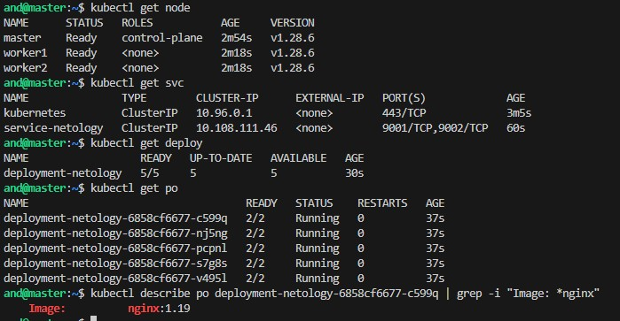
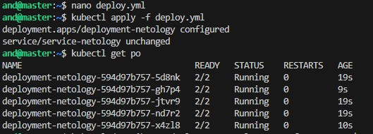
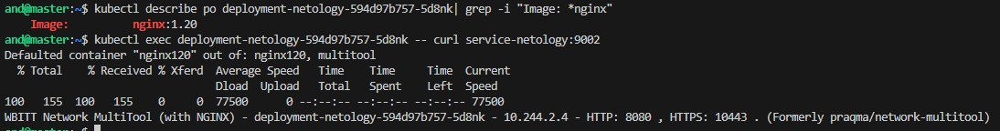
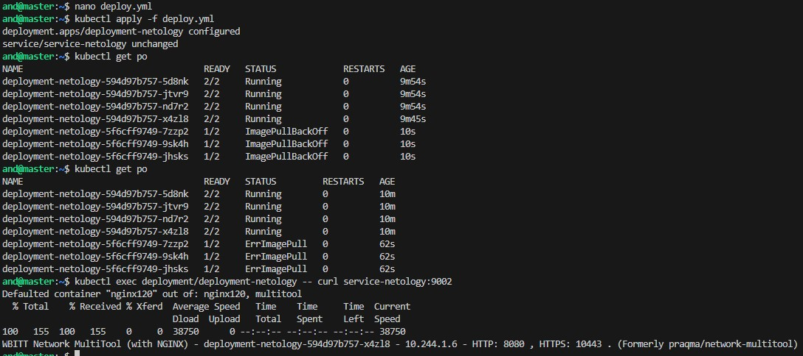
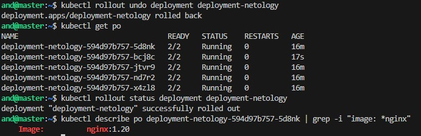

> # Домашнее задание к занятию «Обновление приложений»

> ### Цель задания

> Выбрать и настроить стратегию обновления приложения.

> ### Чеклист готовности к домашнему заданию

> 1. Кластер K8s.

> ### Инструменты и дополнительные материалы, которые пригодятся для выполнения задания

> 1. [Документация Updating a Deployment](https://kubernetes.io/docs/concepts/workloads/controllers/deployment/#updating-a-deployment).
> 2. [Статья про стратегии обновлений](https://habr.com/ru/companies/flant/articles/471620/).

-----

> ### Задание 1. Выбрать стратегию обновления приложения и описать ваш выбор

> 1. Имеется приложение, состоящее из нескольких реплик, которое требуется обновить.
> 2. Ресурсы, выделенные для приложения, ограничены, и нет возможности их увеличить.
> 3. Запас по ресурсам в менее загруженный момент времени составляет 20%.
> 4. Обновление мажорное, новые версии приложения не умеют работать со старыми.
> 5. Вам нужно объяснить свой выбор стратегии обновления приложения.

-----
### Решение:

Имея аналогичные условия постоянно, в своей работе использую стратегию Rolling Update. Мое мнение, что это наиболее подходящий способ. В стратегии Rolling Update обновление приложения происходит путем последовательного замещения реплик старой версии новыми, одну за другой, без прерывания работы приложения.

Преимущества стратегии Rolling Update включают:

- Экономия ресурсов: При использовании Rolling Update не требуется дополнительный набор ресурсов для параллельного развертывания новой версии приложения. Обновление происходит постепенно, что позволяет более эффективно использовать доступные ресурсы.

- Непрерывность работы: Rolling Update позволяет поддерживать непрерывную работу приложения, поскольку каждая реплика обновляется по отдельности. Это означает, что во время обновления остальные реплики продолжают обрабатывать запросы.

- Возможность отката: Если в процессе обновления возникают проблемы, можно откатиться к предыдущей версии приложения, отключив обновление или восстановив предыдущие реплики.

- Постепенное развертывание: Rolling Update позволяет контролировать скорость обновления, что полезно в случае, если требуется более длительное время для проверки новой версии приложения перед полным развертыванием.

Однако, при использовании стратегии Rolling Update необходимо учитывать, что во время обновления могут возникнуть проблемы совместимости между старой и новой версиями приложения. Поэтому нужно проводить тщательное тестирование новой версии перед ее развертыванием и иметь возможность быстрого отката в случае необходимости.

-----

> ### Задание 2. Обновить приложение

> 1. Создать deployment приложения с контейнерами nginx и multitool. Версию nginx взять 1.19. Количество реплик — 5.
> 2. Обновить версию nginx в приложении до версии 1.20, сократив время обновления до минимума. Приложение должно быть доступно.
> 3. Попытаться обновить nginx до версии 1.28, приложение должно оставаться доступным.
> 4. Откатиться после неудачного обновления.

-----
### Решение:

Использую материалы из прощлых домашних заданий.

[deploy.yml](./deploy.yml)

Применяем и роверяем работоспособность.

Меняем версию nginx на 1.20, проверяем.

Меняем версию nginx на 1.28, проверяем. Что-то идет не так, но приложение работает.

Откатываемся на предыдущую версию, проверяем.

Откатились на предыдущую версию успешно.

-----

> ## Дополнительные задания — со звёздочкой*

> Задания дополнительные, необязательные к выполнению, они не повлияют на получение зачёта по домашнему заданию. **Но мы настоятельно рекомендуем вам выполнять все задания со звёздочкой.** Это поможет лучше разобраться в материале.   

> ### Задание 3*. Создать Canary deployment

> 1. Создать два deployment'а приложения nginx.
> 2. При помощи разных ConfigMap сделать две версии приложения — веб-страницы.
> 3. С помощью ingress создать канареечный деплоймент, чтобы можно было часть трафика перебросить на разные версии приложения.

> ### Правила приёма работы

> 1. Домашняя работа оформляется в своем Git-репозитории в файле README.md. Выполненное домашнее задание пришлите ссылкой на .md-файл в вашем репозитории.
> 2. Файл README.md должен содержать скриншоты вывода необходимых команд, а также скриншоты результатов.
> 3. Репозиторий должен содержать тексты манифестов или ссылки на них в файле README.md.