> # Домашнее задание к занятию Troubleshooting

> ### Цель задания

> Устранить неисправности при деплое приложения.

> ### Чеклист готовности к домашнему заданию

> 1. Кластер K8s.

> ### Задание. При деплое приложение web-consumer не может подключиться к auth-db. Необходимо это исправить

> 1. Установить приложение по команде:
```shell
> kubectl apply -f https://raw.githubusercontent.com/netology-code/kuber-homeworks/main/3.5/files/task.yaml
```
> 2. Выявить проблему и описать.
> 3. Исправить проблему, описать, что сделано.
> 4. Продемонстрировать, что проблема решена.

-----
### Решение:

Применяем.

```shell
kubectl apply -f https://raw.githubusercontent.com/netology-code/kuber-homeworks/main/3.5/files/task.yaml
```

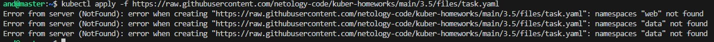

Видич, что нет нужных неймспейсов, создаем вручную.

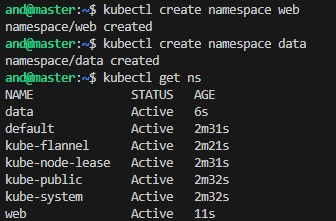

Применяем заново.

```shell
kubectl apply -f https://raw.githubusercontent.com/netology-code/kuber-homeworks/main/3.5/files/task.yaml
```

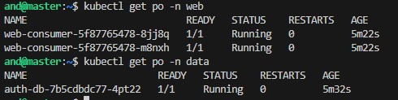

На первый взгляд никакого криминала нет.

Исследуем деплойменты.

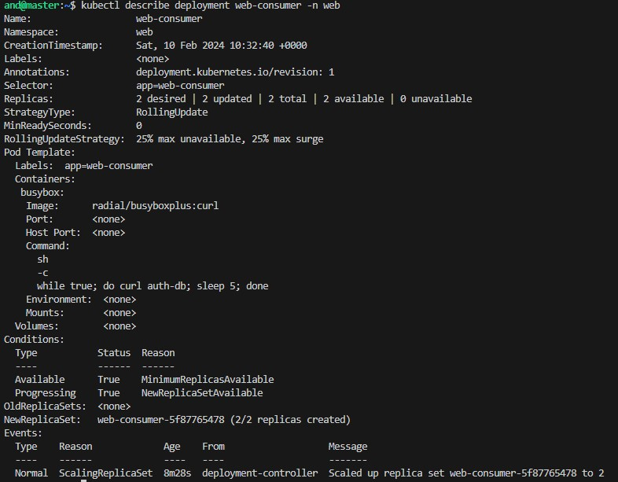

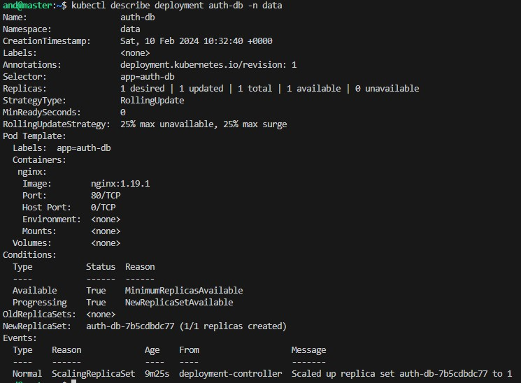

Смотрим логи и видим, 

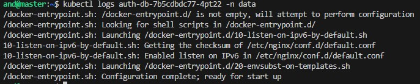

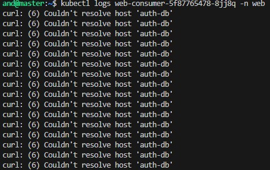

Под не может подключиться к auth-db, т.к. поды находятся в разных неймспейсах.

Заходим в контейнер и проверяем доступ по IP, доступ есть.

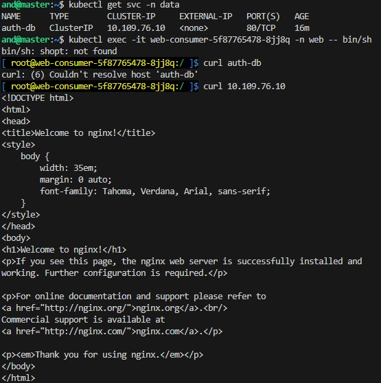

Попробуем подключиться по полному доменному имени. Доступ есть.

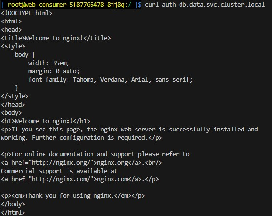

Поэтому правим манифест. Применяем (файл был создан локально).

```shell
kubectl apply -f task.yaml
```

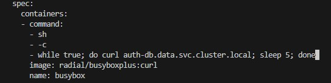

Старые контейнеры удалились, смотри логи новых подов.

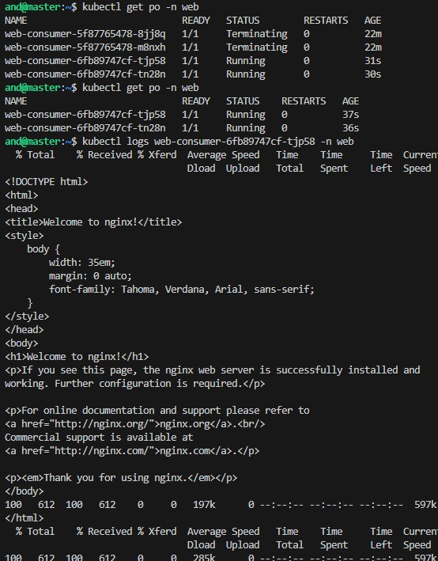

------

> ### Правила приёма работы

> 1. Домашняя работа оформляется в своём Git-репозитории в файле README.md. Выполненное домашнее задание пришлите ссылкой на .md-файл в вашем репозитории.
> 2. Файл README.md должен содержать скриншоты вывода необходимых команд, а также скриншоты результатов.
> 3. Репозиторий должен содержать тексты манифестов или ссылки на них в файле README.md.