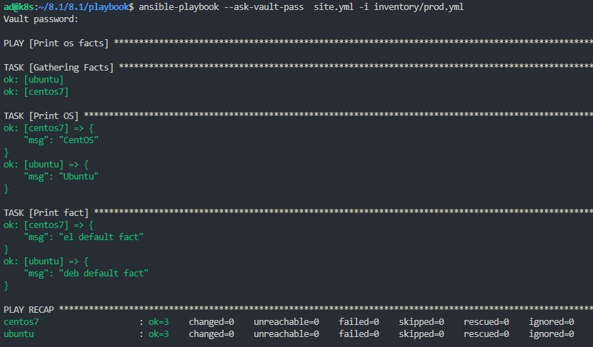

# Домашнее задание к занятию "08.01 Введение в Ansible"

## Подготовка к выполнению
1. Установите ansible версии 2.10 или выше.


2. Создайте свой собственный публичный репозиторий на github с произвольным именем.

[https://github.com/lunezhev/8.1]


3. Скачайте [playbook](./playbook/) из репозитория с домашним заданием и перенесите его в свой репозиторий.

[https://github.com/lunezhev/8.1/tree/main/playbook]

```

```

## Основная часть
1. Попробуйте запустить playbook на окружении из `test.yml`, зафиксируйте какое значение имеет факт `some_fact` для указанного хоста при выполнении playbook'a.


2. Найдите файл с переменными (group_vars) в котором задаётся найденное в первом пункте значение и поменяйте его на 'all default fact'.


3. Воспользуйтесь подготовленным (используется `docker`) или создайте собственное окружение для проведения дальнейших испытаний.


4. Проведите запуск playbook на окружении из `prod.yml`. Зафиксируйте полученные значения `some_fact` для каждого из `managed host`.


5. Добавьте факты в `group_vars` каждой из групп хостов так, чтобы для `some_fact` получились следующие значения: для `deb` - 'deb default fact', для `el` - 'el default fact'.

```
Меняем значение some_fact в файлах group_vars/el/exampl.yml и group_vars/deb/exampl.yml на deb default fact и el default fact соответственно
```

6.  Повторите запуск playbook на окружении `prod.yml`. Убедитесь, что выдаются корректные значения для всех хостов.


7. При помощи `ansible-vault` зашифруйте факты в `group_vars/deb` и `group_vars/el` с паролем `netology`.


8. Запустите playbook на окружении `prod.yml`. При запуске `ansible` должен запросить у вас пароль. Убедитесь в работоспособности.



9. Посмотрите при помощи `ansible-doc` список плагинов для подключения. Выберите подходящий для работы на `control node`.

<details>
<summary>Список плагинов</summary>

```

ad@k8s:~/8.1/8.1/playbook$ ansible-doc -t connection -l
ansible.netcommon.grpc         Provides a persistent connection using the gRPC protocol                                                                                              
ansible.netcommon.httpapi      Use httpapi to run command on network appliances                                                                                                      
ansible.netcommon.libssh       Run tasks using libssh for ssh connection                                                                                                             
ansible.netcommon.napalm       Provides persistent connection using NAPALM                                                                                                           
ansible.netcommon.netconf      Provides a persistent connection using the netconf protocol                                                                                           
ansible.netcommon.network_cli  Use network_cli to run command on network appliances                                                                                                  
ansible.netcommon.persistent   Use a persistent unix socket for connection                                                                                                           
community.aws.aws_ssm          execute via AWS Systems Manager                                                                                                                       
community.docker.docker        Run tasks in docker containers                                                                                                                        
community.docker.docker_api    Run tasks in docker containers                                                                                                                        
community.docker.nsenter       execute on host running controller container                                                                                                          
community.general.chroot       Interact with local chroot                                                                                                                            
community.general.funcd        Use funcd to connect to target                                                                                                                        
community.general.iocage       Run tasks in iocage jails                                                                                                                             
community.general.jail         Run tasks in jails                                                                                                                                    
community.general.lxc          Run tasks in lxc containers via lxc python library                                                                                                    
community.general.lxd          Run tasks in lxc containers via lxc CLI                                                                                                               
community.general.qubes        Interact with an existing QubesOS AppVM                                                                                                               
community.general.saltstack    Allow ansible to piggyback on salt minions                                                                                                            
community.general.zone         Run tasks in a zone instance                                                                                                                          
community.libvirt.libvirt_lxc  Run tasks in lxc containers via libvirt                                                                                                               
community.libvirt.libvirt_qemu Run tasks on libvirt/qemu virtual machines                                                                                                            
community.okd.oc               Execute tasks in pods running on OpenShift                                                                                                            
community.vmware.vmware_tools  Execute tasks inside a VM via VMware Tools                                                                                                            
community.zabbix.httpapi       Use httpapi to run command on network appliances                                                                                                      
containers.podman.buildah      Interact with an existing buildah container                                                                                                           
containers.podman.podman       Interact with an existing podman container                                                                                                            
kubernetes.core.kubectl        Execute tasks in pods running on Kubernetes                                                                                                           
local                          execute on controller                                                                                                                                 
paramiko_ssh                   Run tasks via python ssh (paramiko)                                                                                                                   
psrp                           Run tasks over Microsoft PowerShell Remoting Protocol                                                                                                 
ssh                            connect via SSH client binary                                                                                                                         
winrm                          Run tasks over Microsoft's WinRM 
```

</details>

```
Подходящий для работы на control node - local (execute on controller)
```

10. В `prod.yml` добавьте новую группу хостов с именем  `local`, в ней разместите localhost с необходимым типом подключения.


11. Запустите playbook на окружении `prod.yml`. При запуске `ansible` должен запросить у вас пароль. Убедитесь что факты `some_fact` для каждого из хостов определены из верных `group_vars`.


12. Заполните `README.md` ответами на вопросы. Сделайте `git push` в ветку `master`. В ответе отправьте ссылку на ваш открытый репозиторий с изменённым `playbook` и заполненным `README.md`.

## Необязательная часть

1. При помощи `ansible-vault` расшифруйте все зашифрованные файлы с переменными.
2. Зашифруйте отдельное значение `PaSSw0rd` для переменной `some_fact` паролем `netology`. Добавьте полученное значение в `group_vars/all/exmp.yml`.
3. Запустите `playbook`, убедитесь, что для нужных хостов применился новый `fact`.
4. Добавьте новую группу хостов `fedora`, самостоятельно придумайте для неё переменную. В качестве образа можно использовать [этот](https://hub.docker.com/r/pycontribs/fedora).
5. Напишите скрипт на bash: автоматизируйте поднятие необходимых контейнеров, запуск ansible-playbook и остановку контейнеров.
6. Все изменения должны быть зафиксированы и отправлены в вашей личный репозиторий.

---

### Как оформить ДЗ?

Выполненное домашнее задание пришлите ссылкой на .md-файл в вашем репозитории.

---
