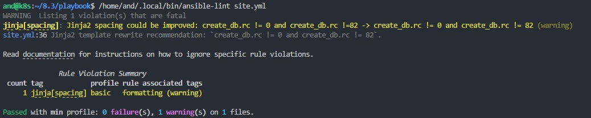
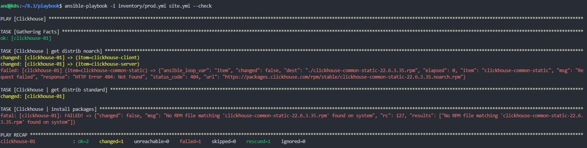

# 8.3
Выполнение [домашнего задания](https://github.com/netology-code/mnt-homeworks/blob/MNT-13/08-ansible-03-yandex/README.md)
по теме "8.3. Использование Yandex Cloud".

## Q/A

### Задание 1

> Подготовка к выполнению
> 1. Подготовьте в Yandex Cloud три хоста: для [clickhouse](https://clickhouse.com/), для [vector](https://vector.dev) и для [lighthouse](https://github.com/VKCOM/lighthouse)

Хосты настроил, предыдущий playbook с установкой `clickhouse` и `vector` (запускается  как systemd-сервис) перенесена в [playbook](./playbook) из домашней работы 8.2 и переписан для запуска на YC.

### Задание 2

> Основная часть
> 1. Допишите playbook: нужно сделать ещё один play, который устанавливает и настраивает lighthouse.
> 2. При создании tasks рекомендую использовать модули: get_url, template, yum, apt.
> 3. Tasks должны: скачать статику lighthouse, установить nginx или любой другой webserver, настроить его конфиг для открытия lighthouse, запустить webserver.

Установка и настройка `lighthouse` производится пошагово

 - установим необходимые зависимости в систему: `git` и `epel-release` 
 - создадим директорию `/var/www` с правами для текущего пользователя для хранения web-сервисов
 - создадим директорию `/var/log/nginx` с правами для текущего пользователя для записи логов `nginx`
 - склонируем репозиторий `lighthouse`. Путь возьмём из переменной `lighthouse_vcs`.
 - сконфигурируем `SElinux`, чтобы `nginx` имел доступ до директории `/var/www` ([stackoverflow](https://stackoverflow.com/questions/22586166/why-does-nginx-return-a-403-even-though-all-permissions-are-set-properly#answer-26228135))
 - установим `nginx` официально рекомендуемым способом
 - скопируем на машину и заполним шаблон конфигурации `nginx`
 - скопируем на машину и заполним шаблон конфигурации web-сервиса `lighthouse` для `nginx`
 - стартуем сервис `nginx`

> 4. Приготовьте свой собственный inventory файл prod.yml.
> 5. Запустите ansible-lint site.yml и исправьте ошибки, если они есть

Утилита `ansible-lint` не входит в стандартную поставку `ansible` и её необходимо установить отдельно:

```shell
pip3 install "ansible-lint" --user
```

Запуск линтера:



> 6. Попробуйте запустить playbook на этом окружении с флагом `--check`

```shell
ansible-playbook -i inventory/prod.yml site.yml --check
```




`Play` при установке `clickhouse` прошел с ошибкой, так как при флаге `--check` реальных изменений не вносится,
а значит и файлы не сохраняются.

> 7. Запустите playbook на prod.yml окружении с флагом `--diff`. Убедитесь, что изменения на системе произведены.

<details>
<summary>ansible-playbook -i inventory/prod.yml site.yml --diff</summary>

```
and@k8s:~/8.3/playbook$ ansible-playbook -i inventory/prod.yml site.yml --diff

PLAY [Clickhouse] ********************************************************************************************************************************************************************************************************

TASK [Gathering Facts] ***************************************************************************************************************************************************************************************************
ok: [clickhouse-01]

TASK [Clickhouse | get distrib noarch] ***********************************************************************************************************************************************************************************
changed: [clickhouse-01] => (item=clickhouse-client)
changed: [clickhouse-01] => (item=clickhouse-server)
failed: [clickhouse-01] (item=clickhouse-common-static) => {"ansible_loop_var": "item", "changed": false, "dest": "./clickhouse-common-static-22.6.3.35.rpm", "elapsed": 0, "item": "clickhouse-common-static", "msg": "Request failed", "response": "HTTP Error 404: Not Found", "status_code": 404, "url": "https://packages.clickhouse.com/rpm/stable/clickhouse-common-static-22.6.3.35.noarch.rpm"}

TASK [Clickhouse | get distrib standard] *********************************************************************************************************************************************************************************
changed: [clickhouse-01]

TASK [Clickhouse | install packages] *************************************************************************************************************************************************************************************
changed: [clickhouse-01]

TASK [Clickhouse | start service] ****************************************************************************************************************************************************************************************
changed: [clickhouse-01]

TASK [Clickhouse | create database] **************************************************************************************************************************************************************************************
fatal: [clickhouse-01]: FAILED! => {"changed": false, "cmd": ["clickhouse-client", "-q", "create database logs;"], "delta": "0:00:00.031005", "end": "2023-05-17 09:52:17.341509", "failed_when_result": true, "msg": "non-zero return code", "rc": 210, "start": "2023-05-17 09:52:17.310504", "stderr": "Code: 210. DB::NetException: Connection refused (localhost:9000). (NETWORK_ERROR)", "stderr_lines": ["Code: 210. DB::NetException: Connection refused (localhost:9000). (NETWORK_ERROR)"], "stdout": "", "stdout_lines": []}

PLAY RECAP ***************************************************************************************************************************************************************************************************************
clickhouse-01              : ok=4    changed=3    unreachable=0    failed=1    skipped=0    rescued=1    ignored=0   

and@k8s:~/8.3/playbook$ ansible-playbook -i inventory/prod.yml site.yml --diff

PLAY [Clickhouse] ********************************************************************************************************************************************************************************************************

TASK [Gathering Facts] ***************************************************************************************************************************************************************************************************
ok: [clickhouse-1]

TASK [Clickhouse | get distrib noarch] ***********************************************************************************************************************************************************************************
ok: [clickhouse-1] => (item=clickhouse-client)
ok: [clickhouse-1] => (item=clickhouse-server)
failed: [clickhouse-1] (item=clickhouse-common-static) => {"ansible_loop_var": "item", "changed": false, "dest": "./clickhouse-common-static-22.6.3.35.rpm", "elapsed": 0, "gid": 1000, "group": "and", "item": "clickhouse-common-static", "mode": "0755", "msg": "Request failed", "owner": "and", "response": "HTTP Error 404: Not Found", "secontext": "unconfined_u:object_r:user_home_t:s0", "size": 259749094, "state": "file", "status_code": 404, "uid": 1000, "url": "https://packages.clickhouse.com/rpm/stable/clickhouse-common-static-22.6.3.35.noarch.rpm"}

TASK [Clickhouse | get distrib standard] *********************************************************************************************************************************************************************************
ok: [clickhouse-1]

TASK [Clickhouse | install packages] *************************************************************************************************************************************************************************************
ok: [clickhouse-1]

TASK [Clickhouse | start service] ****************************************************************************************************************************************************************************************
^C [ERROR]: User interrupted execution
and@k8s:~/8.3/playbook$ ansible-playbook -i inventory/prod.yml site.yml --diff

PLAY [Clickhouse] ********************************************************************************************************************************************************************************************************

TASK [Gathering Facts] ***************************************************************************************************************************************************************************************************
ok: [clickhouse-1]

TASK [Clickhouse | get distrib noarch] ***********************************************************************************************************************************************************************************
ok: [clickhouse-1] => (item=clickhouse-client)
ok: [clickhouse-1] => (item=clickhouse-server)
failed: [clickhouse-1] (item=clickhouse-common-static) => {"ansible_loop_var": "item", "changed": false, "dest": "./clickhouse-common-static-22.6.3.35.rpm", "elapsed": 0, "gid": 1000, "group": "and", "item": "clickhouse-common-static", "mode": "0755", "msg": "Request failed", "owner": "and", "response": "HTTP Error 404: Not Found", "secontext": "unconfined_u:object_r:user_home_t:s0", "size": 259749094, "state": "file", "status_code": 404, "uid": 1000, "url": "https://packages.clickhouse.com/rpm/stable/clickhouse-common-static-22.6.3.35.noarch.rpm"}

TASK [Clickhouse | get distrib standard] *********************************************************************************************************************************************************************************
ok: [clickhouse-1]

TASK [Clickhouse | install packages] *************************************************************************************************************************************************************************************
ok: [clickhouse-1]

TASK [Clickhouse | start service] ****************************************************************************************************************************************************************************************
changed: [clickhouse-1]

TASK [Clickhouse | create database] **************************************************************************************************************************************************************************************
changed: [clickhouse-1]

PLAY [Lighthouse] ********************************************************************************************************************************************************************************************************

TASK [Gathering Facts] ***************************************************************************************************************************************************************************************************
The authenticity of host '158.160.27.59 (158.160.27.59)' can't be established.
ECDSA key fingerprint is SHA256:Tx9rIEclnPmpjZ70UInr/IgZVfA7+nGhXX/hD11vLSw.
Are you sure you want to continue connecting (yes/no/[fingerprint])? yes
ok: [lighthouse-1]

TASK [Lighthouse | install dependencies] *********************************************************************************************************************************************************************************
changed: [lighthouse-1]

TASK [Lighthouse | create nginx site dir] ********************************************************************************************************************************************************************************
--- before
+++ after
@@ -1,6 +1,6 @@
 {
-    "group": 0,
-    "owner": 0,
+    "group": 1000,
+    "owner": 1000,
     "path": "/var/www",
-    "state": "absent"
+    "state": "directory"
 }

changed: [lighthouse-1]

TASK [Lighthouse | create nginx log dir] *********************************************************************************************************************************************************************************
--- before
+++ after
@@ -1,6 +1,6 @@
 {
-    "group": 0,
-    "owner": 0,
+    "group": 1000,
+    "owner": 1000,
     "path": "/var/log/nginx",
-    "state": "absent"
+    "state": "directory"
 }

changed: [lighthouse-1]

TASK [Lighthouse | clone repository] *************************************************************************************************************************************************************************************
>> Newly checked out d701335c25cd1bb9b5155711190bad8ab852c2ce
changed: [lighthouse-1]

TASK [Lighthouse | config selinux] ***************************************************************************************************************************************************************************************
ok: [lighthouse-1]

TASK [Lighthouse | install nginx] ****************************************************************************************************************************************************************************************
changed: [lighthouse-1]

TASK [Lighthouse | nginx template config] ********************************************************************************************************************************************************************************
--- before: /etc/nginx/nginx.conf
+++ after: /home/and/.ansible/tmp/ansible-local-129692v_pef1eq/tmpllvqcyh8/nginx.conf.j2
@@ -1,17 +1,11 @@
-# For more information on configuration, see:
-#   * Official English Documentation: http://nginx.org/en/docs/
-#   * Official Russian Documentation: http://nginx.org/ru/docs/
+user  and;
 
-user nginx;
 worker_processes auto;
 error_log /var/log/nginx/error.log;
 pid /run/nginx.pid;
 
-# Load dynamic modules. See /usr/share/doc/nginx/README.dynamic.
-include /usr/share/nginx/modules/*.conf;
-
 events {
-    worker_connections 1024;
+    worker_connections  1024;
 }
 
 http {
@@ -30,55 +24,5 @@
     include             /etc/nginx/mime.types;
     default_type        application/octet-stream;
 
-    # Load modular configuration files from the /etc/nginx/conf.d directory.
-    # See http://nginx.org/en/docs/ngx_core_module.html#include
-    # for more information.
     include /etc/nginx/conf.d/*.conf;
-
-    server {
-        listen       80;
-        listen       [::]:80;
-        server_name  _;
-        root         /usr/share/nginx/html;
-
-        # Load configuration files for the default server block.
-        include /etc/nginx/default.d/*.conf;
-
-        error_page 404 /404.html;
-        location = /404.html {
-        }
-
-        error_page 500 502 503 504 /50x.html;
-        location = /50x.html {
-        }
-    }
-
-# Settings for a TLS enabled server.
-#
-#    server {
-#        listen       443 ssl http2;
-#        listen       [::]:443 ssl http2;
-#        server_name  _;
-#        root         /usr/share/nginx/html;
-#
-#        ssl_certificate "/etc/pki/nginx/server.crt";
-#        ssl_certificate_key "/etc/pki/nginx/private/server.key";
-#        ssl_session_cache shared:SSL:1m;
-#        ssl_session_timeout  10m;
-#        ssl_ciphers HIGH:!aNULL:!MD5;
-#        ssl_prefer_server_ciphers on;
-#
-#        # Load configuration files for the default server block.
-#        include /etc/nginx/default.d/*.conf;
-#
-#        error_page 404 /404.html;
-#            location = /40x.html {
-#        }
-#
-#        error_page 500 502 503 504 /50x.html;
-#            location = /50x.html {
-#        }
-#    }
-
 }
-

changed: [lighthouse-1]

TASK [Lighthouse | nginx lighthouse config] ******************************************************************************************************************************************************************************
--- before
+++ after: /home/and/.ansible/tmp/ansible-local-129692v_pef1eq/tmpjxdlb6gi/nginx.lighthouse.conf.j2
@@ -0,0 +1,10 @@
+server {
+    listen 80;
+
+    access_log /var/log/nginx/lighthouse.log;
+
+    location / {
+        root /var/www/lighthouse;
+        index index.html;
+    }
+}

changed: [lighthouse-1]

TASK [Lighthouse | start nginx service] **********************************************************************************************************************************************************************************
changed: [lighthouse-1]

TASK [Lighthouse | check service is accessible] **************************************************************************************************************************************************************************
ok: [lighthouse-1]

PLAY [Vector] ************************************************************************************************************************************************************************************************************

TASK [Gathering Facts] ***************************************************************************************************************************************************************************************************
The authenticity of host '84.201.179.151 (84.201.179.151)' can't be established.
ECDSA key fingerprint is SHA256:ih+IVKJ1nbIBiz1bJqZtPQx3jzpZEzidzyEDmFc3180.
Are you sure you want to continue connecting (yes/no/[fingerprint])? yes
ok: [vector-1]

TASK [Vector | install archive manager] **********************************************************************************************************************************************************************************
ok: [vector-1]

TASK [Vector | get distrib] **********************************************************************************************************************************************************************************************
changed: [vector-1]

TASK [Vector | unpack distrib] *******************************************************************************************************************************************************************************************
changed: [vector-1]

TASK [Vector | install] **************************************************************************************************************************************************************************************************
changed: [vector-1]

TASK [Vector | check installed version] **********************************************************************************************************************************************************************************
ok: [vector-1]

TASK [Vector | create data dir] ******************************************************************************************************************************************************************************************
--- before
+++ after
@@ -1,6 +1,6 @@
 {
-    "group": 0,
-    "owner": 0,
+    "group": 1000,
+    "owner": 1000,
     "path": "/var/lib/vector",
-    "state": "absent"
+    "state": "directory"
 }

changed: [vector-1]

TASK [Vector | template config] ******************************************************************************************************************************************************************************************
--- before
+++ after: /home/and/.ansible/tmp/ansible-local-129692v_pef1eq/tmps4_t44ji/vector.config.j2
@@ -0,0 +1 @@
+data_dir: /var/lib/vector

changed: [vector-1]

TASK [Vector | register as service] **************************************************************************************************************************************************************************************
--- before
+++ after: /home/and/.ansible/tmp/ansible-local-129692v_pef1eq/tmp4ke0vvqs/vector.service.j2
@@ -0,0 +1,7 @@
+[Unit]
+Description=Vector service
+[Service]
+User=and
+Group=1000
+ExecStart=/usr/local/bin/vector --config-yaml /var/lib/vector/vector.yaml --watch-config
+Restart=always

changed: [vector-1]

TASK [Vector | start service] ********************************************************************************************************************************************************************************************
changed: [vector-1]

PLAY RECAP ***************************************************************************************************************************************************************************************************************
clickhouse-1               : ok=5    changed=2    unreachable=0    failed=0    skipped=0    rescued=1    ignored=0   
lighthouse-1               : ok=11   changed=8    unreachable=0    failed=0    skipped=0    rescued=0    ignored=0   
vector-1                   : ok=10   changed=7    unreachable=0    failed=0    skipped=0    rescued=0    ignored=0   
```
</details>


> 8. Повторно запустите playbook с флагом `--diff` и убедитесь, что playbook идемпотентен.


<details>
<summary>ansible-playbook -i inventory/prod.yml site.yml --diff</summary>

```
and@k8s:~/8.3/playbook$ ansible-playbook -i inventory/prod.yml site.yml --diff

PLAY [Clickhouse] ********************************************************************************************************************************************************************************************************

TASK [Gathering Facts] ***************************************************************************************************************************************************************************************************
ok: [clickhouse-1]

TASK [Clickhouse | get distrib noarch] ***********************************************************************************************************************************************************************************
ok: [clickhouse-1] => (item=clickhouse-client)
ok: [clickhouse-1] => (item=clickhouse-server)
failed: [clickhouse-1] (item=clickhouse-common-static) => {"ansible_loop_var": "item", "changed": false, "dest": "./clickhouse-common-static-22.6.3.35.rpm", "elapsed": 0, "gid": 1000, "group": "and", "item": "clickhouse-common-static", "mode": "0755", "msg": "Request failed", "owner": "and", "response": "HTTP Error 404: Not Found", "secontext": "unconfined_u:object_r:user_home_t:s0", "size": 259749094, "state": "file", "status_code": 404, "uid": 1000, "url": "https://packages.clickhouse.com/rpm/stable/clickhouse-common-static-22.6.3.35.noarch.rpm"}

TASK [Clickhouse | get distrib standard] *********************************************************************************************************************************************************************************
ok: [clickhouse-1]

TASK [Clickhouse | install packages] *************************************************************************************************************************************************************************************
ok: [clickhouse-1]

TASK [Clickhouse | start service] ****************************************************************************************************************************************************************************************
changed: [clickhouse-1]

TASK [Clickhouse | create database] **************************************************************************************************************************************************************************************
changed: [clickhouse-1]

PLAY [Lighthouse] ********************************************************************************************************************************************************************************************************

TASK [Gathering Facts] ***************************************************************************************************************************************************************************************************
The authenticity of host '158.160.27.59 (158.160.27.59)' can't be established.
ECDSA key fingerprint is SHA256:Tx9rIEclnPmpjZ70UInr/IgZVfA7+nGhXX/hD11vLSw.
Are you sure you want to continue connecting (yes/no/[fingerprint])? yes
ok: [lighthouse-1]

TASK [Lighthouse | install dependencies] *********************************************************************************************************************************************************************************
changed: [lighthouse-1]

TASK [Lighthouse | create nginx site dir] ********************************************************************************************************************************************************************************
--- before
+++ after
@@ -1,6 +1,6 @@
 {
-    "group": 0,
-    "owner": 0,
+    "group": 1000,
+    "owner": 1000,
     "path": "/var/www",
-    "state": "absent"
+    "state": "directory"
 }

changed: [lighthouse-1]

TASK [Lighthouse | create nginx log dir] *********************************************************************************************************************************************************************************
--- before
+++ after
@@ -1,6 +1,6 @@
 {
-    "group": 0,
-    "owner": 0,
+    "group": 1000,
+    "owner": 1000,
     "path": "/var/log/nginx",
-    "state": "absent"
+    "state": "directory"
 }

changed: [lighthouse-1]

TASK [Lighthouse | clone repository] *************************************************************************************************************************************************************************************
>> Newly checked out d701335c25cd1bb9b5155711190bad8ab852c2ce
changed: [lighthouse-1]

TASK [Lighthouse | config selinux] ***************************************************************************************************************************************************************************************
ok: [lighthouse-1]

TASK [Lighthouse | install nginx] ****************************************************************************************************************************************************************************************
changed: [lighthouse-1]

TASK [Lighthouse | nginx template config] ********************************************************************************************************************************************************************************
--- before: /etc/nginx/nginx.conf
+++ after: /home/and/.ansible/tmp/ansible-local-129692v_pef1eq/tmpllvqcyh8/nginx.conf.j2
@@ -1,17 +1,11 @@
-# For more information on configuration, see:
-#   * Official English Documentation: http://nginx.org/en/docs/
-#   * Official Russian Documentation: http://nginx.org/ru/docs/
+user  and;
 
-user nginx;
 worker_processes auto;
 error_log /var/log/nginx/error.log;
 pid /run/nginx.pid;
 
-# Load dynamic modules. See /usr/share/doc/nginx/README.dynamic.
-include /usr/share/nginx/modules/*.conf;
-
 events {
-    worker_connections 1024;
+    worker_connections  1024;
 }
 
 http {
@@ -30,55 +24,5 @@
     include             /etc/nginx/mime.types;
     default_type        application/octet-stream;
 
-    # Load modular configuration files from the /etc/nginx/conf.d directory.
-    # See http://nginx.org/en/docs/ngx_core_module.html#include
-    # for more information.
     include /etc/nginx/conf.d/*.conf;
-
-    server {
-        listen       80;
-        listen       [::]:80;
-        server_name  _;
-        root         /usr/share/nginx/html;
-
-        # Load configuration files for the default server block.
-        include /etc/nginx/default.d/*.conf;
-
-        error_page 404 /404.html;
-        location = /404.html {
-        }
-
-        error_page 500 502 503 504 /50x.html;
-        location = /50x.html {
-        }
-    }
-
-# Settings for a TLS enabled server.
-#
-#    server {
-#        listen       443 ssl http2;
-#        listen       [::]:443 ssl http2;
-#        server_name  _;
-#        root         /usr/share/nginx/html;
-#
-#        ssl_certificate "/etc/pki/nginx/server.crt";
-#        ssl_certificate_key "/etc/pki/nginx/private/server.key";
-#        ssl_session_cache shared:SSL:1m;
-#        ssl_session_timeout  10m;
-#        ssl_ciphers HIGH:!aNULL:!MD5;
-#        ssl_prefer_server_ciphers on;
-#
-#        # Load configuration files for the default server block.
-#        include /etc/nginx/default.d/*.conf;
-#
-#        error_page 404 /404.html;
-#            location = /40x.html {
-#        }
-#
-#        error_page 500 502 503 504 /50x.html;
-#            location = /50x.html {
-#        }
-#    }
-
 }
-

changed: [lighthouse-1]

TASK [Lighthouse | nginx lighthouse config] ******************************************************************************************************************************************************************************
--- before
+++ after: /home/and/.ansible/tmp/ansible-local-129692v_pef1eq/tmpjxdlb6gi/nginx.lighthouse.conf.j2
@@ -0,0 +1,10 @@
+server {
+    listen 80;
+
+    access_log /var/log/nginx/lighthouse.log;
+
+    location / {
+        root /var/www/lighthouse;
+        index index.html;
+    }
+}

changed: [lighthouse-1]

TASK [Lighthouse | start nginx service] **********************************************************************************************************************************************************************************
changed: [lighthouse-1]

TASK [Lighthouse | check service is accessible] **************************************************************************************************************************************************************************
ok: [lighthouse-1]

PLAY [Vector] ************************************************************************************************************************************************************************************************************

TASK [Gathering Facts] ***************************************************************************************************************************************************************************************************
The authenticity of host '84.201.179.151 (84.201.179.151)' can't be established.
ECDSA key fingerprint is SHA256:ih+IVKJ1nbIBiz1bJqZtPQx3jzpZEzidzyEDmFc3180.
Are you sure you want to continue connecting (yes/no/[fingerprint])? yes
ok: [vector-1]

TASK [Vector | install archive manager] **********************************************************************************************************************************************************************************
ok: [vector-1]

TASK [Vector | get distrib] **********************************************************************************************************************************************************************************************
changed: [vector-1]

TASK [Vector | unpack distrib] *******************************************************************************************************************************************************************************************
changed: [vector-1]

TASK [Vector | install] **************************************************************************************************************************************************************************************************
changed: [vector-1]

TASK [Vector | check installed version] **********************************************************************************************************************************************************************************
ok: [vector-1]

TASK [Vector | create data dir] ******************************************************************************************************************************************************************************************
--- before
+++ after
@@ -1,6 +1,6 @@
 {
-    "group": 0,
-    "owner": 0,
+    "group": 1000,
+    "owner": 1000,
     "path": "/var/lib/vector",
-    "state": "absent"
+    "state": "directory"
 }

changed: [vector-1]

TASK [Vector | template config] ******************************************************************************************************************************************************************************************
--- before
+++ after: /home/and/.ansible/tmp/ansible-local-129692v_pef1eq/tmps4_t44ji/vector.config.j2
@@ -0,0 +1 @@
+data_dir: /var/lib/vector

changed: [vector-1]

TASK [Vector | register as service] **************************************************************************************************************************************************************************************
--- before
+++ after: /home/and/.ansible/tmp/ansible-local-129692v_pef1eq/tmp4ke0vvqs/vector.service.j2
@@ -0,0 +1,7 @@
+[Unit]
+Description=Vector service
+[Service]
+User=and
+Group=1000
+ExecStart=/usr/local/bin/vector --config-yaml /var/lib/vector/vector.yaml --watch-config
+Restart=always

changed: [vector-1]

TASK [Vector | start service] ********************************************************************************************************************************************************************************************
changed: [vector-1]

PLAY RECAP ***************************************************************************************************************************************************************************************************************
clickhouse-1               : ok=5    changed=2    unreachable=0    failed=0    skipped=0    rescued=1    ignored=0   
lighthouse-1               : ok=11   changed=8    unreachable=0    failed=0    skipped=0    rescued=0    ignored=0   
vector-1                   : ok=10   changed=7    unreachable=0    failed=0    skipped=0    rescued=0    ignored=0   

and@k8s:~/8.3/playbook$ ansible-playbook -i inventory/prod.yml site.yml --diff

PLAY [Clickhouse] ********************************************************************************************************************************************************************************************************

TASK [Gathering Facts] ***************************************************************************************************************************************************************************************************
ok: [clickhouse-1]

TASK [Clickhouse | get distrib noarch] ***********************************************************************************************************************************************************************************
ok: [clickhouse-1] => (item=clickhouse-client)
ok: [clickhouse-1] => (item=clickhouse-server)
failed: [clickhouse-1] (item=clickhouse-common-static) => {"ansible_loop_var": "item", "changed": false, "dest": "./clickhouse-common-static-22.6.3.35.rpm", "elapsed": 0, "gid": 1000, "group": "and", "item": "clickhouse-common-static", "mode": "0755", "msg": "Request failed", "owner": "and", "response": "HTTP Error 404: Not Found", "secontext": "unconfined_u:object_r:user_home_t:s0", "size": 259749094, "state": "file", "status_code": 404, "uid": 1000, "url": "https://packages.clickhouse.com/rpm/stable/clickhouse-common-static-22.6.3.35.noarch.rpm"}

TASK [Clickhouse | get distrib standard] *********************************************************************************************************************************************************************************
ok: [clickhouse-1]

TASK [Clickhouse | install packages] *************************************************************************************************************************************************************************************
ok: [clickhouse-1]

TASK [Clickhouse | start service] ****************************************************************************************************************************************************************************************
changed: [clickhouse-1]

TASK [Clickhouse | create database] **************************************************************************************************************************************************************************************
ok: [clickhouse-1]

PLAY [Lighthouse] ********************************************************************************************************************************************************************************************************

TASK [Gathering Facts] ***************************************************************************************************************************************************************************************************
ok: [lighthouse-1]

TASK [Lighthouse | install dependencies] *********************************************************************************************************************************************************************************
ok: [lighthouse-1]

TASK [Lighthouse | create nginx site dir] ********************************************************************************************************************************************************************************
ok: [lighthouse-1]

TASK [Lighthouse | create nginx log dir] *********************************************************************************************************************************************************************************
--- before
+++ after
@@ -1,6 +1,6 @@
 {
-    "group": 0,
-    "mode": "0711",
-    "owner": 0,
+    "group": 1000,
+    "mode": "0755",
+    "owner": 1000,
     "path": "/var/log/nginx"
 }

changed: [lighthouse-1]

TASK [Lighthouse | clone repository] *************************************************************************************************************************************************************************************
ok: [lighthouse-1]

TASK [Lighthouse | config selinux] ***************************************************************************************************************************************************************************************
ok: [lighthouse-1]

TASK [Lighthouse | install nginx] ****************************************************************************************************************************************************************************************
ok: [lighthouse-1]

TASK [Lighthouse | nginx template config] ********************************************************************************************************************************************************************************
ok: [lighthouse-1]

TASK [Lighthouse | nginx lighthouse config] ******************************************************************************************************************************************************************************
ok: [lighthouse-1]

TASK [Lighthouse | start nginx service] **********************************************************************************************************************************************************************************
ok: [lighthouse-1]

TASK [Lighthouse | check service is accessible] **************************************************************************************************************************************************************************
ok: [lighthouse-1]

PLAY [Vector] ************************************************************************************************************************************************************************************************************

TASK [Gathering Facts] ***************************************************************************************************************************************************************************************************
ok: [vector-1]

TASK [Vector | install archive manager] **********************************************************************************************************************************************************************************
ok: [vector-1]

TASK [Vector | get distrib] **********************************************************************************************************************************************************************************************
ok: [vector-1]

TASK [Vector | unpack distrib] *******************************************************************************************************************************************************************************************
ok: [vector-1]

TASK [Vector | install] **************************************************************************************************************************************************************************************************
ok: [vector-1]

TASK [Vector | check installed version] **********************************************************************************************************************************************************************************
ok: [vector-1]

TASK [Vector | create data dir] ******************************************************************************************************************************************************************************************
ok: [vector-1]

TASK [Vector | template config] ******************************************************************************************************************************************************************************************
ok: [vector-1]

TASK [Vector | register as service] **************************************************************************************************************************************************************************************
ok: [vector-1]

TASK [Vector | start service] ********************************************************************************************************************************************************************************************
changed: [vector-1]

PLAY RECAP ***************************************************************************************************************************************************************************************************************
clickhouse-1               : ok=5    changed=1    unreachable=0    failed=0    skipped=0    rescued=1    ignored=0   
lighthouse-1               : ok=11   changed=1    unreachable=0    failed=0    skipped=0    rescued=0    ignored=0   
vector-1                   : ok=10   changed=1    unreachable=0    failed=0    skipped=0    rescued=0    ignored=0   
```
</details>

Изменения были только с работой сервисов, всё остальное выполняется идемпотентно.

> 9. Подготовьте README.md файл по своему playbook. В нём должно быть описано: что делает playbook, какие у него есть параметры и теги.

[readme.md](./playbook/readme.md)
