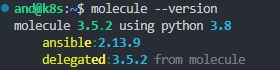
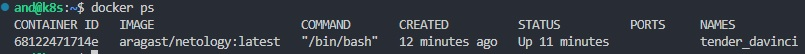
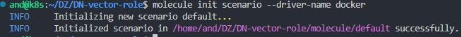
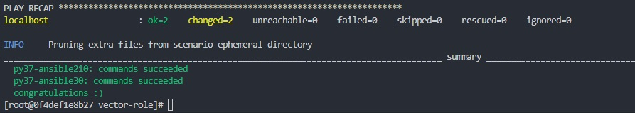

Выполнение [домашнего задания](https://github.com/netology-code/mnt-homeworks/blob/MNT-video/08-ansible-05-testing/README.md)
по теме "8.5. Тестирование Roles".

## Q/A


> Подготовка к выполнению
> 1. Установите `molecule`: `pip3 install "molecule==3.5.2"`
> 2. Выполните `docker pull aragast/netology:latest` - это образ с `podman`, `tox` и несколькими пайтонами (3.7 и 3.9) внутри


Установка `molecule`:

```shell
pip3 install "molecule==3.5.2" --user
pip3 install molecule[docker] --user
```

```shell
molecule --version
```



Получение образа:

```shell
docker pull aragast/netology:latest
```

```shell
docker run --rm -it aragast/netology:latest
```




> ### Основная часть
> Ваша цель — настроить тестирование ваших ролей.

> Задача — сделать сценарии тестирования для vector.

> Ожидаемый результат — все сценарии успешно проходят тестирование ролей.

> #### Molecule
> 1. Запустите `molecule test -s centos7` внутри корневой директории `clickhouse-role`, посмотрите на вывод команды.


<details>
<summary>molecule test -s centos_7</summary>

```
and@k8s:~/.ansible/roles/clickhouse$ molecule test -s centos_7
INFO     centos_7 scenario test matrix: dependency, lint, cleanup, destroy, syntax, create, prepare, converge, idempotence, side_effect, verify, cleanup, destroy
INFO     Performing prerun...
INFO     Set ANSIBLE_LIBRARY=/home/and/.cache/ansible-compat/7e099f/modules:/home/and/.ansible/plugins/modules:/usr/share/ansible/plugins/modules
INFO     Set ANSIBLE_COLLECTIONS_PATH=/home/and/.cache/ansible-compat/7e099f/collections:/home/and/.ansible/collections:/usr/share/ansible/collections
INFO     Set ANSIBLE_ROLES_PATH=/home/and/.cache/ansible-compat/7e099f/roles:/home/and/.ansible/roles:/usr/share/ansible/roles:/etc/ansible/roles
INFO     Inventory /home/and/.ansible/roles/clickhouse/molecule/centos_7/../resources/inventory/hosts.yml linked to /home/and/.cache/molecule/clickhouse/centos_7/inventory/hosts
INFO     Inventory /home/and/.ansible/roles/clickhouse/molecule/centos_7/../resources/inventory/group_vars/ linked to /home/and/.cache/molecule/clickhouse/centos_7/inventory/group_vars
INFO     Inventory /home/and/.ansible/roles/clickhouse/molecule/centos_7/../resources/inventory/host_vars/ linked to /home/and/.cache/molecule/clickhouse/centos_7/inventory/host_vars
INFO     Running centos_7 > dependency
INFO     Running from /home/and/.ansible/roles/clickhouse : ansible-galaxy collection install -vvv community.docker:>=3.0.2
INFO     Running from /home/and/.ansible/roles/clickhouse : ansible-galaxy collection install -vvv ansible.posix:>=1.4.0
WARNING  Skipping, missing the requirements file.
WARNING  Skipping, missing the requirements file.
INFO     Inventory /home/and/.ansible/roles/clickhouse/molecule/centos_7/../resources/inventory/hosts.yml linked to /home/and/.cache/molecule/clickhouse/centos_7/inventory/hosts
INFO     Inventory /home/and/.ansible/roles/clickhouse/molecule/centos_7/../resources/inventory/group_vars/ linked to /home/and/.cache/molecule/clickhouse/centos_7/inventory/group_vars
INFO     Inventory /home/and/.ansible/roles/clickhouse/molecule/centos_7/../resources/inventory/host_vars/ linked to /home/and/.cache/molecule/clickhouse/centos_7/inventory/host_vars
INFO     Running centos_7 > lint
COMMAND: yamllint .
ansible-lint
flake8

WARNING: ansible-lint is no longer tested under Python 3.8 and will soon require 3.9. Do not report bugs for this version.
Traceback (most recent call last):
  File "/usr/local/bin/ansible-lint", line 8, in <module>
    sys.exit(_run_cli_entrypoint())
  File "/home/and/.local/lib/python3.8/site-packages/ansiblelint/__main__.py", line 359, in _run_cli_entrypoint
    sys.exit(main(sys.argv))
  File "/home/and/.local/lib/python3.8/site-packages/ansiblelint/__main__.py", line 235, in main
    rules = RulesCollection(options.rulesdirs, profile_name=options.profile)
  File "/home/and/.local/lib/python3.8/site-packages/ansiblelint/rules/__init__.py", line 388, in __init__
    for rule in load_plugins(rulesdirs):
  File "/home/and/.local/lib/python3.8/site-packages/ansiblelint/rules/__init__.py", line 339, in load_plugins
    import_module(f"{f.stem}")
  File "/usr/lib/python3.8/importlib/__init__.py", line 127, in import_module
    return _bootstrap._gcd_import(name[level:], package, level)
  File "<frozen importlib._bootstrap>", line 1014, in _gcd_import
  File "<frozen importlib._bootstrap>", line 991, in _find_and_load
  File "<frozen importlib._bootstrap>", line 975, in _find_and_load_unlocked
  File "<frozen importlib._bootstrap>", line 671, in _load_unlocked
  File "<frozen importlib._bootstrap_external>", line 848, in exec_module
  File "<frozen importlib._bootstrap>", line 219, in _call_with_frames_removed
  File "/home/and/.local/lib/python3.8/site-packages/ansiblelint/rules/role_name.py", line 26, in <module>
    from functools import cache
ImportError: cannot import name 'cache' from 'functools' (/usr/lib/python3.8/functools.py)
/bin/bash: line 2: flake8: command not found
CRITICAL Lint failed with error code 127
WARNING  An error occurred during the test sequence action: 'lint'. Cleaning up.
INFO     Inventory /home/and/.ansible/roles/clickhouse/molecule/centos_7/../resources/inventory/hosts.yml linked to /home/and/.cache/molecule/clickhouse/centos_7/inventory/hosts
INFO     Inventory /home/and/.ansible/roles/clickhouse/molecule/centos_7/../resources/inventory/group_vars/ linked to /home/and/.cache/molecule/clickhouse/centos_7/inventory/group_vars
INFO     Inventory /home/and/.ansible/roles/clickhouse/molecule/centos_7/../resources/inventory/host_vars/ linked to /home/and/.cache/molecule/clickhouse/centos_7/inventory/host_vars
INFO     Running centos_7 > cleanup
WARNING  Skipping, cleanup playbook not configured.
INFO     Inventory /home/and/.ansible/roles/clickhouse/molecule/centos_7/../resources/inventory/hosts.yml linked to /home/and/.cache/molecule/clickhouse/centos_7/inventory/hosts
INFO     Inventory /home/and/.ansible/roles/clickhouse/molecule/centos_7/../resources/inventory/group_vars/ linked to /home/and/.cache/molecule/clickhouse/centos_7/inventory/group_vars
INFO     Inventory /home/and/.ansible/roles/clickhouse/molecule/centos_7/../resources/inventory/host_vars/ linked to /home/and/.cache/molecule/clickhouse/centos_7/inventory/host_vars
INFO     Running centos_7 > destroy
INFO     Sanity checks: 'docker'

PLAY [Destroy] *****************************************************************

TASK [Set async_dir for HOME env] **********************************************
ok: [localhost]

TASK [Destroy molecule instance(s)] ********************************************
changed: [localhost] => (item=centos_7)

TASK [Wait for instance(s) deletion to complete] *******************************
FAILED - RETRYING: [localhost]: Wait for instance(s) deletion to complete (300 retries left).
ok: [localhost] => (item=centos_7)

TASK [Delete docker networks(s)] ***********************************************

PLAY RECAP *********************************************************************
localhost                  : ok=3    changed=1    unreachable=0    failed=0    skipped=1    rescued=0    ignored=0

INFO     Pruning extra files from scenario ephemeral directory
```
</details>


> 2. Перейдите в каталог с ролью `vector-role` и создайте сценарий тестирования по умолчанию при помощи `molecule init scenario --driver-name docker`



> 3. Добавьте несколько разных дистрибутивов (centos:8, ubuntu:latest) для инстансов и протестируйте роль, исправьте найденные ошибки, если они есть.

```yaml
platforms:
  - name: Centos7
    image: docker.io/pycontribs/centos:7
    pre_build_image: true
  - name: Centos8
    image: docker.io/pycontribs/centos:8
    pre_build_image: true
  - name: Ubuntu
    image: docker.io/pycontribs/ubuntu:latest
    pre_build_image: true
```

> 4. Добавьте несколько assert'ов в verify.yml файл для проверки работоспособности vector-role (проверка, что конфиг валидный, проверка успешности запуска, etc).
> Запустите тестирование роли повторно и проверьте, что оно прошло успешно.

В `verify.yml` были добавлены проверки на установку, валидность конфига и успешный запуск сервиса `vector`:
```yaml
---
- name: Verify
  hosts: all
  gather_facts: false
  tasks:
  - name: Assert Vector installation
    assert:
      that: "'{{ vector_version.rc }}' == '0'"
  - name: Validate vector config file
    ansible.builtin.command: "vector validate --no-environment --config-yaml /etc/vector/vector.yaml"
    register: vector_validate
    changed_when: false
  - name: Assert Vector validate config
    assert:
      that: "'{{ vector_validate.rc }}' == '0'"
  - name: Assert vector service started
    ansible.builtin.service:
      name: vector
      state: started
```

> 5. Добавьте новый тег на коммит с рабочим сценарием в соответствии с семантическим версионированием.

Так как в данном случае было расширение функционала без потери обратной совместимости, то по семантическому версионированию 
новая версия будет иметь тэг `1.1.0`.

[DN-vector-role](https://github.com/lunezhev/DN-vector-role/releases/tag/1.1.0)

> #### Tox
> 1. Добавьте в директорию с vector-role файлы из [директории](https://github.com/netology-code/mnt-homeworks/blob/MNT-video/08-ansible-05-testing/example)
> 2. Запустите `docker run --privileged=True -v <path_to_repo>:/opt/vector-role -w /opt/vector-role -it aragast/netology:latest /bin/bash`, где path_to_repo - путь до корня репозитория с vector-role на вашей файловой системе.
> 3. Внутри контейнера выполните команду `tox`, посмотрите на вывод.

<details>
<summary>tox</summary>

```
and@k8s:~/DZ/DN-vector-role$ docker run --privileged=True -v /home/and/DZ/DN-vector-role:/opt/vector-role -w /opt/vector-role -it aragast/netology:latest /bin/bash
[root@cb4912f7232e vector-role]# tox
py37-ansible210 create: /opt/vector-role/.tox/py37-ansible210
py37-ansible210 installdeps: -rtox-requirements.txt, ansible<3.0
py37-ansible210 installed: ansible==2.10.7,ansible-base==2.10.17,ansible-compat==1.0.0,ansible-lint==5.1.3,arrow==1.2.3,bcrypt==4.0.1,binaryornot==0.4.4,bracex==2.3.post1,cached-property==1.5.2,Cerberus==1.3.2,certifi==2023.5.7,cffi==1.15.1,chardet==5.1.0,charset-normalizer==3.1.0,click==8.1.3,click-help-colors==0.9.1,cookiecutter==2.1.1,cryptography==40.0.2,distro==1.8.0,enrich==1.2.7,idna==3.4,importlib-metadata==6.6.0,Jinja2==3.1.2,jinja2-time==0.2.0,jmespath==1.0.1,lxml==4.9.2,markdown-it-py==2.2.0,MarkupSafe==2.1.2,mdurl==0.1.2,molecule==3.4.0,molecule-podman==1.0.1,packaging==23.1,paramiko==2.12.0,pathspec==0.11.1,pluggy==0.13.1,pycparser==2.21,Pygments==2.15.1,PyNaCl==1.5.0,python-dateutil==2.8.2,python-slugify==8.0.1,PyYAML==5.4.1,requests==2.31.0,rich==13.3.5,ruamel.yaml==0.17.26,ruamel.yaml.clib==0.2.7,selinux==0.2.1,six==1.16.0,subprocess-tee==0.3.5,tenacity==8.2.2,text-unidecode==1.3,typing_extensions==4.6.0,urllib3==2.0.2,wcmatch==8.4.1,yamllint==1.26.3,zipp==3.15.0
py37-ansible210 run-test-pre: PYTHONHASHSEED='3662965303'
py37-ansible210 run-test: commands[0] | molecule test -s compatibility --destroy always
CRITICAL 'molecule/compatibility/molecule.yml' glob failed.  Exiting.
ERROR: InvocationError for command /opt/vector-role/.tox/py37-ansible210/bin/molecule test -s compatibility --destroy always (exited with code 1)
py37-ansible30 create: /opt/vector-role/.tox/py37-ansible30
py37-ansible30 installdeps: -rtox-requirements.txt, ansible<3.1
py37-ansible30 installed: ansible==3.0.0,ansible-base==2.10.17,ansible-compat==1.0.0,ansible-lint==5.1.3,arrow==1.2.3,bcrypt==4.0.1,binaryornot==0.4.4,bracex==2.3.post1,cached-property==1.5.2,Cerberus==1.3.2,certifi==2023.5.7,cffi==1.15.1,chardet==5.1.0,charset-normalizer==3.1.0,click==8.1.3,click-help-colors==0.9.1,cookiecutter==2.1.1,cryptography==40.0.2,distro==1.8.0,enrich==1.2.7,idna==3.4,importlib-metadata==6.6.0,Jinja2==3.1.2,jinja2-time==0.2.0,jmespath==1.0.1,lxml==4.9.2,markdown-it-py==2.2.0,MarkupSafe==2.1.2,mdurl==0.1.2,molecule==3.4.0,molecule-podman==1.0.1,packaging==23.1,paramiko==2.12.0,pathspec==0.11.1,pluggy==0.13.1,pycparser==2.21,Pygments==2.15.1,PyNaCl==1.5.0,python-dateutil==2.8.2,python-slugify==8.0.1,PyYAML==5.4.1,requests==2.31.0,rich==13.3.5,ruamel.yaml==0.17.26,ruamel.yaml.clib==0.2.7,selinux==0.2.1,six==1.16.0,subprocess-tee==0.3.5,tenacity==8.2.2,text-unidecode==1.3,typing_extensions==4.6.0,urllib3==2.0.2,wcmatch==8.4.1,yamllint==1.26.3,zipp==3.15.0
py37-ansible30 run-test-pre: PYTHONHASHSEED='3662965303'
py37-ansible30 run-test: commands[0] | molecule test -s compatibility --destroy always
CRITICAL 'molecule/compatibility/molecule.yml' glob failed.  Exiting.
ERROR: InvocationError for command /opt/vector-role/.tox/py37-ansible30/bin/molecule test -s compatibility --destroy always (exited with code 1)
py39-ansible210 create: /opt/vector-role/.tox/py39-ansible210
py39-ansible210 installdeps: -rtox-requirements.txt, ansible<3.0
py39-ansible210 installed: ansible==2.10.7,ansible-base==2.10.17,ansible-compat==4.0.5,ansible-core==2.15.0,ansible-lint==5.1.3,arrow==1.2.3,attrs==23.1.0,bcrypt==4.0.1,binaryornot==0.4.4,bracex==2.3.post1,Cerberus==1.3.2,certifi==2023.5.7,cffi==1.15.1,chardet==5.1.0,charset-normalizer==3.1.0,click==8.1.3,click-help-colors==0.9.1,cookiecutter==2.1.1,cryptography==40.0.2,distro==1.8.0,enrich==1.2.7,idna==3.4,importlib-resources==5.0.7,Jinja2==3.1.2,jinja2-time==0.2.0,jmespath==1.0.1,jsonschema==4.17.3,lxml==4.9.2,markdown-it-py==2.2.0,MarkupSafe==2.1.2,mdurl==0.1.2,molecule==3.4.0,molecule-podman==1.0.1,packaging==23.1,paramiko==2.12.0,pathspec==0.11.1,pluggy==0.13.1,pycparser==2.21,Pygments==2.15.1,PyNaCl==1.5.0,pyrsistent==0.19.3,python-dateutil==2.8.2,python-slugify==8.0.1,PyYAML==5.4.1,requests==2.31.0,resolvelib==1.0.1,rich==13.3.5,ruamel.yaml==0.17.26,ruamel.yaml.clib==0.2.7,selinux==0.3.0,six==1.16.0,subprocess-tee==0.4.1,tenacity==8.2.2,text-unidecode==1.3,typing_extensions==4.6.0,urllib3==2.0.2,wcmatch==8.4.1,yamllint==1.26.3
py39-ansible210 run-test-pre: PYTHONHASHSEED='3662965303'
py39-ansible210 run-test: commands[0] | molecule test -s compatibility --destroy always
CRITICAL 'molecule/compatibility/molecule.yml' glob failed.  Exiting.
ERROR: InvocationError for command /opt/vector-role/.tox/py39-ansible210/bin/molecule test -s compatibility --destroy always (exited with code 1)
py39-ansible30 create: /opt/vector-role/.tox/py39-ansible30
py39-ansible30 installdeps: -rtox-requirements.txt, ansible<3.1
py39-ansible30 installed: ansible==3.0.0,ansible-base==2.10.17,ansible-compat==4.0.5,ansible-core==2.15.0,ansible-lint==5.1.3,arrow==1.2.3,attrs==23.1.0,bcrypt==4.0.1,binaryornot==0.4.4,bracex==2.3.post1,Cerberus==1.3.2,certifi==2023.5.7,cffi==1.15.1,chardet==5.1.0,charset-normalizer==3.1.0,click==8.1.3,click-help-colors==0.9.1,cookiecutter==2.1.1,cryptography==40.0.2,distro==1.8.0,enrich==1.2.7,idna==3.4,importlib-resources==5.0.7,Jinja2==3.1.2,jinja2-time==0.2.0,jmespath==1.0.1,jsonschema==4.17.3,lxml==4.9.2,markdown-it-py==2.2.0,MarkupSafe==2.1.2,mdurl==0.1.2,molecule==3.4.0,molecule-podman==1.0.1,packaging==23.1,paramiko==2.12.0,pathspec==0.11.1,pluggy==0.13.1,pycparser==2.21,Pygments==2.15.1,PyNaCl==1.5.0,pyrsistent==0.19.3,python-dateutil==2.8.2,python-slugify==8.0.1,PyYAML==5.4.1,requests==2.31.0,resolvelib==1.0.1,rich==13.3.5,ruamel.yaml==0.17.26,ruamel.yaml.clib==0.2.7,selinux==0.3.0,six==1.16.0,subprocess-tee==0.4.1,tenacity==8.2.2,text-unidecode==1.3,typing_extensions==4.6.0,urllib3==2.0.2,wcmatch==8.4.1,yamllint==1.26.3
py39-ansible30 run-test-pre: PYTHONHASHSEED='3662965303'
py39-ansible30 run-test: commands[0] | molecule test -s compatibility --destroy always
CRITICAL 'molecule/compatibility/molecule.yml' glob failed.  Exiting.
ERROR: InvocationError for command /opt/vector-role/.tox/py39-ansible30/bin/molecule test -s compatibility --destroy always (exited with code 1)
________________________________________________________________________________________________________ summary _________________________________________________________________________________________________________
ERROR:   py37-ansible210: commands failed
ERROR:   py37-ansible30: commands failed
ERROR:   py39-ansible210: commands failed
ERROR:   py39-ansible30: commands failed

```
</details>

> 4. Создайте облегчённый сценарий для `molecule` с драйвером `molecule_podman`. Проверьте его на исполнимость.

Новый сценарий называется `podman`.

Добавим в переменную окружения `PATH`

```shell
export PATH="$PATH:/opt/vector-role/.tox/py37-ansible30/bin"
```


3. Запустим новый сценарий.


<details>
<summary>molecule test -s podman</summary>

```
[root@0f4def1e8b27 vector-role]# molecule test -s podman
INFO     podman scenario test matrix: destroy, create, converge, verify, destroy
INFO     Performing prerun...
WARNING  Failed to locate command: [Errno 2] No such file or directory: 'git': 'git'
INFO     Guessed /opt/vector-role as project root directory
INFO     Running podman > destroy
INFO     Sanity checks: 'podman'

PLAY [Destroy] *****************************************************************

TASK [Destroy molecule instance(s)] ********************************************
changed: [localhost] => (item={'image': 'docker.io/pycontribs/centos:7', 'name': 'centos7', 'pre_build_image': True})

TASK [Wait for instance(s) deletion to complete] *******************************
changed: [localhost] => (item={'started': 1, 'finished': 0, 'ansible_job_id': '748931110114.5150', 'results_file': '/root/.ansible_async/748931110114.5150', 'changed': True, 'failed': False, 'item': {'image': 'docker.io/pycontribs/centos:7', 'name': 'centos7', 'pre_build_image': True}, 'ansible_loop_var': 'item'})

PLAY RECAP *********************************************************************
localhost                  : ok=2    changed=2    unreachable=0    failed=0    skipped=0    rescued=0    ignored=0

INFO     Running podman > create

PLAY [Create] ******************************************************************

TASK [get podman executable path] **********************************************
ok: [localhost]

TASK [save path to executable as fact] *****************************************
ok: [localhost]

TASK [Log into a container registry] *******************************************
skipping: [localhost] => (item="centos7 registry username: None specified") 

TASK [Check presence of custom Dockerfiles] ************************************
ok: [localhost] => (item=Dockerfile: None specified)

TASK [Create Dockerfiles from image names] *************************************
skipping: [localhost] => (item="Dockerfile: None specified; Image: docker.io/pycontribs/centos:7") 

TASK [Discover local Podman images] ********************************************
ok: [localhost] => (item=centos7)

TASK [Build an Ansible compatible image] ***************************************
skipping: [localhost] => (item=docker.io/pycontribs/centos:7) 

TASK [Determine the CMD directives] ********************************************
ok: [localhost] => (item="centos7 command: None specified")

TASK [Remove possible pre-existing containers] *********************************
changed: [localhost]

TASK [Discover local podman networks] ******************************************
skipping: [localhost] => (item=centos7: None specified) 

TASK [Create podman network dedicated to this scenario] ************************
skipping: [localhost]

TASK [Create molecule instance(s)] *********************************************
changed: [localhost] => (item=centos7)

TASK [Wait for instance(s) creation to complete] *******************************
changed: [localhost] => (item=centos7)

PLAY RECAP *********************************************************************
localhost                  : ok=8    changed=3    unreachable=0    failed=0    skipped=5    rescued=0    ignored=0

INFO     Running podman > converge

PLAY [Converge] ****************************************************************

TASK [Gathering Facts] *********************************************************
ok: [centos7]

TASK [Copy something to test use of synchronize module] ************************
changed: [centos7]

TASK [Include DN-vector-role] **************************************************

PLAY RECAP *********************************************************************
centos7                    : ok=2    changed=1    unreachable=0    failed=0    skipped=0    rescued=0    ignored=0

INFO     Running podman > verify
INFO     Running Ansible Verifier

PLAY [Verify] ******************************************************************

TASK [Example assertion] *******************************************************
ok: [centos7] => {
    "changed": false,
    "msg": "All assertions passed"
}

PLAY RECAP *********************************************************************
centos7                    : ok=1    changed=0    unreachable=0    failed=0    skipped=0    rescued=0    ignored=0

INFO     Verifier completed successfully.
INFO     Running podman > destroy

PLAY [Destroy] *****************************************************************

TASK [Destroy molecule instance(s)] ********************************************
changed: [localhost] => (item={'image': 'docker.io/pycontribs/centos:7', 'name': 'centos7', 'pre_build_image': True})

TASK [Wait for instance(s) deletion to complete] *******************************
FAILED - RETRYING: Wait for instance(s) deletion to complete (300 retries left).
FAILED - RETRYING: Wait for instance(s) deletion to complete (299 retries left).
changed: [localhost] => (item={'started': 1, 'finished': 0, 'ansible_job_id': '705467917958.5830', 'results_file': '/root/.ansible_async/705467917958.5830', 'changed': True, 'failed': False, 'item': {'image': 'docker.io/pycontribs/centos:7', 'name': 'centos7', 'pre_build_image': True}, 'ansible_loop_var': 'item'})

PLAY RECAP *********************************************************************
localhost                  : ok=2    changed=2    unreachable=0    failed=0    skipped=0    rescued=0    ignored=0

INFO     Pruning extra files from scenario ephemeral directory
```
</details>

> 5. Пропишите правильную команду в `tox.ini` для того чтобы запускался облегчённый сценарий.

```ini
commands =
    {posargs:molecule test -s podman}
```

> 6. Запустите команду `tox`. Убедитесь, что всё отработало успешно.

<details>
<summary>tox</summary>

```
[root@0f4def1e8b27 vector-role]# tox
py37-ansible210 installed: ansible==2.10.7,ansible-base==2.10.17,ansible-compat==1.0.0,ansible-lint==5.1.3,arrow==1.2.3,bcrypt==4.0.1,binaryornot==0.4.4,bracex==2.3.post1,cached-property==1.5.2,Cerberus==1.3.2,certifi==2023.5.7,cffi==1.15.1,chardet==5.1.0,charset-normalizer==3.1.0,click==8.1.3,click-help-colors==0.9.1,cookiecutter==2.1.1,cryptography==40.0.2,distro==1.8.0,enrich==1.2.7,idna==3.4,importlib-metadata==6.6.0,Jinja2==3.1.2,jinja2-time==0.2.0,jmespath==1.0.1,lxml==4.9.2,markdown-it-py==2.2.0,MarkupSafe==2.1.2,mdurl==0.1.2,molecule==3.4.0,molecule-podman==1.0.1,packaging==23.1,paramiko==2.12.0,pathspec==0.11.1,pluggy==0.13.1,pycparser==2.21,Pygments==2.15.1,PyNaCl==1.5.0,python-dateutil==2.8.2,python-slugify==8.0.1,PyYAML==5.4.1,requests==2.31.0,rich==13.3.5,ruamel.yaml==0.17.26,ruamel.yaml.clib==0.2.7,selinux==0.2.1,six==1.16.0,subprocess-tee==0.3.5,tenacity==8.2.2,text-unidecode==1.3,typing_extensions==4.6.0,urllib3==2.0.2,wcmatch==8.4.1,yamllint==1.26.3,zipp==3.15.0
py37-ansible210 run-test-pre: PYTHONHASHSEED='2220373808'
py37-ansible210 run-test: commands[0] | molecule test -s podman
INFO     podman scenario test matrix: destroy, create, converge, verify, destroy
INFO     Performing prerun...
WARNING  Failed to locate command: [Errno 2] No such file or directory: 'git': 'git'
INFO     Guessed /opt/vector-role as project root directory
INFO     Running podman > destroy
INFO     Sanity checks: 'podman'

PLAY [Destroy] *****************************************************************

TASK [Destroy molecule instance(s)] ********************************************
changed: [localhost] => (item={'image': 'docker.io/pycontribs/centos:7', 'name': 'centos7', 'pre_build_image': True})

TASK [Wait for instance(s) deletion to complete] *******************************
changed: [localhost] => (item={'started': 1, 'finished': 0, 'ansible_job_id': '512732554460.5967', 'results_file': '/root/.ansible_async/512732554460.5967', 'changed': True, 'failed': False, 'item': {'image': 'docker.io/pycontribs/centos:7', 'name': 'centos7', 'pre_build_image': True}, 'ansible_loop_var': 'item'})

PLAY RECAP *********************************************************************
localhost                  : ok=2    changed=2    unreachable=0    failed=0    skipped=0    rescued=0    ignored=0

INFO     Running podman > create

PLAY [Create] ******************************************************************

TASK [get podman executable path] **********************************************
ok: [localhost]

TASK [save path to executable as fact] *****************************************
ok: [localhost]

TASK [Log into a container registry] *******************************************
skipping: [localhost] => (item="centos7 registry username: None specified") 

TASK [Check presence of custom Dockerfiles] ************************************
ok: [localhost] => (item=Dockerfile: None specified)

TASK [Create Dockerfiles from image names] *************************************
skipping: [localhost] => (item="Dockerfile: None specified; Image: docker.io/pycontribs/centos:7") 

TASK [Discover local Podman images] ********************************************
ok: [localhost] => (item=centos7)

TASK [Build an Ansible compatible image] ***************************************
skipping: [localhost] => (item=docker.io/pycontribs/centos:7) 

TASK [Determine the CMD directives] ********************************************
ok: [localhost] => (item="centos7 command: None specified")

TASK [Remove possible pre-existing containers] *********************************
changed: [localhost]

TASK [Discover local podman networks] ******************************************
skipping: [localhost] => (item=centos7: None specified) 

TASK [Create podman network dedicated to this scenario] ************************
skipping: [localhost]

TASK [Create molecule instance(s)] *********************************************
changed: [localhost] => (item=centos7)

TASK [Wait for instance(s) creation to complete] *******************************
changed: [localhost] => (item=centos7)

PLAY RECAP *********************************************************************
localhost                  : ok=8    changed=3    unreachable=0    failed=0    skipped=5    rescued=0    ignored=0

INFO     Running podman > converge

PLAY [Converge] ****************************************************************

TASK [Gathering Facts] *********************************************************
ok: [centos7]

TASK [Copy something to test use of synchronize module] ************************
changed: [centos7]

TASK [Include DN-vector-role] **************************************************

PLAY RECAP *********************************************************************
centos7                    : ok=2    changed=1    unreachable=0    failed=0    skipped=0    rescued=0    ignored=0

INFO     Running podman > verify
INFO     Running Ansible Verifier

PLAY [Verify] ******************************************************************

TASK [Example assertion] *******************************************************
ok: [centos7] => {
    "changed": false,
    "msg": "All assertions passed"
}

PLAY RECAP *********************************************************************
centos7                    : ok=1    changed=0    unreachable=0    failed=0    skipped=0    rescued=0    ignored=0

INFO     Verifier completed successfully.
INFO     Running podman > destroy

PLAY [Destroy] *****************************************************************

TASK [Destroy molecule instance(s)] ********************************************
changed: [localhost] => (item={'image': 'docker.io/pycontribs/centos:7', 'name': 'centos7', 'pre_build_image': True})

TASK [Wait for instance(s) deletion to complete] *******************************
FAILED - RETRYING: Wait for instance(s) deletion to complete (300 retries left).
FAILED - RETRYING: Wait for instance(s) deletion to complete (299 retries left).
changed: [localhost] => (item={'started': 1, 'finished': 0, 'ansible_job_id': '225502703589.6650', 'results_file': '/root/.ansible_async/225502703589.6650', 'changed': True, 'failed': False, 'item': {'image': 'docker.io/pycontribs/centos:7', 'name': 'centos7', 'pre_build_image': True}, 'ansible_loop_var': 'item'})

PLAY RECAP *********************************************************************
localhost                  : ok=2    changed=2    unreachable=0    failed=0    skipped=0    rescued=0    ignored=0

INFO     Pruning extra files from scenario ephemeral directory
py37-ansible30 installed: ansible==3.0.0,ansible-base==2.10.17,ansible-compat==1.0.0,ansible-lint==5.1.3,arrow==1.2.3,bcrypt==4.0.1,binaryornot==0.4.4,bracex==2.3.post1,cached-property==1.5.2,Cerberus==1.3.2,certifi==2023.5.7,cffi==1.15.1,chardet==5.1.0,charset-normalizer==3.1.0,click==8.1.3,click-help-colors==0.9.1,cookiecutter==2.1.1,cryptography==40.0.2,distro==1.8.0,enrich==1.2.7,idna==3.4,importlib-metadata==6.6.0,Jinja2==3.1.2,jinja2-time==0.2.0,jmespath==1.0.1,lxml==4.9.2,markdown-it-py==2.2.0,MarkupSafe==2.1.2,mdurl==0.1.2,molecule==3.4.0,molecule-podman==1.0.1,packaging==23.1,paramiko==2.12.0,pathspec==0.11.1,pluggy==0.13.1,pycparser==2.21,Pygments==2.15.1,PyNaCl==1.5.0,python-dateutil==2.8.2,python-slugify==8.0.1,PyYAML==5.4.1,requests==2.31.0,rich==13.3.5,ruamel.yaml==0.17.26,ruamel.yaml.clib==0.2.7,selinux==0.2.1,six==1.16.0,subprocess-tee==0.3.5,tenacity==8.2.2,text-unidecode==1.3,typing_extensions==4.6.0,urllib3==2.0.2,wcmatch==8.4.1,yamllint==1.26.3,zipp==3.15.0
py37-ansible30 run-test-pre: PYTHONHASHSEED='2220373808'
py37-ansible30 run-test: commands[0] | molecule test -s podman
INFO     podman scenario test matrix: destroy, create, converge, verify, destroy
INFO     Performing prerun...
WARNING  Failed to locate command: [Errno 2] No such file or directory: 'git': 'git'
INFO     Guessed /opt/vector-role as project root directory
INFO     Running podman > destroy
INFO     Sanity checks: 'podman'

PLAY [Destroy] *****************************************************************

TASK [Destroy molecule instance(s)] ********************************************
changed: [localhost] => (item={'image': 'docker.io/pycontribs/centos:7', 'name': 'centos7', 'pre_build_image': True})

TASK [Wait for instance(s) deletion to complete] *******************************
changed: [localhost] => (item={'started': 1, 'finished': 0, 'ansible_job_id': '950439730646.6780', 'results_file': '/root/.ansible_async/950439730646.6780', 'changed': True, 'failed': False, 'item': {'image': 'docker.io/pycontribs/centos:7', 'name': 'centos7', 'pre_build_image': True}, 'ansible_loop_var': 'item'})

PLAY RECAP *********************************************************************
localhost                  : ok=2    changed=2    unreachable=0    failed=0    skipped=0    rescued=0    ignored=0

INFO     Running podman > create

PLAY [Create] ******************************************************************

TASK [get podman executable path] **********************************************
ok: [localhost]

TASK [save path to executable as fact] *****************************************
ok: [localhost]

TASK [Log into a container registry] *******************************************
skipping: [localhost] => (item="centos7 registry username: None specified") 

TASK [Check presence of custom Dockerfiles] ************************************
ok: [localhost] => (item=Dockerfile: None specified)

TASK [Create Dockerfiles from image names] *************************************
skipping: [localhost] => (item="Dockerfile: None specified; Image: docker.io/pycontribs/centos:7") 

TASK [Discover local Podman images] ********************************************
ok: [localhost] => (item=centos7)

TASK [Build an Ansible compatible image] ***************************************
skipping: [localhost] => (item=docker.io/pycontribs/centos:7) 

TASK [Determine the CMD directives] ********************************************
ok: [localhost] => (item="centos7 command: None specified")

TASK [Remove possible pre-existing containers] *********************************
changed: [localhost]

TASK [Discover local podman networks] ******************************************
skipping: [localhost] => (item=centos7: None specified) 

TASK [Create podman network dedicated to this scenario] ************************
skipping: [localhost]

TASK [Create molecule instance(s)] *********************************************
changed: [localhost] => (item=centos7)

TASK [Wait for instance(s) creation to complete] *******************************
changed: [localhost] => (item=centos7)

PLAY RECAP *********************************************************************
localhost                  : ok=8    changed=3    unreachable=0    failed=0    skipped=5    rescued=0    ignored=0

INFO     Running podman > converge

PLAY [Converge] ****************************************************************

TASK [Gathering Facts] *********************************************************
ok: [centos7]

TASK [Copy something to test use of synchronize module] ************************
changed: [centos7]

TASK [Include DN-vector-role] **************************************************

PLAY RECAP *********************************************************************
centos7                    : ok=2    changed=1    unreachable=0    failed=0    skipped=0    rescued=0    ignored=0

INFO     Running podman > verify
INFO     Running Ansible Verifier

PLAY [Verify] ******************************************************************

TASK [Example assertion] *******************************************************
ok: [centos7] => {
    "changed": false,
    "msg": "All assertions passed"
}

PLAY RECAP *********************************************************************
centos7                    : ok=1    changed=0    unreachable=0    failed=0    skipped=0    rescued=0    ignored=0

INFO     Verifier completed successfully.
INFO     Running podman > destroy

PLAY [Destroy] *****************************************************************

TASK [Destroy molecule instance(s)] ********************************************
changed: [localhost] => (item={'image': 'docker.io/pycontribs/centos:7', 'name': 'centos7', 'pre_build_image': True})

TASK [Wait for instance(s) deletion to complete] *******************************
FAILED - RETRYING: Wait for instance(s) deletion to complete (300 retries left).
FAILED - RETRYING: Wait for instance(s) deletion to complete (299 retries left).
changed: [localhost] => (item={'started': 1, 'finished': 0, 'ansible_job_id': '157526583092.7457', 'results_file': '/root/.ansible_async/157526583092.7457', 'changed': True, 'failed': False, 'item': {'image': 'docker.io/pycontribs/centos:7', 'name': 'centos7', 'pre_build_image': True}, 'ansible_loop_var': 'item'})

PLAY RECAP *********************************************************************
localhost                  : ok=2    changed=2    unreachable=0    failed=0    skipped=0    rescued=0    ignored=0

INFO     Pruning extra files from scenario ephemeral directory
________________________________________________________________________________________ summary _________________________________________________________________________________________
  py37-ansible210: commands succeeded
  py37-ansible30: commands succeeded
  congratulations :)
```
</details>



> 7. Добавьте новый тег на коммит с рабочим сценарием в соответствии с семантическим версионированием.

Новый тэг [`1.2.0`](https://github.com/lunezhev/DN-vector-role/releases/tag/1.2.0).