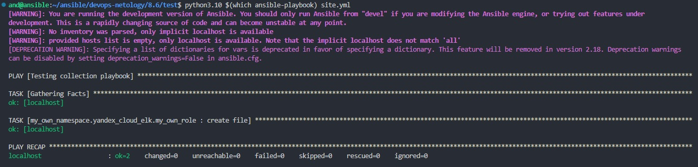

Выполнение [домашнего задания](https://github.com/netology-code/mnt-homeworks/blob/MNT-video/08-ansible-06-module/README.md)
по теме "8.6. Создание собственных modules".

## Q/A

> ## Подготовка к выполнению
> 1. Создайте пустой публичный репозиторий в своём любом проекте: `my_own_collection`.
> 2. Скачайте репозиторий Ansible: `git clone https://github.com/ansible/ansible.git` по любому, удобному вам пути.
> 3. Зайдите в директорию Ansible: `cd ansible`.
> 4. Создайте виртуальное окружение: `python3 -m venv venv`.
> 5. Активируйте виртуальное окружение: `. venv/bin/activate`. Дальнейшие действия производятся только в виртуальном окружении.
> 6. Установите зависимости `pip install -r requirements.txt`.
> 7. Запустите настройку окружения `. hacking/env-setup`.
> 8. Если все шаги прошли успешно — выйдите из виртуального окружения `deactivate`.
> 9. Ваше окружение настроено. Чтобы запустить его, нужно находиться в директории `ansible` и выполнить конструкцию `. venv/bin/activate && . hacking/env-setup`.

 [Репозиторий](https://github.com/lunezhev/DN-my_own_collection)

>## Основная часть
>
> Ваша цель — написать собственный module, который вы можете использовать в своей role через playbook.
> Всё это должно быть собрано в виде collection и отправлено в ваш репозиторий.
> 
> 1. В виртуальном окружении создайте новый `my_own_module.py` файл.
>
> 2. Наполните его содержимым:
>
> 3. Заполните файл в соответствии с требованиями Ansible так, чтобы он выполнял основную задачу: module должен создавать текстовый файл на удалённом хосте по пути, определённом в параметре `path`, с содержимым, определённым в параметре `content`.
>
> 4. Проверьте module на исполняемость локально.

> 5. Напишите single task playbook и используйте module в нём.

> 6. Проверьте через playbook на идемпотентность.

> 7. Выйдите из виртуального окружения.
>
> 8. Инициализируйте новую collection: `ansible-galaxy collection init my_own_namespace.yandex_cloud_elk`.
>
> 9. В эту collection перенесите свой module в соответствующую директорию.

[module](https://github.com/lunezhev/DN-my_own_collection/tree/main/yandex_cloud_elk/plugins/modules)

> 10. Single task playbook преобразуйте в single task role и перенесите в collection. У role должны быть default всех параметров module.

 [roles](https://github.com/lunezhev/DN-my_own_collection/tree/main/yandex_cloud_elk/roles)

> 11. Создайте playbook для использования этой role.

[playbook/site.yml](./playbook/site.yml)

> 12. Заполните всю документацию по collection, выложите в свой репозиторий, поставьте тег `1.0.0` на этот коммит.

[DN-my_own_collection](https://github.com/lunezhev/DN-my_own_collection/releases/tag/1.0.0)

> 13. Создайте .tar.gz этой collection: `ansible-galaxy collection build` в корневой директории collection.
>
> 14. Создайте ещё одну директорию любого наименования, перенесите туда single task playbook и архив c collection.
>
> 15. Установите collection из локального архива: `ansible-galaxy collection install <archivename>.tar.gz`.

> 16. Запустите playbook, убедитесь, что он работает.

> 17. В ответ необходимо прислать ссылки на collection и tar.gz архив, а также скриншоты выполнения пунктов 4, 6, 15 и 16.

[DN-my_own_collection](https://github.com/lunezhev/DN-my_own_collection)

[my_own_namespace-yandex_cloud_elk-1.0.0.tar.gz](./my_own_namespace-yandex_cloud_elk-1.0.0.tar.gz)