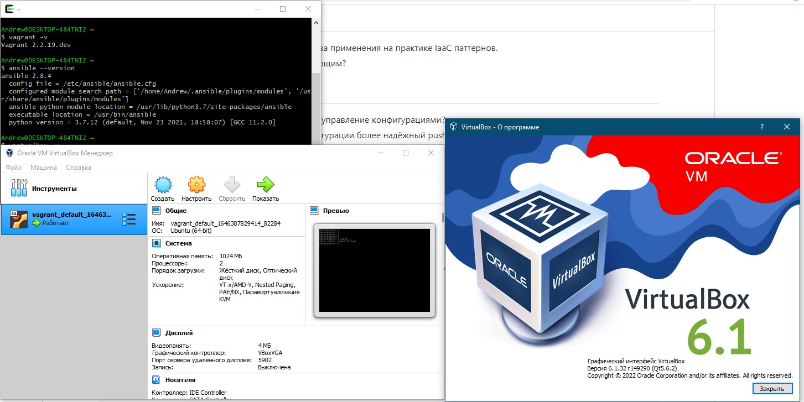

Задача 1.

1. Глвным перимуществом считаю возможность быстрого восстановления после того, как инфраструктура вышла из строя после любого рода неприятностей))). Еще, как и любой код, IaaC можно документировать, регистрировать и отслеживать любые изменения (хотя сам код уже является документацией). Развертывания инфраструктуры с помощью IaaC повторяемы и предотвращают проблемы во время выполнения, вызванных дрейфом конфигурации или отсутствием зависимостей. Iaac полностью стандартизирует инфраструктуру, что снижает вероятность ошибок или отклонений, ускоряет конфигурирование и освобождает ресурсы для выполнения других важных задач.

2. Основополагающим принципом IaaC является идемпотентность.

Задача 2. 
1.  Главное преимущество - Ansible использует существующую SSH инфраструктуру, что обеспечивает быстрый старт на текущей SSH инфраструктуре. Также, за счет использования декларативного метода описания конфигурации, Ansible обеспечивает простоту в использовании, а за счет легкого подключения модулей и кастомных ролей отличную расширяемость. Еще плюсом Ansible считаю возможность его применения на всех стадиях жизненного цикла инфраструктуры проекта.

2.  На мой взгляд, более надёжным методом работы систем конфигурации является push, т.к. при данном методе могу сам, без установки дополнительных серверов, принудительно запихивать в нужную машину нужную конфигурацию, которую храню в удобном виде, где хочу.

Задача 3. 



Andrew@DESKTOP-484TNI2 ~
$ vagrant -v
Vagrant 2.2.19.dev

Andrew@DESKTOP-484TNI2 ~
$ ansible --version
ansible 2.8.4
  config file = /etc/ansible/ansible.cfg
  configured module search path = ['/home/Andrew/.ansible/plugins/modules', '/usr/share/ansible/plugins/modules']
  ansible python module location = /usr/lib/python3.7/site-packages/ansible
  executable location = /usr/bin/ansible
  python version = 3.7.12 (default, Nov 23 2021, 18:58:07) [GCC 11.2.0]

Задача 4.

  Под Windows полноценно запустить связку virtualbox+vagrant+ansible не вышло))) Пришлось ansible ставить из-под cygdrive и немного исправленный плэйбук запускать вручную.

```
Andrew@DESKTOP-484TNI2 /cygdrive/d/netology/vagrant
$ vagrant up
Bringing machine 'server1.netology' up with 'virtualbox' provider...
==> server1.netology: Importing base box 'bento/ubuntu-20.04'...
==> server1.netology: Matching MAC address for NAT networking...
==> server1.netology: Checking if box 'bento/ubuntu-20.04' version '202112.19.0' is up to date...
==> server1.netology: There was a problem while downloading the metadata for your box
==> server1.netology: to check for updates. This is not an error, since it is usually due
==> server1.netology: to temporary network problems. This is just a warning. The problem
==> server1.netology: encountered was:
==> server1.netology:
==> server1.netology: The requested URL returned error: 404
==> server1.netology:
==> server1.netology: If you want to check for box updates, verify your network connection
==> server1.netology: is valid and try again.
==> server1.netology: Setting the name of the VM: server1.netology
==> server1.netology: Clearing any previously set network interfaces...
==> server1.netology: Preparing network interfaces based on configuration...
    server1.netology: Adapter 1: nat
    server1.netology: Adapter 2: hostonly
==> server1.netology: Forwarding ports...
    server1.netology: 22 (guest) => 20011 (host) (adapter 1)
    server1.netology: 22 (guest) => 2222 (host) (adapter 1)
==> server1.netology: Running 'pre-boot' VM customizations...
==> server1.netology: Booting VM...
==> server1.netology: Waiting for machine to boot. This may take a few minutes...
    server1.netology: SSH address: 127.0.0.1:2222
    server1.netology: SSH username: vagrant
    server1.netology: SSH auth method: private key
    server1.netology: Warning: Connection reset. Retrying...
    server1.netology: Warning: Connection aborted. Retrying...
    server1.netology:
    server1.netology: Vagrant insecure key detected. Vagrant will automatically replace
    server1.netology: this with a newly generated keypair for better security.
    server1.netology:
    server1.netology: Inserting generated public key within guest...
    server1.netology: Removing insecure key from the guest if it's present...
    server1.netology: Key inserted! Disconnecting and reconnecting using new SSH key...
==> server1.netology: Machine booted and ready!
==> server1.netology: Checking for guest additions in VM...
==> server1.netology: Setting hostname...
==> server1.netology: Configuring and enabling network interfaces...
==> server1.netology: Mounting shared folders...
    server1.netology: /vagrant => D:/Netology/vagrant
==> server1.netology: Running provisioner: ansible...
Windows is not officially supported for the Ansible Control Machine.
Please check https://docs.ansible.com/intro_installation.html#control-machine-requirements
Vagrant gathered an unknown Ansible version:


and falls back on the compatibility mode '1.8'.

Alternatively, the compatibility mode can be specified in your Vagrantfile:
https://www.vagrantup.com/docs/provisioning/ansible_common.html#compatibility_mode
    server1.netology: Running ansible-playbook...
The Ansible software could not be found! Please verify
that Ansible is correctly installed on your host system.

If you haven't installed Ansible yet, please install Ansible
on your host system. Vagrant can't do this for you in a safe and
automated way.
Please check https://docs.ansible.com for more information.

Andrew@DESKTOP-484TNI2 /cygdrive/d/netology/vagrant
$ ansible-playbook -i ./ansible/inventory/ ./ansible/provision.yml

PLAY [nodes] ******************************************************************************************************************************************************************************************************************************************************************

TASK [Gathering Facts] ********************************************************************************************************************************************************************************************************************************************************
ok: [server1.netology]

TASK [Create directory for ssh-keys] ******************************************************************************************************************************************************************************************************************************************
ok: [server1.netology]

TASK [Adding rsa-key in /root/.ssh/authorized_keys] ***************************************************************************************************************************************************************************************************************************
An exception occurred during task execution. To see the full traceback, use -vvv. The error was: If you are using a module and expect the file to exist on the remote, see the remote_src option
fatal: [server1.netology]: FAILED! => {"changed": false, "msg": "Could not find or access '~/.ssh/id_rsa.pub' on the Ansible Controller.\nIf you are using a module and expect the file to exist on the remote, see the remote_src option"}
...ignoring

TASK [Checking DNS] ***********************************************************************************************************************************************************************************************************************************************************
changed: [server1.netology]

TASK [Install a list of packages] *********************************************************************************************************************************************************************************************************************************************
 [WARNING]: Could not find aptitude. Using apt-get instead

ok: [server1.netology]

TASK [Installing docker] ******************************************************************************************************************************************************************************************************************************************************
 [WARNING]: Consider using the get_url or uri module rather than running 'curl'.  If you need to use command because get_url or uri is insufficient you can add 'warn: false' to this command task or set 'command_warnings=False' in ansible.cfg to get rid of this message.

changed: [server1.netology]

TASK [Add the current user to docker group] ***********************************************************************************************************************************************************************************************************************************
changed: [server1.netology]

PLAY RECAP ********************************************************************************************************************************************************************************************************************************************************************
server1.netology           : ok=7    changed=3    unreachable=0    failed=0    skipped=0    rescued=0    ignored=1

Andrew@DESKTOP-484TNI2 /cygdrive/d/netology/vagrant
$ vagrant ssh
Welcome to Ubuntu 20.04.3 LTS (GNU/Linux 5.4.0-91-generic x86_64)

 * Documentation:  https://help.ubuntu.com
 * Management:     https://landscape.canonical.com
 * Support:        https://ubuntu.com/advantage

  System information as of Sat 05 Mar 2022 08:31:40 AM UTC

  System load:  0.26               Users logged in:          0
  Usage of /:   13.4% of 30.88GB   IPv4 address for docker0: 172.17.0.1
  Memory usage: 24%                IPv4 address for eth0:    10.0.2.15
  Swap usage:   0%                 IPv4 address for eth1:    192.168.192.11
  Processes:    112


This system is built by the Bento project by Chef Software
More information can be found at https://github.com/chef/bento
Last login: Sat Mar  5 08:30:35 2022 from 192.168.192.1
vagrant@server1:~$ docker ps
CONTAINER ID   IMAGE     COMMAND   CREATED   STATUS    PORTS     NAMES
vagrant@server1:~$ docker --version
Docker version 20.10.12, build e91ed57

```