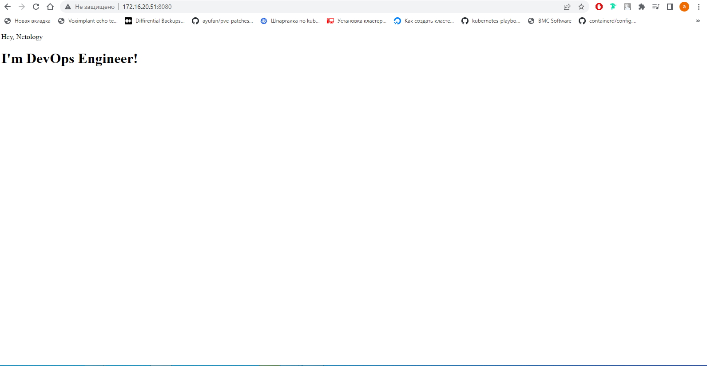

# Домашнее задание к занятию "5.3. Введение. Экосистема. Архитектура. Жизненный цикл Docker контейнера"

---

## Задача 1

Сценарий выполения задачи:

- создайте свой репозиторий на https://hub.docker.com;
- выберете любой образ, который содержит веб-сервер Nginx;
- создайте свой fork образа;
- реализуйте функциональность:
запуск веб-сервера в фоне с индекс-страницей, содержащей HTML-код ниже:
```
<html>
<head>
Hey, Netology
</head>
<body>
<h1>I’m DevOps Engineer!</h1>
</body>
</html>
```
Опубликуйте созданный форк в своем репозитории и предоставьте ответ в виде ссылки на https://hub.docker.com/username_repo.


Проверяем результат в браузере




Ссылка на репозиторий \
<https://hub.docker.com/r/elf11/nginx>
## Задача 2

Посмотрите на сценарий ниже и ответьте на вопрос:
"Подходит ли в этом сценарии использование Docker контейнеров или лучше подойдет виртуальная машина, физическая машина? Может быть возможны разные варианты?"

Детально опишите и обоснуйте свой выбор.

--

Сценарий:

#### Высоконагруженное монолитное java веб-приложение;
Физическая машина. Приложение монолитно (не подходят контейнеры) и нагружено (криточно быстродействие - не подходят ВМ).
#### Nodejs веб-приложение;
Docker контейнер. Тут в полной мере проявляются все преимущества контенеризации: скорость развертывания, масштабируемость, производительность, независимость от инфрастуктуры и тд
#### Мобильное приложение c версиями для Android и iOS;
iOS - физический хост, так как разработка возможна только в пределах macOS. Под Android можно использовать Docker
#### Шина данных на базе Apache Kafka;
Docker (для масштабирования)
#### Elasticsearch кластер для реализации логирования продуктивного веб-приложения - три ноды elasticsearch, два logstash и две ноды kibana;
Docker подходит хорошо
#### Мониторинг-стек на базе Prometheus и Grafana;
Docker подходит хорошо, так как данный стек не требователен к ресурсам. Контейнеризация позволит легко его масштабировать
#### MongoDB, как основное хранилище данных для java-приложения;
Виртуальная машина или физический сервер, так как требуется производительность. Контейнер можно использовать для невысоконагруженных БД
#### Gitlab сервер для реализации CI/CD процессов и приватный (закрытый) Docker Registry.
Docker подходит хорошо, БД хранить отдельно, используется в работе.

## Задача 3

- Запустите первый контейнер из образа ***centos*** c любым тэгом в фоновом режиме, подключив папку ```/data``` из текущей рабочей директории на хостовой машине в ```/data``` контейнера;
- Запустите второй контейнер из образа ***debian*** в фоновом режиме, подключив папку ```/data``` из текущей рабочей директории на хостовой машине в ```/data``` контейнера;
- Подключитесь к первому контейнеру с помощью ```docker exec``` и создайте текстовый файл любого содержания в ```/data```;
- Добавьте еще один файл в папку ```/data``` на хостовой машине;
- Подключитесь во второй контейнер и отобразите листинг и содержание файлов в ```/data``` контейнера.
```bash
ad@docker:~/5.3$ docker run -it -d -v $PWD/data:/data --name centos centos
Unable to find image 'centos:latest' locally
latest: Pulling from library/centos
a1d0c7532777: Pull complete 
Digest: sha256:a27fd8080b517143cbbbab9dfb7c8571c40d67d534bbdee55bd6c473f432b177
Status: Downloaded newer image for centos:latest
0e4e6610fb02e40fd604c6018dd7a160b2c320122ef31d0946ceed8d1c6af901

vad@docker:~/5.3$ docker run -it -d -v $PWD/data:/data --name debian debian
Unable to find image 'debian:latest' locally
latest: Pulling from library/debian
e756f3fdd6a3: Pull complete 
Digest: sha256:3f1d6c17773a45c97bd8f158d665c9709d7b29ed7917ac934086ad96f92e4510
Status: Downloaded newer image for debian:latest
9abe1e11e1d9125a7202d7e455174473f1048ff0523d18581c6dc67a26b508ab

ad@docker:~/5.3$ docker exec -it centos /bin/bash
[root@781fb1f78272 /]# printf 'Hello\nworld\n' > /data/1.txt
[root@781fb1f78272 /]# cat /data/1.txt
Hello
world
[root@781fb1f78272 /]# exit
exit

ad@docker:~/5.3$ sudo touch ./data/2.txt

ad@docker:~/5.3$ docker exec -it debian /bin/bash
root@568471fb55bb:/# ls /data
1.txt  2.txt
root@568471fb55bb:/# cat /data/1.txt
Hello
world
root@568471fb55bb:/# cat /data/2.txt
root@568471fb55bb:/# exit
exit
```

## Задача 4 (*)

Воспроизвести практическую часть лекции самостоятельно.

Соберите Docker образ с Ansible, загрузите на Docker Hub и пришлите ссылку вместе с остальными ответами к задачам.

<https://hub.docker.com/r/elf11/ansible>