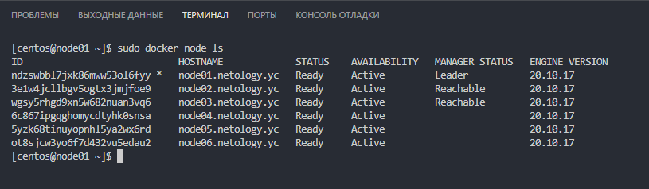
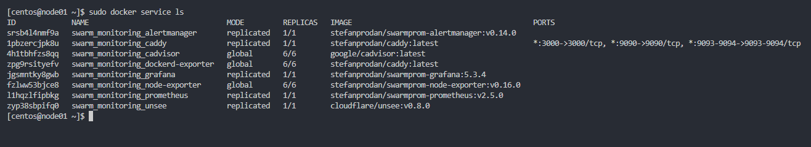

# Домашнее задание к занятию "5.5. Оркестрация кластером Docker контейнеров на примере Docker Swarm"

## Как сдавать задания

Обязательными к выполнению являются задачи без указания звездочки. Их выполнение необходимо для получения зачета и диплома о профессиональной переподготовке.

Задачи со звездочкой (*) являются дополнительными задачами и/или задачами повышенной сложности. Они не являются обязательными к выполнению, но помогут вам глубже понять тему.

Домашнее задание выполните в файле readme.md в github репозитории. В личном кабинете отправьте на проверку ссылку на .md-файл в вашем репозитории.

Любые вопросы по решению задач задавайте в чате учебной группы.

---


## Важно!

Перед отправкой работы на проверку удаляйте неиспользуемые ресурсы.
Это важно для того, чтоб предупредить неконтролируемый расход средств, полученных в результате использования промокода.

Подробные рекомендации [здесь](https://github.com/netology-code/virt-homeworks/blob/virt-11/r/README.md)

---

## Задача 1

Дайте письменые ответы на следующие вопросы:

- В чём отличие режимов работы сервисов в Docker Swarm кластере: replication и global?

Для replicated сервисов мы указываем количество идентичных задач, которых хотим запустить. Swarm отслеживает текущее количество запущенных задач и в случае падения какой-либо ноды - запустит задачу на другой (поддерживает заданное количество реплик).
Global сервис запускает одну задачу на каждой ноде. То есть при добавлении в кластер новых нод, глобальный сервис будет запущен и на ней автоматически.

- Какой алгоритм выбора лидера используется в Docker Swarm кластере?

Docker Swarm использует алгоритм консенсуса Raft для определения лидера. Этот алгоритм обеспечивает согласованное состояние кластера. Raft требует, чтобы большинство членов кластера согласились на изменение, и допускает (N-1)/2сбоев. В случае недоступности лидера, его роль берет на себя одна из нод-менеджеров (если за нее проголосовало большинство менеджеров). Реализуется это за счет таймаутов. Если в течение определенного времени менеджер не получил данные от лидера - он объявляет себя кандидатом и другие ноды голосуют за него.

- Что такое Overlay Network?

Overlay сеть - это сеть между несколькими демонами Docker. Она перекрывает сети хоста и позволяет контейнерам безопасно обмениваться данными (с использованием сертификатов и шифрования). Docker маршрутизирует пакеты к нужному хосту и контейнеру.

## Задача 2

Создать ваш первый Docker Swarm кластер в Яндекс.Облаке

Для получения зачета, вам необходимо предоставить скриншот из терминала (консоли), с выводом команды:
```
docker node ls
```

## Задача 3

Создать ваш первый, готовый к боевой эксплуатации кластер мониторинга, состоящий из стека микросервисов.

Для получения зачета, вам необходимо предоставить скриншот из терминала (консоли), с выводом команды:
```
docker service ls
```

## Задача 4 (*)

Выполнить на лидере Docker Swarm кластера команду (указанную ниже) и дать письменное описание её функционала, что она делает и зачем она нужна:
```
# см.документацию: https://docs.docker.com/engine/swarm/swarm_manager_locking/
docker swarm update --autolock=true
```

Данная команда нужна для включения автоблокировки Swarm после перезагрузки ноды.
Когда демон Docker перезапускается, ключи шифрования журналов Raft и ключи TLS для взаимодействия серверов загружаются в память каждой ноды. Чтобы защитить эти ключи, Docker может включить механизм блокировки ноды (по сути шифрование этих ключей).
После активации данного механизма при перезагрузке ноды необходимо каждый раз вводить вручную ключ шифрования, чтобы нода успешно запустилась и продолжила работу в составе кластера.