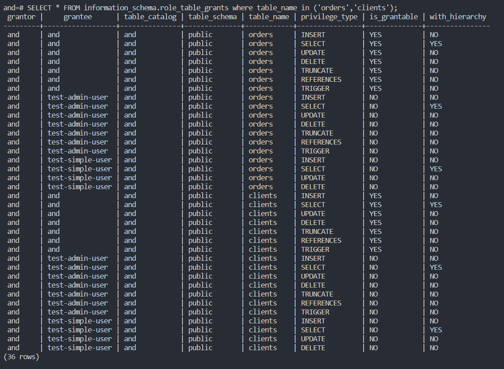

# Домашнее задание к занятию "6.2. SQL"

## Введение

Перед выполнением задания вы можете ознакомиться с 
[дополнительными материалами](https://github.com/netology-code/virt-homeworks/tree/master/additional/README.md).

## Задача 1

Используя docker поднимите инстанс PostgreSQL (версию 12) c 2 volume, 
в который будут складываться данные БД и бэкапы.

Приведите получившуюся команду или docker-compose манифест.
```
version: '3.9'
services:
  postgres:
    image: postgres:12
    environment:
      - POSTGRES_PASSWORD=and
      - POSTGRES_USER=and
    volumes:
      - ./data:/var/lib/postgresql/data
      - ./backup:/data/backup/postgres
    ports:
      - "5432:5432"
    restart: always
```
## Задача 2

В БД из задачи 1: 
- создайте пользователя test-admin-user и БД test_db
- в БД test_db создайте таблицу orders и clients (спeцификация таблиц ниже)
- предоставьте привилегии на все операции пользователю test-admin-user на таблицы БД test_db
- создайте пользователя test-simple-user  
- предоставьте пользователю test-simple-user права на SELECT/INSERT/UPDATE/DELETE данных таблиц БД test_db

Таблица orders:
- id (serial primary key)
- наименование (string)
- цена (integer)

Таблица clients:
- id (serial primary key)
- фамилия (string)
- страна проживания (string, index)
- заказ (foreign key orders)
```
root@v1272864:~/6.2# docker-compose up -d
Creating network "62_default" with the default driver
Creating 62_postgres_1 ... done
root@v1272864:~/6.2# docker ps
CONTAINER ID   IMAGE         COMMAND                  CREATED         STATUS         PORTS                                       NAMES
4e672b37110d   postgres:12   "docker-entrypoint.s…"   8 seconds ago   Up 7 seconds   0.0.0.0:5432->5432/tcp, :::5432->5432/tcp   62_postgres_1
root@v1272864:~/6.2# docker exec -it 4e672b37110d /bin/bash
root@4e672b37110d:/# psql -h 127.0.0.1 -U and
psql (12.11 (Debian 12.11-1.pgdg110+1))
Type "help" for help.

and=# CREATE USER "test-admin-user";
CREATE ROLE
and=# CREATE DATABASE test_db;
CREATE DATABASE
and=# \c test_db
You are now connected to database "test_db" as user "and".
test_db=# CREATE TABLE orders (
        id SERIAL PRIMARY KEY, 
        наименование TEXT, 
        цена INT
);
CREATE TABLE
test_db=# CREATE TABLE clients (
        id SERIAL PRIMARY KEY, 
        фамилия TEXT, 
        "страна проживания" TEXT, 
        заказ INT REFERENCES orders (id)
);
CREATE TABLE
test_db=# CREATE INDEX ON clients ("страна проживания");
CREATE INDEX
test_db=# GRANT ALL ON TABLE clients, orders TO "test-admin-user";
GRANT
test_db=# CREATE USER "test-simple-user";
CREATE ROLE
test_db=# GRANT SELECT,INSERT,UPDATE,DELETE ON TABLE clients,orders TO "test-simple-user";
GRANT
```
Приведите:
- итоговый список БД после выполнения пунктов выше,
```
test_db=# \l
                             List of databases
   Name    | Owner | Encoding |  Collate   |   Ctype    | Access privileges 
-----------+-------+----------+------------+------------+-------------------
 and       | and   | UTF8     | en_US.utf8 | en_US.utf8 | 
 postgres  | and   | UTF8     | en_US.utf8 | en_US.utf8 | 
 template0 | and   | UTF8     | en_US.utf8 | en_US.utf8 | =c/and           +
           |       |          |            |            | and=CTc/and
 template1 | and   | UTF8     | en_US.utf8 | en_US.utf8 | =c/and           +
           |       |          |            |            | and=CTc/and
 test_db   | and   | UTF8     | en_US.utf8 | en_US.utf8 | 
(5 rows)
```
- описание таблиц (describe)
```
test_db=# \d orders
                               Table "public.orders"
    Column    |  Type   | Collation | Nullable |              Default               
--------------+---------+-----------+----------+------------------------------------
 id           | integer |           | not null | nextval('orders_id_seq'::regclass)
 наименование | text    |           |          | 
 цена         | integer |           |          | 
Indexes:
    "orders_pkey" PRIMARY KEY, btree (id)
Referenced by:
    TABLE "clients" CONSTRAINT "clients_заказ_fkey" FOREIGN KEY ("заказ") REFERENCES orders(id)

test_db=# \d clients
                                  Table "public.clients"
      Column       |  Type   | Collation | Nullable |               Default               
-------------------+---------+-----------+----------+-------------------------------------
 id                | integer |           | not null | nextval('clients_id_seq'::regclass)
 фамилия           | text    |           |          | 
 страна проживания | text    |           |          | 
 заказ             | integer |           |          | 
Indexes:
    "clients_pkey" PRIMARY KEY, btree (id)
    "clients_страна проживания_idx" btree ("страна проживания")
Foreign-key constraints:
    "clients_заказ_fkey" FOREIGN KEY ("заказ") REFERENCES orders(id)
```
- SQL-запрос для выдачи списка пользователей с правами над таблицами test_db
```
SELECT * FROM information_schema.role_table_grants where table_name in ('orders','clients');
```

- список пользователей с правами над таблицами test_db
## Задача 3

Используя SQL синтаксис - наполните таблицы следующими тестовыми данными:

Таблица orders

|Наименование|цена|
|------------|----|
|Шоколад| 10 |
|Принтер| 3000 |
|Книга| 500 |
|Монитор| 7000|
|Гитара| 4000|

Таблица clients

|ФИО|Страна проживания|
|------------|----|
|Иванов Иван Иванович| USA |
|Петров Петр Петрович| Canada |
|Иоганн Себастьян Бах| Japan |
|Ронни Джеймс Дио| Russia|
|Ritchie Blackmore| Russia|
```
test_db=# INSERT INTO orders (наименование, цена )
VALUES 
    ('Шоколад', '10'),
    ('Принтер', '3000'),
    ('Книга', '500'),
    ('Монитор', '7000'),
    ('Гитара', '4000');
INSERT 0 5
test_db=# INSERT INTO clients ("фамилия", "страна проживания")
VALUES 
    ('Иванов Иван Иванович', 'USA'),
    ('Петров Петр Петрович', 'Canada'),
    ('Иоганн Себастьян Бах', 'Japan'),
    ('Ронни Джеймс Дио', 'Russia'),
    ('Ritchie Blackmore', 'Russia');
INSERT 0 5
```

Используя SQL синтаксис:
- вычислите количество записей для каждой таблицы 
- приведите в ответе:
    - запросы 
    - результаты их выполнения.
```
test_db=# SELECT 'orders' AS name_table,  COUNT(*) AS number_rows FROM orders
UNION ALL
SELECT 'clients' AS name_table,  COUNT(*) AS number_rows  FROM clients;
 name_table | number_rows 
------------+-------------
 orders     |           5
 clients    |           5
(2 rows)
```

## Задача 4

Часть пользователей из таблицы clients решили оформить заказы из таблицы orders.

Используя foreign keys свяжите записи из таблиц, согласно таблице:

|ФИО|Заказ|
|------------|----|
|Иванов Иван Иванович| Книга |
|Петров Петр Петрович| Монитор |
|Иоганн Себастьян Бах| Гитара |

Приведите SQL-запросы для выполнения данных операций.
```
test_db=# UPDATE clients SET "заказ"=3 WHERE id=1;
UPDATE 1
test_db=# UPDATE clients SET "заказ"=4 WHERE id=2;
UPDATE 1
test_db=# UPDATE clients SET "заказ"=5 WHERE id=3;
UPDATE 1
test_db=# SELECT "фамилия","заказ",orders."наименование"
FROM clients
INNER JOIN orders ON "заказ"=orders."id";
       фамилия        | заказ | наименование 
----------------------+-------+--------------
 Иванов Иван Иванович |     3 | Книга
 Петров Петр Петрович |     4 | Монитор
 Иоганн Себастьян Бах |     5 | Гитара
(3 rows)
```

Приведите SQL-запрос для выдачи всех пользователей, которые совершили заказ, а также вывод данного запроса.
```
test_db=# SELECT * FROM clients
WHERE "заказ" IS NOT null;
 id |       фамилия        | страна проживания | заказ 
----+----------------------+-------------------+-------
  1 | Иванов Иван Иванович | USA               |     3
  2 | Петров Петр Петрович | Canada            |     4
  3 | Иоганн Себастьян Бах | Japan             |     5
(3 rows)
```
 
Подсказк - используйте директиву `UPDATE`.

## Задача 5

Получите полную информацию по выполнению запроса выдачи всех пользователей из задачи 4 
(используя директиву EXPLAIN).

Приведите получившийся результат и объясните что значат полученные значения.
```
test_db=# SELECT * FROM clients
WHERE "заказ" IS NOT null;
 id |       фамилия        | страна проживания | заказ 
----+----------------------+-------------------+-------
  1 | Иванов Иван Иванович | USA               |     3
  2 | Петров Петр Петрович | Canada            |     4
  3 | Иоганн Себастьян Бах | Japan             |     5
(3 rows)

test_db=# EXPLAIN SELECT * FROM clients
WHERE "заказ" IS NOT null;
                        QUERY PLAN                         
-----------------------------------------------------------
 Seq Scan on clients  (cost=0.00..18.10 rows=806 width=72)
   Filter: ("заказ" IS NOT NULL)
(2 rows)
```

EXPLAIN показывает план запроса. В данном случае запрос простой, полезной информации мало. Мы не получили результата самого запроса, только план. Мы получили в верхней строке "стоимость" запроса (первой строки и всех строк), количество запланированных к прочтению строк и средний размер строки в байтах. Вторая строка - информация о фильтре.

## Задача 6

Создайте бэкап БД test_db и поместите его в volume, предназначенный для бэкапов (см. Задачу 1).

Остановите контейнер с PostgreSQL (но не удаляйте volumes).

Поднимите новый пустой контейнер с PostgreSQL.

Восстановите БД test_db в новом контейнере.

Приведите список операций, который вы применяли для бэкапа данных и восстановления. 
```
test_db=# pg_dump -U and -F t test_db > /data/backup/postgres/test_db.tar
root@4e672b37110d:/# exit
exit
root@v1272864:~/6.2# docker ps
CONTAINER ID   IMAGE         COMMAND                  CREATED          STATUS          PORTS                                       NAMES
4e672b37110d   postgres:12   "docker-entrypoint.s…"   26 minutes ago   Up 26 minutes   0.0.0.0:5432->5432/tcp, :::5432->5432/tcp   62_postgres_1
root@v1272864:~/6.2# docker stop 4e672b37110d
4e672b37110d
root@v1272864:~/6.2# cd ../6.2-copy
root@v1272864:~/6.2-copy# docker-compose up -d
Starting 62-copy_postgres_1 ... done
root@v1272864:~/6.2-copy# cp /root/6.2/backup/test_db.tar /root/6.2-copy/backup/
root@v1272864:~/6.2-copy# docker ps
CONTAINER ID   IMAGE         COMMAND                  CREATED          STATUS          PORTS                                       NAMES
ce734c5806d0   postgres:12   "docker-entrypoint.s…"   20 seconds ago   Up 19 seconds   0.0.0.0:5432->5432/tcp, :::5432->5432/tcp   62-copy_postgres_1
root@v1272864:~/6.2-copy# docker exec -it ce734c5806d0 /bin/bash
root@ce734c5806d0:/# psql -h 127.0.0.1 -U and
psql (12.11 (Debian 12.11-1.pgdg110+1))
Type "help" for help.

and=# create database test_db;
CREATE DATABASE
and=# CREATE USER "test-admin-user";
CREATE ROLE
and=# CREATE USER "test-simple-user";
CREATE ROLE
and=# \q
root@ce734c5806d0:/# psql -U and -d test_db -f /data/backup/postgres/test_db.tar

...

root@ce734c5806d0:/# psql -h 127.0.0.1 -U and
psql (12.11 (Debian 12.11-1.pgdg110+1))
Type "help" for help.

and=# \c test_db
You are now connected to database "test_db" as user "and".
test_db=# \d clients
                                  Table "public.clients"
      Column       |  Type   | Collation | Nullable |               Default               
-------------------+---------+-----------+----------+-------------------------------------
 id                | integer |           | not null | nextval('clients_id_seq'::regclass)
 фамилия           | text    |           |          | 
 страна проживания | text    |           |          | 
 заказ             | integer |           |          | 
Indexes:
    "clients_pkey" PRIMARY KEY, btree (id)
    "clients_страна проживания_idx" btree ("страна проживания")
Foreign-key constraints:
    "clients_заказ_fkey" FOREIGN KEY ("заказ") REFERENCES orders(id)

test_db=# \d orders
                               Table "public.orders"
    Column    |  Type   | Collation | Nullable |              Default               
--------------+---------+-----------+----------+------------------------------------
 id           | integer |           | not null | nextval('orders_id_seq'::regclass)
 наименование | text    |           |          | 
 цена         | integer |           |          | 
Indexes:
    "orders_pkey" PRIMARY KEY, btree (id)
Referenced by:
    TABLE "clients" CONSTRAINT "clients_заказ_fkey" FOREIGN KEY ("заказ") REFERENCES orders(id)
```
---

### Как cдавать задание

Выполненное домашнее задание пришлите ссылкой на .md-файл в вашем репозитории.

---
