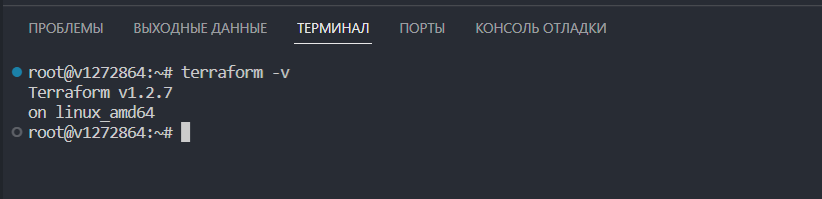
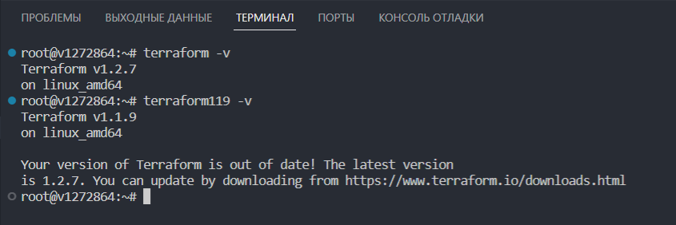

# Домашнее задание к занятию "7.1. Инфраструктура как код"

## Задача 1. Выбор инструментов. 
 
### Легенда
 
Через час совещание на котором менеджер расскажет о новом проекте. Начать работу над которым надо 
будет уже сегодня. 
На данный момент известно, что это будет сервис, который ваша компания будет предоставлять внешним заказчикам.
Первое время, скорее всего, будет один внешний клиент, со временем внешних клиентов станет больше.

Так же по разговорам в компании есть вероятность, что техническое задание еще не четкое, что приведет к большому
количеству небольших релизов, тестирований интеграций, откатов, доработок, то есть скучно не будет.  
   
Вам, как девопс инженеру, будет необходимо принять решение об инструментах для организации инфраструктуры.
На данный момент в вашей компании уже используются следующие инструменты: 
- остатки Сloud Formation, 
- некоторые образы сделаны при помощи Packer,
- год назад начали активно использовать Terraform, 
- разработчики привыкли использовать Docker, 
- уже есть большая база Kubernetes конфигураций, 
- для автоматизации процессов используется Teamcity, 
- также есть совсем немного Ansible скриптов, 
- и ряд bash скриптов для упрощения рутинных задач.  

Для этого в рамках совещания надо будет выяснить подробности о проекте, что бы в итоге определиться с инструментами:

1. Какой тип инфраструктуры будем использовать для этого проекта: изменяемый или не изменяемый?
1. Будет ли центральный сервер для управления инфраструктурой?
1. Будут ли агенты на серверах?
1. Будут ли использованы средства для управления конфигурацией или инициализации ресурсов? 
 
В связи с тем, что проект стартует уже сегодня, в рамках совещания надо будет определиться со всеми этими вопросами.

### В результате задачи необходимо

1. Ответить на четыре вопроса представленных в разделе "Легенда". 
1. Какие инструменты из уже используемых вы хотели бы использовать для нового проекта? 
1. Хотите ли рассмотреть возможность внедрения новых инструментов для этого проекта? 

Если для ответа на эти вопросы недостаточно информации, то напишите какие моменты уточните на совещании.

### Ответ:
Задание во многом схоже с тем, что сейчас есть на работе))) Готового ТЗ нет, но проект стартовал "еще позавчера".

1. Какой тип инфраструктуры будем использовать для этого проекта: изменяемый или не изменяемый?

Так как заявлено, что "техническое задание еще не четкое, что приведет к большому количеству небольших релизов, тестирований интеграций, откатов, доработок", то будем использовать изменяемый с последующим переводом на неизменяемый тип инфраструктуры. На первых порах, так как изменений будет много, можем использовать Ansible + Terraform для определения необходимых компонентов и конфигурации. В дальнейшем, когда релизы станут более стабильными, можем перейти на шаблонизацию (Packer + Terraform + Docker + Kubernetes). У нас есть наработки автоматизации, оркестрации и инициализации ресурсов, то есть будем использовать их для создания и разворачивания шаблонов новых серверов. В случае необходимости изменения серверов - создаем новый шаблон. Данный подход позволит нам поддерживать согласованность инфраструктуры (минимизировать дрейф конфигурации), обеспечить предсказуемость развертывания и быстрое масштабирование.

2. Будет ли центральный сервер для управления инфраструктурой?

Для управления инфраструктурой будем использовать центральный сервер. Это позволит нам отказаться от агентов на конечных хостах, что упростит процесс мониторинга, логирования, предоставления доступа другим участникам команды.

3. Будут ли агенты на серверах?

 Ansible и Terraform не нужны агенты, агенты не будут использоваться.

4. Будут ли использованы средства для управления конфигурацией или инициализации ресурсов? 

Да, конечно. Terraform используется активно уже год.

- Для проекта мы будем использовать:

Будет использоваться связка docker+packer+terraform для управления неизменяемой инфраструктурой и kubernetes для оркестрации контейнеров. От bash-скриптов отказываемся максимально.

- Хотите ли рассмотреть возможность внедрения новых инструментов для этого проекта?

Будет использоваться GitLab CI/CD, т.к. есть опыт его использования. Также необходимы системы сбора логов и мониторинга.

## Задача 2. Установка терраформ. 

Официальный сайт: https://www.terraform.io/

Установите терраформ при помощи менеджера пакетов используемого в вашей операционной системе.
В виде результата этой задачи приложите вывод команды `terraform --version`.

## Задача 3. Поддержка легаси кода. 

В какой-то момент вы обновили терраформ до новой версии, например с 0.12 до 0.13. 
А код одного из проектов настолько устарел, что не может работать с версией 0.13. 
В связи с этим необходимо сделать так, чтобы вы могли одновременно использовать последнюю версию терраформа установленную при помощи
штатного менеджера пакетов и устаревшую версию 0.12. 

В виде результата этой задачи приложите вывод `--version` двух версий терраформа доступных на вашем компьютере 
или виртуальной машине.

---

### Как cдавать задание

Выполненное домашнее задание пришлите ссылкой на .md-файл в вашем репозитории.

---
