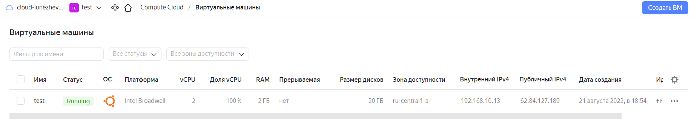

# Домашнее задание к занятию "7.2. Облачные провайдеры и синтаксис Terraform."

Зачастую разбираться в новых инструментах гораздо интересней понимая то, как они работают изнутри. 
Поэтому в рамках первого *необязательного* задания предлагается завести свою учетную запись в AWS (Amazon Web Services) или Yandex.Cloud.
Идеально будет познакомится с обоими облаками, потому что они отличаются. 

## Задача 1 (вариант с AWS). Регистрация в aws и знакомство с основами (необязательно, но крайне желательно).

Остальные задания можно будет выполнять и без этого аккаунта, но с ним можно будет увидеть полный цикл процессов. 

AWS предоставляет достаточно много бесплатных ресурсов в первый год после регистрации, подробно описано [здесь](https://aws.amazon.com/free/).
1. Создайте аккаут aws.
1. Установите c aws-cli https://aws.amazon.com/cli/.
1. Выполните первичную настройку aws-sli https://docs.aws.amazon.com/cli/latest/userguide/cli-configure-quickstart.html.
1. Создайте IAM политику для терраформа c правами
    * AmazonEC2FullAccess
    * AmazonS3FullAccess
    * AmazonDynamoDBFullAccess
    * AmazonRDSFullAccess
    * CloudWatchFullAccess
    * IAMFullAccess
1. Добавьте переменные окружения 
    ```
    export AWS_ACCESS_KEY_ID=(your access key id)
    export AWS_SECRET_ACCESS_KEY=(your secret access key)
    ```
1. Создайте, остановите и удалите ec2 инстанс (любой с пометкой `free tier`) через веб интерфейс. 

В виде результата задания приложите вывод команды `aws configure list`.

## Задача 1 (Вариант с Yandex.Cloud). Регистрация в ЯО и знакомство с основами (необязательно, но крайне желательно).

1. Подробная инструкция на русском языке содержится [здесь](https://cloud.yandex.ru/docs/solutions/infrastructure-management/terraform-quickstart).
2. Обратите внимание на период бесплатного использования после регистрации аккаунта. 
3. Используйте раздел "Подготовьте облако к работе" для регистрации аккаунта. Далее раздел "Настройте провайдер" для подготовки
базового терраформ конфига.
4. Воспользуйтесь [инструкцией](https://registry.terraform.io/providers/yandex-cloud/yandex/latest/docs) на сайте терраформа, что бы 
не указывать авторизационный токен в коде, а терраформ провайдер брал его из переменных окружений.

## Задача 2. Создание aws ec2 или yandex_compute_instance через терраформ. 

1. В каталоге `terraform` вашего основного репозитория, который был создан в начале курсе, создайте файл `main.tf` и `versions.tf`.
2. Зарегистрируйте провайдер 
   1. для [aws](https://registry.terraform.io/providers/hashicorp/aws/latest/docs). В файл `main.tf` добавьте
   блок `provider`, а в `versions.tf` блок `terraform` с вложенным блоком `required_providers`. Укажите любой выбранный вами регион 
   внутри блока `provider`.
   2. либо для [yandex.cloud](https://registry.terraform.io/providers/yandex-cloud/yandex/latest/docs). Подробную инструкцию можно найти 
   [здесь](https://cloud.yandex.ru/docs/solutions/infrastructure-management/terraform-quickstart).
3. Внимание! В гит репозиторий нельзя пушить ваши личные ключи доступа к аккаунту. Поэтому в предыдущем задании мы указывали
их в виде переменных окружения. 
4. В файле `main.tf` воспользуйтесь блоком `data "aws_ami` для поиска ami образа последнего Ubuntu.  
5. В файле `main.tf` создайте рессурс 
   1. либо [ec2 instance](https://registry.terraform.io/providers/hashicorp/aws/latest/docs/resources/instance).
   Постарайтесь указать как можно больше параметров для его определения. Минимальный набор параметров указан в первом блоке 
   `Example Usage`, но желательно, указать большее количество параметров.
   2. либо [yandex_compute_image](https://registry.terraform.io/providers/yandex-cloud/yandex/latest/docs/resources/compute_image).
6. Также в случае использования aws:
   1. Добавьте data-блоки `aws_caller_identity` и `aws_region`.
   2. В файл `outputs.tf` поместить блоки `output` с данными об используемых в данный момент: 
       * AWS account ID,
       * AWS user ID,
       * AWS регион, который используется в данный момент, 
       * Приватный IP ec2 инстансы,
       * Идентификатор подсети в которой создан инстанс.  
7. Если вы выполнили первый пункт, то добейтесь того, что бы команда `terraform plan` выполнялась без ошибок. 


В качестве результата задания предоставьте:
1. Ответ на вопрос: при помощи какого инструмента (из разобранных на прошлом занятии) можно создать свой образ ami?
1. Ссылку на репозиторий с исходной конфигурацией терраформа.  
 
---
### Ответ:
[main.tf](https://github.com/lunezhev/devops-netology/blob/main/terraform/main.tf)

[main.tf](https://github.com/lunezhev/devops-netology/blob/main/terraform/versions.tf)

[outputs.tf](https://github.com/lunezhev/devops-netology/blob/main/terraform/outputs.tf)


<details>
<summary>В переменную получаем токен сервисного аккаунта (с оф. сайта terraform)</summary>

```
root@v1272864:~/devops-netology/terraform# yc iam service-account list --folder-id b1g63r6cv324nqcitmbp
+----------------------+------------------+
|          ID          |       NAME       |
+----------------------+------------------+
| ajecdb2h49krqb7h0vmv | service-account1 |
+----------------------+------------------+

root@v1272864:~/devops-netology/terraform# export YC_TOKEN=`yc iam create-token`
```

</details>

<details>
<summary>terraform init</summary>

```
root@v1272864:~/devops-netology/terraform# terraform init

Initializing the backend...

Initializing provider plugins...
- Finding latest version of yandex-cloud/yandex...
- Installing yandex-cloud/yandex v0.77.0...
- Installed yandex-cloud/yandex v0.77.0 (self-signed, key ID E40F590B50BB8E40)

Partner and community providers are signed by their developers.
If you'd like to know more about provider signing, you can read about it here:
https://www.terraform.io/docs/cli/plugins/signing.html

Terraform has created a lock file .terraform.lock.hcl to record the provider
selections it made above. Include this file in your version control repository
so that Terraform can guarantee to make the same selections by default when
you run "terraform init" in the future.

Terraform has been successfully initialized!

You may now begin working with Terraform. Try running "terraform plan" to see
any changes that are required for your infrastructure. All Terraform commands
should now work.

If you ever set or change modules or backend configuration for Terraform,
rerun this command to reinitialize your working directory. If you forget, other
commands will detect it and remind you to do so if necessary.
```

</details>

<details>
<summary>terraform plan</summary>

```
root@v1272864:~/devops-netology/terraform# terraform plan

Terraform used the selected providers to generate the following execution plan. Resource actions are indicated with the following symbols:
  + create

Terraform will perform the following actions:

  # yandex_compute_instance.test will be created
  + resource "yandex_compute_instance" "test" {
      + created_at                = (known after apply)
      + folder_id                 = (known after apply)
      + fqdn                      = (known after apply)
      + hostname                  = (known after apply)
      + id                        = (known after apply)
      + metadata                  = {
          + "ssh-keys" = <<-EOT
                ubuntu:ssh-rsa AAAAB3NzaC1yc2EAAAADAQABAAABAQD9UPABZvMBObtq35baOzfoRUreDBq1lFj9OnLPR8LNxHNwE90cp2bHZ5HfDJnsNvpQZZu+baQk6urgscG1ze8FJX/HjdGO2o4EsalAdyaod7tGi0m62kYvqI5ZyJqs12t7lrEoEdPWmxsk/cyFlfFxr+n22zUkGj1TeDBiro2W9s7na6nBfOIoVh7QI8UF8SCK7wiVGLDt/uK7nDHjIw7OxLIu68q42AoWZZJ0UmoPjHwBPedbnQxtVbD1LECiXlfGkiJdLdKLz0TRvrC24gfDq+QSopsyAhiXmo6cd+S0dNNcLCA8eL0Zm+wH6SsLioDvX2kv/+XAh40TjrT+8pLP root@v1272864.hosted-by-vdsina.ru
            EOT
        }
      + name                      = "test"
      + network_acceleration_type = "standard"
      + platform_id               = "standard-v1"
      + service_account_id        = (known after apply)
      + status                    = (known after apply)
      + zone                      = (known after apply)

      + boot_disk {
          + auto_delete = true
          + device_name = (known after apply)
          + disk_id     = (known after apply)
          + mode        = (known after apply)

          + initialize_params {
              + block_size  = (known after apply)
              + description = (known after apply)
              + image_id    = "fd8ju9iqf6g5bcq77jns"
              + name        = "root-test"
              + size        = 20
              + snapshot_id = (known after apply)
              + type        = "network-nvme"
            }
        }

      + network_interface {
          + index              = (known after apply)
          + ip_address         = (known after apply)
          + ipv4               = true
          + ipv6               = (known after apply)
          + ipv6_address       = (known after apply)
          + mac_address        = (known after apply)
          + nat                = true
          + nat_ip_address     = (known after apply)
          + nat_ip_version     = (known after apply)
          + security_group_ids = (known after apply)
          + subnet_id          = (known after apply)
        }

      + placement_policy {
          + host_affinity_rules = (known after apply)
          + placement_group_id  = (known after apply)
        }

      + resources {
          + core_fraction = 100
          + cores         = 2
          + memory        = 2
        }

      + scheduling_policy {
          + preemptible = (known after apply)
        }
    }

  # yandex_vpc_network.test_network will be created
  + resource "yandex_vpc_network" "test_network" {
      + created_at                = (known after apply)
      + default_security_group_id = (known after apply)
      + folder_id                 = (known after apply)
      + id                        = (known after apply)
      + labels                    = (known after apply)
      + name                      = "test_network"
      + subnet_ids                = (known after apply)
    }

  # yandex_vpc_subnet.test_subnet will be created
  + resource "yandex_vpc_subnet" "test_subnet" {
      + created_at     = (known after apply)
      + folder_id      = (known after apply)
      + id             = (known after apply)
      + labels         = (known after apply)
      + name           = "test_subnet"
      + network_id     = (known after apply)
      + v4_cidr_blocks = [
          + "192.168.10.0/24",
        ]
      + v6_cidr_blocks = (known after apply)
      + zone           = "ru-central1-a"
    }

Plan: 3 to add, 0 to change, 0 to destroy.

Changes to Outputs:
  + external_ip_address_test = (known after apply)
  + internal_ip_address_test = (known after apply)

────────────────────────────────────────────────────────────────────────────────────────────────────────────────────────────────────────────────────────────────────────

Note: You didn't use the -out option to save this plan, so Terraform can't guarantee to take exactly these actions if you run "terraform apply" now.
```

</details>

<details>
<summary>terraform apply</summary>

```
root@v1272864:~/devops-netology/terraform# terraform apply -auto-approve

Terraform used the selected providers to generate the following execution plan. Resource actions are indicated with the following symbols:
  + create

Terraform will perform the following actions:

  # yandex_compute_instance.test will be created
  + resource "yandex_compute_instance" "test" {
      + created_at                = (known after apply)
      + folder_id                 = (known after apply)
      + fqdn                      = (known after apply)
      + hostname                  = (known after apply)
      + id                        = (known after apply)
      + metadata                  = {
          + "ssh-keys" = <<-EOT
                ubuntu:ssh-rsa AAAAB3NzaC1yc2EAAAADAQABAAABAQD9UPABZvMBObtq35baOzfoRUreDBq1lFj9OnLPR8LNxHNwE90cp2bHZ5HfDJnsNvpQZZu+baQk6urgscG1ze8FJX/HjdGO2o4EsalAdyaod7tGi0m62kYvqI5ZyJqs12t7lrEoEdPWmxsk/cyFlfFxr+n22zUkGj1TeDBiro2W9s7na6nBfOIoVh7QI8UF8SCK7wiVGLDt/uK7nDHjIw7OxLIu68q42AoWZZJ0UmoPjHwBPedbnQxtVbD1LECiXlfGkiJdLdKLz0TRvrC24gfDq+QSopsyAhiXmo6cd+S0dNNcLCA8eL0Zm+wH6SsLioDvX2kv/+XAh40TjrT+8pLP root@v1272864.hosted-by-vdsina.ru
            EOT
        }
      + name                      = "test"
      + network_acceleration_type = "standard"
      + platform_id               = "standard-v1"
      + service_account_id        = (known after apply)
      + status                    = (known after apply)
      + zone                      = (known after apply)

      + boot_disk {
          + auto_delete = true
          + device_name = (known after apply)
          + disk_id     = (known after apply)
          + mode        = (known after apply)

          + initialize_params {
              + block_size  = (known after apply)
              + description = (known after apply)
              + image_id    = "fd8ju9iqf6g5bcq77jns"
              + name        = "root-test"
              + size        = 20
              + snapshot_id = (known after apply)
              + type        = "network-nvme"
            }
        }

      + network_interface {
          + index              = (known after apply)
          + ip_address         = (known after apply)
          + ipv4               = true
          + ipv6               = (known after apply)
          + ipv6_address       = (known after apply)
          + mac_address        = (known after apply)
          + nat                = true
          + nat_ip_address     = (known after apply)
          + nat_ip_version     = (known after apply)
          + security_group_ids = (known after apply)
          + subnet_id          = (known after apply)
        }

      + placement_policy {
          + host_affinity_rules = (known after apply)
          + placement_group_id  = (known after apply)
        }

      + resources {
          + core_fraction = 100
          + cores         = 2
          + memory        = 2
        }

      + scheduling_policy {
          + preemptible = (known after apply)
        }
    }

  # yandex_vpc_network.test_network will be created
  + resource "yandex_vpc_network" "test_network" {
      + created_at                = (known after apply)
      + default_security_group_id = (known after apply)
      + folder_id                 = (known after apply)
      + id                        = (known after apply)
      + labels                    = (known after apply)
      + name                      = "test_network"
      + subnet_ids                = (known after apply)
    }

  # yandex_vpc_subnet.test_subnet will be created
  + resource "yandex_vpc_subnet" "test_subnet" {
      + created_at     = (known after apply)
      + folder_id      = (known after apply)
      + id             = (known after apply)
      + labels         = (known after apply)
      + name           = "test_subnet"
      + network_id     = (known after apply)
      + v4_cidr_blocks = [
          + "192.168.10.0/24",
        ]
      + v6_cidr_blocks = (known after apply)
      + zone           = "ru-central1-a"
    }

Plan: 3 to add, 0 to change, 0 to destroy.

Changes to Outputs:
  + external_ip_address_test = (known after apply)
  + internal_ip_address_test = (known after apply)
yandex_vpc_network.test_network: Creating...
yandex_vpc_network.test_network: Creation complete after 1s [id=enp0k27nu3fdaihnbcgr]
yandex_vpc_subnet.test_subnet: Creating...
yandex_vpc_subnet.test_subnet: Creation complete after 1s [id=e9babnbhj7u3fh6aj78t]
yandex_compute_instance.test: Creating...
yandex_compute_instance.test: Still creating... [10s elapsed]
yandex_compute_instance.test: Still creating... [20s elapsed]
yandex_compute_instance.test: Creation complete after 22s [id=fhmsrdsmtelieurnnk9a]

Apply complete! Resources: 3 added, 0 changed, 0 destroyed.

Outputs:

external_ip_address_test = "62.84.127.189"
internal_ip_address_test = "192.168.10.13"
```

</details>

<br/>



<details>
<summary>Подключаемся к созданной машине по ssh</summary>

```
root@v1272864:~/devops-netology/terraform# ssh ubuntu@62.84.127.189
The authenticity of host '62.84.127.189 (62.84.127.189)' can't be established.
ECDSA key fingerprint is SHA256:HR0yaE/+BxcOPxWVSnc3r1taFGrI1hWv6VTIlkjN7xQ.
Are you sure you want to continue connecting (yes/no/[fingerprint])? yes
Warning: Permanently added '62.84.127.189' (ECDSA) to the list of known hosts.
Welcome to Ubuntu 20.04.4 LTS (GNU/Linux 5.4.0-122-generic x86_64)

 * Documentation:  https://help.ubuntu.com
 * Management:     https://landscape.canonical.com
 * Support:        https://ubuntu.com/advantage

The programs included with the Ubuntu system are free software;
the exact distribution terms for each program are described in the
individual files in /usr/share/doc/*/copyright.

Ubuntu comes with ABSOLUTELY NO WARRANTY, to the extent permitted by
applicable law.

To run a command as administrator (user "root"), use "sudo <command>".
See "man sudo_root" for details.

ubuntu@fhmsrdsmtelieurnnk9a:~$ 
```
</details>

<details>
<summary>Удаляем</summary>

```
ubuntu@fhmsrdsmtelieurnnk9a:~$ exit
logout
Connection to 62.84.127.189 closed.
root@v1272864:~/devops-netology/terraform# terraform destroy -auto-approve
```

</details>

---
При помощи какого инструмента (из разобранных на прошлом занятии) можно создать свой образ ami?
```
При помощи packer от того же Hashicorp. Доводилось пользоваться))) 
```

---
### Как cдавать задание

Выполненное домашнее задание пришлите ссылкой на .md-файл в вашем репозитории.

---
