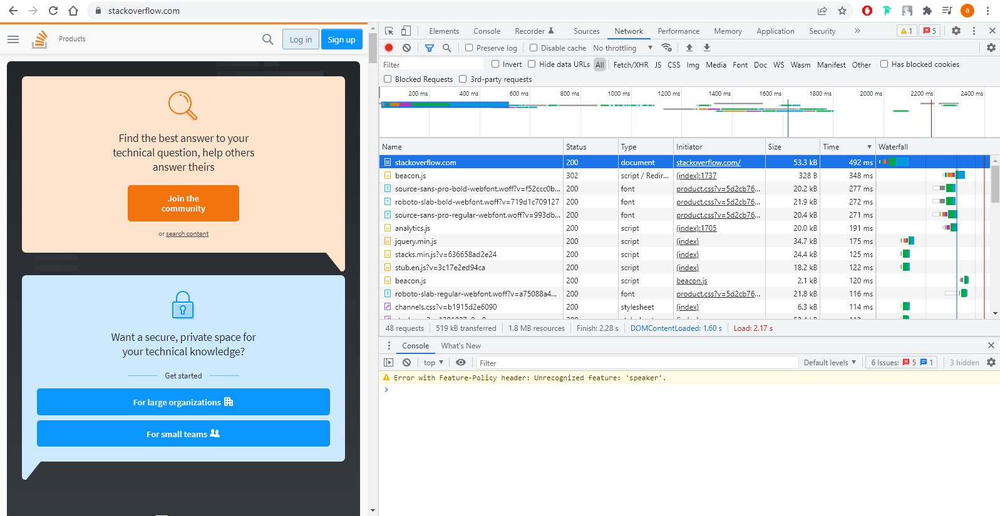

# devops-netology
## Домашнее задание к занятию "3.5. Файловые системы"
```


1. Изучил. Хорошее решение для хранения больших файлов, таких как бэкапы, образы виртуальных машин, торрентов


2. Владелец и права будут одни и те же, т.к. хардлинк - ссылка на тот же самый файл и индексный дескриптор тот же самый.

vagrant@vagrant:~$ touch test_file
vagrant@vagrant:~$ ln test_file test_link
vagrant@vagrant:~$ ls -ilh
total 40K
131081 -rw-r--r-- 1 vagrant vagrant 40K Dec  5 12:22 '-l root'
131091 -rw-rw-r-- 2 vagrant vagrant   0 Feb 14 13:47  test_file
131091 -rw-rw-r-- 2 vagrant vagrant   0 Feb 14 13:47  test_link
vagrant@vagrant:~$ chmod 0755 test_file
vagrant@vagrant:~$ ls -ilh
total 40K
131081 -rw-r--r-- 1 vagrant vagrant 40K Dec  5 12:22 '-l root'
131091 -rwxr-xr-x 2 vagrant vagrant   0 Feb 14 13:47  test_file
131091 -rwxr-xr-x 2 vagrant vagrant   0 Feb 14 13:47  test_link

3. Создал
vagrant@vagrant:~$ lsblk
NAME                 MAJ:MIN RM  SIZE RO TYPE MOUNTPOINT
sda                    8:0    0   64G  0 disk
├─sda1                 8:1    0  512M  0 part /boot/efi
├─sda2                 8:2    0    1K  0 part
└─sda5                 8:5    0 63.5G  0 part
  ├─vgvagrant-root   253:0    0 62.6G  0 lvm  /
  └─vgvagrant-swap_1 253:1    0  980M  0 lvm  [SWAP]
sdb                    8:16   0  2.5G  0 disk
sdc                    8:32   0  2.5G  0 disk
sr0                   11:0    1 58.3M  0 rom

4. 
vagrant@vagrant:~$ sudo fdisk /dev/sdb

Welcome to fdisk (util-linux 2.34).
Changes will remain in memory only, until you decide to write them.
Be careful before using the write command.


Command (m for help): p
Disk /dev/sdb: 2.51 GiB, 2684354560 bytes, 5242880 sectors
Disk model: VBOX HARDDISK
Units: sectors of 1 * 512 = 512 bytes
Sector size (logical/physical): 512 bytes / 512 bytes
I/O size (minimum/optimal): 512 bytes / 512 bytes
Disklabel type: dos
Disk identifier: 0x999d023e

Device     Boot   Start     End Sectors  Size Id Type
/dev/sdb1          2048 4196351 4194304    2G 83 Linux
/dev/sdb2       4196352 5242879 1046528  511M 83 Linux

5. 
root@vagrant:~# sfdisk -d /dev/sdb|sfdisk --force /dev/sdc
Checking that no-one is using this disk right now ... OK

Disk /dev/sdc: 2.51 GiB, 2684354560 bytes, 5242880 sectors
Disk model: VBOX HARDDISK
Units: sectors of 1 * 512 = 512 bytes
Sector size (logical/physical): 512 bytes / 512 bytes
I/O size (minimum/optimal): 512 bytes / 512 bytes

>>> Script header accepted.
>>> Script header accepted.
>>> Script header accepted.
>>> Script header accepted.
>>> Created a new DOS disklabel with disk identifier 0x999d023e.
/dev/sdc1: Created a new partition 1 of type 'Linux' and of size 2 GiB.
/dev/sdc2: Created a new partition 2 of type 'Linux' and of size 511 MiB.
/dev/sdc3: Done.

New situation:
Disklabel type: dos
Disk identifier: 0x999d023e

Device     Boot   Start     End Sectors  Size Id Type
/dev/sdc1          2048 4196351 4194304    2G 83 Linux
/dev/sdc2       4196352 5242879 1046528  511M 83 Linux

The partition table has been altered.
Calling ioctl() to re-read partition table.
Syncing disks.

Device     Boot   Start     End Sectors  Size Id Type
/dev/sdc1          2048 4196351 4194304    2G 83 Linux
/dev/sdc2       4196352 5242879 1046528  511M 83 Linux

6. 
root@vagrant:~# mdadm --create --verbose /dev/md1 -l 1 -n 2 /dev/sd{b1,c1}
mdadm: Note: this array has metadata at the start and
    may not be suitable as a boot device.  If you plan to
    store '/boot' on this device please ensure that
    your boot-loader understands md/v1.x metadata, or use
    --metadata=0.90
mdadm: size set to 2094080K
Continue creating array? y
mdadm: Defaulting to version 1.2 metadata
mdadm: array /dev/md1 started.

7. 
root@vagrant:~# mdadm --create --verbose /dev/md2 -l 1 -n 2 /dev/sd{b2,c2}
mdadm: Note: this array has metadata at the start and
    may not be suitable as a boot device.  If you plan to
    store '/boot' on this device please ensure that
    your boot-loader understands md/v1.x metadata, or use
    --metadata=0.90
mdadm: size set to 522240K
Continue creating array? y
mdadm: Defaulting to version 1.2 metadata
mdadm: array /dev/md2 started.

8. 
root@vagrant:~# pvcreate /dev/md1 /dev/md2
  Physical volume "/dev/md1" successfully created.
  Physical volume "/dev/md2" successfully created.

9. 
root@vagrant:~# vgcreate vg1 /dev/md1 /dev/md2
  Volume group "vg1" successfully created

10. 
root@vagrant:~# lvcreate -L 100M vg1 /dev/md2
  Logical volume "lvol0" created.
root@vagrant:~# lvs
  LV     VG        Attr       LSize   Pool Origin Data%  Meta%  Move Log Cpy%Sync Convert
  lvol0  vg1       -wi-a----- 100.00m
  root   vgvagrant -wi-ao---- <62.54g
  swap_1 vgvagrant -wi-ao---- 980.00m

11. 
root@vagrant:~# mkfs.ext4 /dev/vg1/lvol0
mke2fs 1.45.5 (07-Jan-2020)
Creating filesystem with 25600 4k blocks and 25600 inodes

Allocating group tables: done
Writing inode tables: done
Creating journal (1024 blocks): done
Writing superblocks and filesystem accounting information: done

12. 
root@vagrant:~# mkdir /tmp/new
root@vagrant:~# mount /dev/vg1/lvol0 /tmp/new

13. 
root@vagrant:~# wget https://mirror.yandex.ru/ubuntu/ls-lR.gz -O /tmp/new/test.gz
--2022-02-14 14:39:18--  https://mirror.yandex.ru/ubuntu/ls-lR.gz
Resolving mirror.yandex.ru (mirror.yandex.ru)... 213.180.204.183, 2a02:6b8::183
Connecting to mirror.yandex.ru (mirror.yandex.ru)|213.180.204.183|:443... connected.
HTTP request sent, awaiting response... 200 OK
Length: 22316792 (21M) [application/octet-stream]
Saving to: ‘/tmp/new/test.gz’

/tmp/new/test.gz              100%[=================================================>]  21.28M  1.32MB/s    in 12s

2022-02-14 14:39:31 (1.72 MB/s) - ‘/tmp/new/test.gz’ saved [22316792/22316792]

root@vagrant:~# ls /tmp/new
lost+found  test.gz

14. 
root@vagrant:~# lsblk
NAME                 MAJ:MIN RM  SIZE RO TYPE  MOUNTPOINT
sda                    8:0    0   64G  0 disk
├─sda1                 8:1    0  512M  0 part  /boot/efi
├─sda2                 8:2    0    1K  0 part
└─sda5                 8:5    0 63.5G  0 part
  ├─vgvagrant-root   253:0    0 62.6G  0 lvm   /
  └─vgvagrant-swap_1 253:1    0  980M  0 lvm   [SWAP]
sdb                    8:16   0  2.5G  0 disk
├─sdb1                 8:17   0    2G  0 part
│ └─md1                9:1    0    2G  0 raid1
└─sdb2                 8:18   0  511M  0 part
  └─md2                9:2    0  510M  0 raid1
    └─vg1-lvol0      253:2    0  100M  0 lvm   /tmp/new
sdc                    8:32   0  2.5G  0 disk
├─sdc1                 8:33   0    2G  0 part
│ └─md1                9:1    0    2G  0 raid1
└─sdc2                 8:34   0  511M  0 part
  └─md2                9:2    0  510M  0 raid1
    └─vg1-lvol0      253:2    0  100M  0 lvm   /tmp/new
sr0                   11:0    1 58.3M  0 rom

15. 
root@vagrant:~# gzip -t /tmp/new/test.gz && echo $?
0

16. 
root@vagrant:~# pvmove /dev/md2
  /dev/md2: Moved: 12.00%
  /dev/md2: Moved: 100.00%

17. 
root@vagrant:~# mdadm /dev/md1 --fail /dev/sdb1
mdadm: set /dev/sdb1 faulty in /dev/md1

root@vagrant:~# mdadm -D /dev/md1
/dev/md1:
           Version : 1.2
     Creation Time : Mon Feb 14 14:22:28 2022
        Raid Level : raid1
        Array Size : 2094080 (2045.00 MiB 2144.34 MB)
     Used Dev Size : 2094080 (2045.00 MiB 2144.34 MB)
      Raid Devices : 2
     Total Devices : 2
       Persistence : Superblock is persistent

       Update Time : Mon Feb 14 14:44:38 2022
             State : clean, degraded
    Active Devices : 1
   Working Devices : 1
    Failed Devices : 1
     Spare Devices : 0

Consistency Policy : resync

              Name : vagrant:1  (local to host vagrant)
              UUID : b324da8a:0df9c0b4:8b3f106a:3fefbf61
            Events : 19

    Number   Major   Minor   RaidDevice State
       -       0        0        0      removed
       1       8       33        1      active sync   /dev/sdc1

       0       8       17        -      faulty   /dev/sdb1

18. 
root@vagrant:~# dmesg |grep md1
[ 1489.221321] md/raid1:md1: not clean -- starting background reconstruction
[ 1489.221322] md/raid1:md1: active with 2 out of 2 mirrors
[ 1489.221333] md1: detected capacity change from 0 to 2144337920
[ 1489.221716] md: resync of RAID array md1
[ 1499.503749] md: md1: resync done.
[ 2817.462503] md/raid1:md1: Disk failure on sdb1, disabling device.
               md/raid1:md1: Operation continuing on 1 devices.

19. 
root@vagrant:~# gzip -t /tmp/new/test.gz && echo $?
0

20.
vagrant@vagrant:~$ exit
logout
Connection to 127.0.0.1 closed.
PS D:\vagrant> vagrant destroy
    default: Are you sure you want to destroy the 'default' VM? [y/N] ==> default: Forcing shutdown of VM...
==> default: Destroying VM and associated drives...

```
## Домашнее задание к занятию "3.6. Компьютерные сети, лекция 1"
```
1. 
vagrant@vagrant:~$ telnet stackoverflow.com 80
Trying 151.101.193.69...
Connected to stackoverflow.com.
Escape character is '^]'.
GET /questions HTTP/1.0
HOST: stackoverflow.com

HTTP/1.1 301 Moved Permanently
cache-control: no-cache, no-store, must-revalidate
location: https://stackoverflow.com/questions
x-request-guid: ab254a9a-4518-434d-96cd-df4b03cb6ec3
feature-policy: microphone 'none'; speaker 'none'
content-security-policy: upgrade-insecure-requests; frame-ancestors 'self' https://stackexchange.com
Accept-Ranges: bytes
Date: Mon, 14 Feb 2022 15:55:28 GMT
Via: 1.1 varnish
Connection: close
X-Served-By: cache-hel1410032-HEL
X-Cache: MISS
X-Cache-Hits: 0
X-Timer: S1644854128.229837,VS0,VE110
Vary: Fastly-SSL
X-DNS-Prefetch-Control: off
Set-Cookie: prov=9d4aa1fe-4ef0-ed1a-dcef-f34bb6f5fe86; domain=.stackoverflow.com; expires=Fri, 01-Jan-2055 00:00:00 GMT; path=/; HttpOnly

Connection closed by foreign host.

Код 301, означает что мы перенаправлены. В данном случае на https://stackoverflow.com/questions

2. Request URL: http://stackoverflow.com/
Request Method: GET
Status Code: 307 Internal Redirect
Referrer Policy: strict-origin-when-cross-origin
Location: https://stackoverflow.com/
Non-Authoritative-Reason: HSTS

Время загрузки страницы Load: 2.17 s
Дольше всего обрабатывался запрос на открытие содержимого самой страницы https://stackoverflow.com/

```


```


3. Мой адрес 46.146.32.77

4. Р-Телеком, '46.146.32.0/22AS12768'
vagrant@vagrant:~$ whois 46.146.32.77
% This is the RIPE Database query service.
% The objects are in RPSL format.
%
% The RIPE Database is subject to Terms and Conditions.
% See http://www.ripe.net/db/support/db-terms-conditions.pdf

% Note: this output has been filtered.
%       To receive output for a database update, use the "-B" flag.

% Information related to '46.146.0.0 - 46.146.95.255'

% Abuse contact for '46.146.0.0 - 46.146.95.255' is 'abuse@domru.ru'

inetnum:        46.146.0.0 - 46.146.95.255
netname:        ERTH-PERM-PPPOE-2-NET
descr:          JSC "ER-Telecom" Perm'
descr:          Individual PPPoE customers
descr:          Perm', Russia
country:        RU
admin-c:        RAID1-RIPE
org:            ORG-RA21-RIPE
tech-c:         RAID1-RIPE
status:         ASSIGNED PA
mnt-by:         RAID-MNT
created:        2011-01-21T05:33:41Z
last-modified:  2011-01-21T05:33:41Z
source:         RIPE # Filtered

organisation:   ORG-RA21-RIPE
org-name:       JSC "ER-Telecom Holding"
country:        RU
org-type:       LIR
address:        str. Shosse Kosmonavtov, 111, bldg. 43, office 509
address:        614990
address:        Perm
address:        RUSSIAN FEDERATION
phone:          +7 342 2462233
fax-no:         +7 342 2195024
admin-c:        ERTH3-RIPE
tech-c:         RAID1-RIPE
abuse-c:        RAID1-RIPE
mnt-ref:        RIPE-NCC-HM-MNT
mnt-ref:        RAID-MNT
mnt-ref:        ENFORTA-MNT
mnt-ref:        AS8345-MNT
mnt-ref:        RU-NTK-MNT
mnt-by:         RIPE-NCC-HM-MNT
mnt-by:         RAID-MNT
created:        2004-04-17T11:56:55Z
last-modified:  2021-05-17T06:43:35Z
source:         RIPE # Filtered

role:           ER-Telecom ISP Contact Role
address:        JSC "ER-Telecom"
address:        111, str. Shosse Kosmonavtov
address:        614000 Perm
address:        Russian Federation
phone:          +7 342 2462233
fax-no:         +7 342 2463344
abuse-mailbox:  abuse@domru.ru
remarks:        24/7 phone number: +7-342-2362233
admin-c:        AAP113-RIPE
tech-c:         AAP113-RIPE
tech-c:         GRIF59-RIPE
nic-hdl:        RAID1-RIPE
mnt-by:         RAID-MNT
created:        2005-02-11T12:50:50Z
last-modified:  2022-01-11T06:25:37Z
source:         RIPE # Filtered

% Information related to '46.146.32.0/22AS12768'

route:          46.146.32.0/22
origin:         AS12768
org:            ORG-RA21-RIPE
descr:          OJSC "ER-Telecom" Perm'
descr:          Perm', Russia
mnt-by:         RAID-MNT
created:        2010-10-19T13:04:45Z
last-modified:  2011-01-19T06:12:13Z
source:         RIPE # Filtered

organisation:   ORG-RA21-RIPE
org-name:       JSC "ER-Telecom Holding"
country:        RU
org-type:       LIR
address:        str. Shosse Kosmonavtov, 111, bldg. 43, office 509
address:        614990
address:        Perm
address:        RUSSIAN FEDERATION
phone:          +7 342 2462233
fax-no:         +7 342 2195024
admin-c:        ERTH3-RIPE
tech-c:         RAID1-RIPE
abuse-c:        RAID1-RIPE
mnt-ref:        RIPE-NCC-HM-MNT
mnt-ref:        RAID-MNT
mnt-ref:        ENFORTA-MNT
mnt-ref:        AS8345-MNT
mnt-ref:        RU-NTK-MNT
mnt-by:         RIPE-NCC-HM-MNT
mnt-by:         RAID-MNT
created:        2004-04-17T11:56:55Z
last-modified:  2021-05-17T06:43:35Z
source:         RIPE # Filtered

% This query was served by the RIPE Database Query Service version 1.102.2 (WAGYU)

5. У меня сработало только с параметром -I (ICMP), UDP не работал.
root@vagrant:~# traceroute -I -n 8.8.8.8
traceroute to 8.8.8.8 (8.8.8.8), 30 hops max, 60 byte packets
 1  10.0.2.2  0.073 ms  0.059 ms  0.054 ms
 2  192.168.1.1  2.194 ms  2.271 ms  2.265 ms
 3  10.95.255.254  2.629 ms  2.626 ms  2.668 ms
 4  212.33.233.57  2.987 ms  3.012 ms  4.107 ms
 5  72.14.215.165  23.602 ms  23.600 ms  23.599 ms
 6  72.14.215.166  20.253 ms  20.273 ms  20.510 ms
 7  108.170.250.33  24.047 ms  22.678 ms  22.770 ms
 8  108.170.250.34  21.308 ms  20.939 ms  20.927 ms
 9  142.251.49.24  31.490 ms  31.145 ms  31.239 ms
10  72.14.238.168  37.718 ms  42.562 ms  42.623 ms
11  172.253.51.245  32.399 ms  31.625 ms  32.917 ms
12  * * *
13  * * *
14  * * *
15  * * *
16  * * *
17  * * *
18  * * *
19  * * *
20  * * *
21  8.8.8.8  31.274 ms  31.065 ms  31.355 ms

root@vagrant:~# traceroute -I -A 8.8.8.8
traceroute to 8.8.8.8 (8.8.8.8), 30 hops max, 60 byte packets
 1  _gateway (10.0.2.2) [*]  0.257 ms  0.248 ms  0.244 ms
 2  192.168.1.1 (192.168.1.1) [*]  2.489 ms  2.748 ms  2.723 ms
 3  10.95.255.254 (10.95.255.254) [*]  3.810 ms  3.807 ms  3.803 ms
 4  ae0-439.bbr01.perm.ertelecom.ru (212.33.233.57) [AS12768]  3.799 ms  3.796 ms  4.104 ms
 5  72.14.215.165 (72.14.215.165) [AS15169]  26.258 ms  26.636 ms  26.632 ms
 6  72.14.215.166 (72.14.215.166) [AS15169]  20.392 ms  20.167 ms  20.674 ms
 7  108.170.250.33 (108.170.250.33) [AS15169]  25.161 ms  28.947 ms  41.896 ms
 8  108.170.250.34 (108.170.250.34) [AS15169]  24.732 ms  24.721 ms  23.687 ms
 9  142.251.49.24 (142.251.49.24) [AS15169]  41.817 ms  41.810 ms  41.803 ms
10  72.14.238.168 (72.14.238.168) [AS15169]  50.165 ms  50.532 ms  50.479 ms
11  172.253.51.245 (172.253.51.245) [AS15169]  41.720 ms  41.712 ms  32.904 ms
12  * * *
13  * * *
14  * * *
15  * * *
16  * * *
17  * * *
18  * * *
19  * * *
20  * * *
21  dns.google (8.8.8.8) [AS15169]  32.116 ms  33.194 ms  33.190 ms

6. 
root@vagrant:~# mtr -n 8.8.8.8
                                                 My traceroute  [v0.93]
vagrant (10.0.2.15)                                                                            2022-02-16T16:17:03+0000
Keys:  Help   Display mode   Restart statistics   Order of fields   quit
                                                                               Packets               Pings
 Host                                                                        Loss%   Snt   Last   Avg  Best  Wrst StDev
 1. 10.0.2.2                                                                  0.0%     8    0.6   0.4   0.2   0.8   0.2
 2. 192.168.1.1                                                              12.5%     8    1.6   2.5   1.6   3.9   0.9
 3. 10.95.255.254                                                            12.5%     8    2.4   3.2   2.4   3.7   0.5
 4. 212.33.233.57                                                            12.5%     8    4.1   3.8   3.1   5.2   0.7
 5. 72.14.215.165                                                            12.5%     8   35.1  26.1  22.1  35.1   4.8
 6. 72.14.215.166                                                            12.5%     8   21.3  20.0  19.2  21.3   0.7
 7. 108.170.250.33                                                           12.5%     8   23.2  24.0  23.2  25.3   0.7
 8. 108.170.250.34                                                           12.5%     8   19.6  20.2  19.6  21.4   0.7
 9. 142.251.49.24                                                            12.5%     8   32.2  32.6  32.2  33.1   0.3
10. 72.14.238.168                                                            12.5%     8  335.1  78.2  31.6 335.1 113.3
11. 172.253.51.245                                                            0.0%     8   33.9  47.2  33.2 128.8  36.0
12. (waiting for reply)
13. (waiting for reply)
14. (waiting for reply)
15. (waiting for reply)
16. (waiting for reply)
17. (waiting for reply)
18. (waiting for reply)
19. (waiting for reply)
20. (waiting for reply)
21. 8.8.8.8                                                                  14.3%     8   32.0  31.7  31.0  32.6   0.6

Наибольшая средняя задержка между 9 и 10 пунктами, 78.2 мс

root@vagrant:~# mtr -n -z 8.8.8.8
My traceroute  [v0.93]
vagrant (10.0.2.15)                                                                            2022-02-16T16:19:18+0000
Keys:  Help   Display mode   Restart statistics   Order of fields   quit
                                                                               Packets               Pings
 Host                                                                        Loss%   Snt   Last   Avg  Best  Wrst StDev
 1. AS???    10.0.2.2                                                         0.0%    15    0.3   0.4   0.2   0.6   0.1
 2. AS???    192.168.1.1                                                      6.7%    15    2.0   3.4   1.7  15.8   3.6
 3. AS???    10.95.255.254                                                    6.7%    15    3.0   3.7   2.3  12.3   2.5
 4. AS12768  212.33.233.57                                                    6.7%    15    3.3   5.7   2.4  35.3   8.5
 5. AS15169  72.14.215.165                                                    6.7%    15   22.9  25.7  21.8  48.4   7.3
 6. AS15169  72.14.215.166                                                   13.3%    15   20.3  21.1  19.3  24.2   1.7
 7. AS15169  108.170.250.33                                                   0.0%    14   25.6  35.0  23.3 171.3  39.2
 8. AS15169  108.170.250.34                                                   7.1%    14   23.5  28.3  19.8 117.2  26.7
 9. AS15169  142.251.49.24                                                    7.1%    14   32.2  37.6  32.1  84.5  14.2
10. AS15169  72.14.238.168                                                   14.3%    14   46.5  34.5  31.1  46.5   5.2
11. AS15169  172.253.51.245                                                   7.1%    14   32.9  35.8  32.5  61.9   7.9
12. (waiting for reply)
13. (waiting for reply)
14. (waiting for reply)
15. (waiting for reply)
16. (waiting for reply)
17. (waiting for reply)
18. (waiting for reply)
19. (waiting for reply)
20. (waiting for reply)
21. AS15169  8.8.8.8                                                         15.4%    14   31.6  48.3  31.1 129.5  36.9

7. DNS серверы
dns.google.             21600   IN      NS      ns3.zdns.google.
dns.google.             21600   IN      NS      ns4.zdns.google.
dns.google.             21600   IN      NS      ns2.zdns.google.
dns.google.             21600   IN      NS      ns1.zdns.google.

A записи
dns.google.             405     IN      A       8.8.4.4
dns.google.             405     IN      A       8.8.8.8


root@vagrant:~# dig dns.google NS

; <<>> DiG 9.16.1-Ubuntu <<>> dns.google NS
;; global options: +cmd
;; Got answer:
;; ->>HEADER<<- opcode: QUERY, status: NOERROR, id: 35348
;; flags: qr rd ra; QUERY: 1, ANSWER: 4, AUTHORITY: 0, ADDITIONAL: 1

;; OPT PSEUDOSECTION:
; EDNS: version: 0, flags:; udp: 65494
;; QUESTION SECTION:
;dns.google.                    IN      NS

;; ANSWER SECTION:
dns.google.             21600   IN      NS      ns3.zdns.google.
dns.google.             21600   IN      NS      ns4.zdns.google.
dns.google.             21600   IN      NS      ns2.zdns.google.
dns.google.             21600   IN      NS      ns1.zdns.google.

;; Query time: 36 msec
;; SERVER: 127.0.0.53#53(127.0.0.53)
;; WHEN: Mon Feb 14 19:18:46 UTC 2022
;; MSG SIZE  rcvd: 116

root@vagrant:~# dig dns.google A

; <<>> DiG 9.16.1-Ubuntu <<>> dns.google A
;; global options: +cmd
;; Got answer:
;; ->>HEADER<<- opcode: QUERY, status: NOERROR, id: 65379
;; flags: qr rd ra; QUERY: 1, ANSWER: 2, AUTHORITY: 0, ADDITIONAL: 1

;; OPT PSEUDOSECTION:
; EDNS: version: 0, flags:; udp: 65494
;; QUESTION SECTION:
;dns.google.                    IN      A

;; ANSWER SECTION:
dns.google.             405     IN      A       8.8.4.4
dns.google.             405     IN      A       8.8.8.8

;; Query time: 0 msec
;; SERVER: 127.0.0.53#53(127.0.0.53)
;; WHEN: Mon Feb 14 19:20:22 UTC 2022
;; MSG SIZE  rcvd: 71

8. 
root@vagrant:~# dig -x 8.8.8.8

; <<>> DiG 9.16.1-Ubuntu <<>> -x 8.8.8.8
;; global options: +cmd
;; Got answer:
;; ->>HEADER<<- opcode: QUERY, status: NOERROR, id: 2046
;; flags: qr rd ra; QUERY: 1, ANSWER: 1, AUTHORITY: 0, ADDITIONAL: 1

;; OPT PSEUDOSECTION:
; EDNS: version: 0, flags:; udp: 65494
;; QUESTION SECTION:
;8.8.8.8.in-addr.arpa.          IN      PTR

;; ANSWER SECTION:
8.8.8.8.in-addr.arpa.   65990   IN      PTR     dns.google.

;; Query time: 12 msec
;; SERVER: 127.0.0.53#53(127.0.0.53)
;; WHEN: Mon Feb 14 19:24:43 UTC 2022
;; MSG SIZE  rcvd: 73

root@vagrant:~# dig -x 8.8.4.4

; <<>> DiG 9.16.1-Ubuntu <<>> -x 8.8.4.4
;; global options: +cmd
;; Got answer:
;; ->>HEADER<<- opcode: QUERY, status: NOERROR, id: 15014
;; flags: qr rd ra; QUERY: 1, ANSWER: 1, AUTHORITY: 0, ADDITIONAL: 1

;; OPT PSEUDOSECTION:
; EDNS: version: 0, flags:; udp: 65494
;; QUESTION SECTION:
;4.4.8.8.in-addr.arpa.          IN      PTR

;; ANSWER SECTION:
4.4.8.8.in-addr.arpa.   67643   IN      PTR     dns.google.

;; Query time: 4 msec
;; SERVER: 127.0.0.53#53(127.0.0.53)
;; WHEN: Mon Feb 14 19:24:55 UTC 2022
;; MSG SIZE  rcvd: 73

К IP-адресам привязан домен google.dns


```