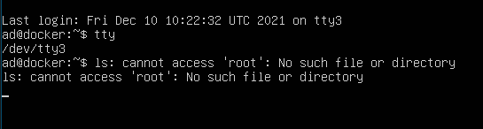
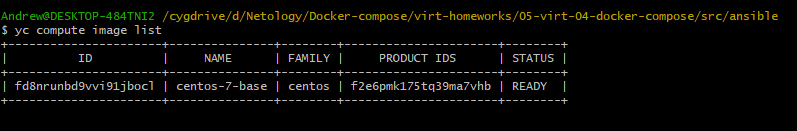
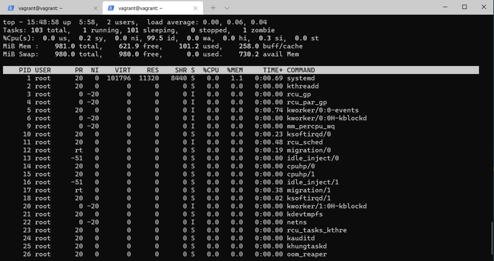

# devops-netology
## Домашнее задание к занятию "3.2. Работа в терминале, лекция 2"
```
1.  Встроенная.
    type cd
    cd is a shell builtin

2. ad@ad:~$ cat testfile
qwertyuiop[]
1234567890
zxcvbnm,./
ghrhdfhdgjrw
asdfghjkl;
qethjtjhtqjrywj
ad@ad:~$ grep qwerty testfile -c
1

3. systemd(1)
ad@ad:~$ pstree -p
systemd(1)─┬─accounts-daemon(668)─┬─{accounts-daemon}(698)
           │                      └─{accounts-daemon}(724)
           ├─agetty(704)
           ├─atd(696)
           ├─containerd(697)─┬─{containerd}(736)
           │                 ├─{containerd}(737)
           │                 ├─{containerd}(738)
           │                 ├─{containerd}(739)
           │                 ├─{containerd}(740)
           │                 ├─{containerd}(754)
           │                 ├─{containerd}(755)
           │                 ├─{containerd}(756)
           │                 ├─{containerd}(757)
           │                 ├─{containerd}(759)
           │                 └─{containerd}(1258)

4. ad@docker:~$ ls -l \root 2>/dev/tty3

```



```

5. ad@ad:~$ cat testfile
qwertyuiop[]
1234567890
zxcvbnm,./
ghrhdfhdgjrw
asdfghjkl;
qethjtjhtqjrywj
ad@ad:~$ cat testfile1
cat: testfile1: No such file or directory
ad@ad:~$ cat <testfile >testfile1
ad@ad:~$ cat testfile1
qwertyuiop[]
1234567890
zxcvbnm,./
ghrhdfhdgjrw
asdfghjkl;
qethjtjhtqjrywj


6. ad@docker:~$ tty
/dev/pts/4
ad@docker:~$ echo pts4 >/dev/tty3

```



```

7. ad@ad:~$ bash 5>&1 Создаст дескриптор 5 и перенаправит его в stdout
ad@ad:~$ echo netology > /proc/$$/fd/5 выведет netology в дескриптор 5

8. ad@ad:~$ ls -l /root 3>&1 1>&2 2>&3 |grep denied -c
1

9. Выводит переменные окружения. Аналоги env, printenv

10. /proc/[pid]/cmdline
              This read-only file holds the complete command line for the process, unless the process is a zombie.
Этот файл содержит полную командную строку запуска процесса, кроме тез, что превратились в зомби (176 строка)

/proc/[pid]/exe
              Under Linux 2.2 and later, this file is a symbolic link containing the actual pathname of the executed command.
Это символьной ссылка, содержащая фактическое полное имя выполняемого файла.

11. grep sse /proc/cpuinfo
SSE 4.2

12. ad@ad:~$ ssh localhost 'tty'
ad@localhost's password: 
not a tty
Интерактивная оболочка не позволяет внутри себя запустить другую интерактивную оболочку, поэтому нежно запустить в псевдо-интерактивном режиме
ad@ad:~$ ssh -t localhost 'tty'
ad@localhost's password: 
/dev/pts/5
Connection to localhost closed.

13. Исправлено!

vagrant@vagrant:~$ ps -a
    PID TTY          TIME CMD
   1149 pts/0    00:00:00 ps
vagrant@vagrant:~$ ps -a
    PID TTY          TIME CMD
   1150 pts/1    00:00:00 top
   1151 pts/0    00:00:00 ps
vagrant@vagrant:~$ reptyr 1150

```


```

14. tee делает вывод одновременно и в файл в параметре и в stdout. 
В примере команда получает вывод из stdin, перенаправленный через pipe от stdout команды echo, а так как команда запущена от sudo , соотвественно имеет права на запись в файл.

```
