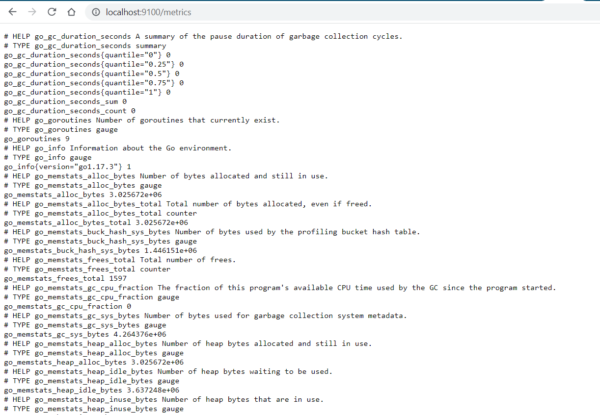
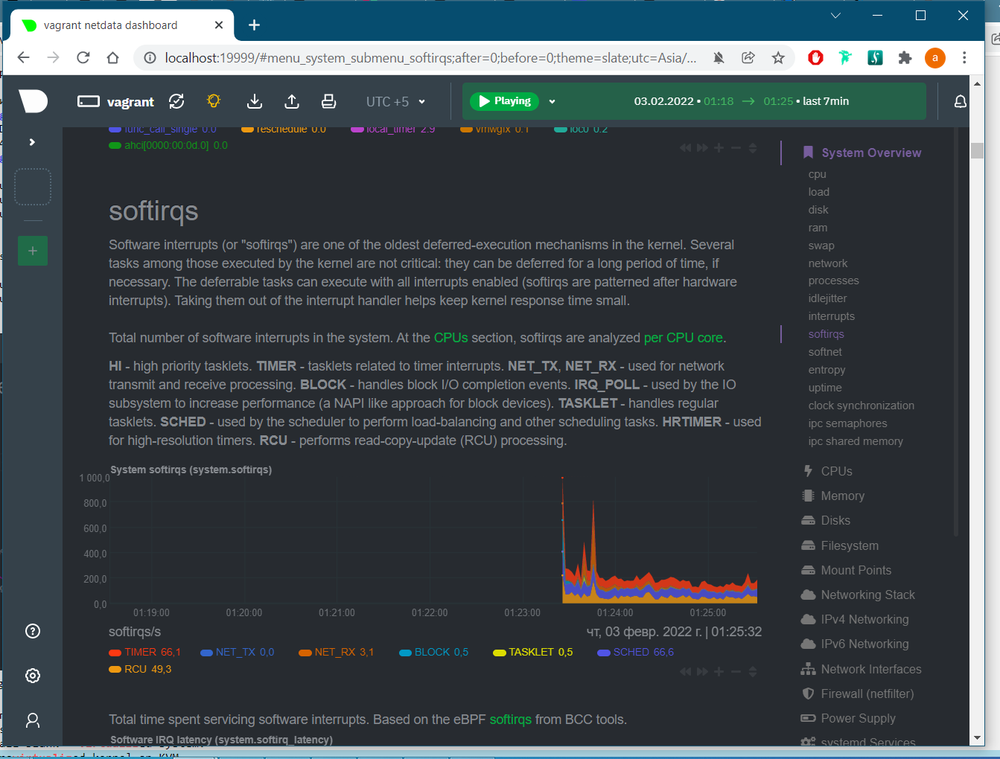
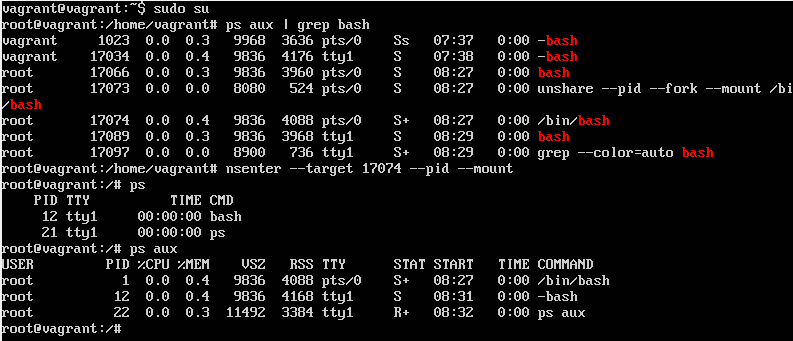

# devops-netology
## Домашнее задание к занятию "3.4. Операционные системы, лекция 2"
```
1. vagrant@vagrant:~$ cat /etc/systemd/system/node_exporter.service
[Unit]
Description=Node Exporter
Wants=network-online.target
After=network-online.target

[Service]
User=node_exporter
Group=node_exporter
Type=simple
ExecStart=/usr/local/bin/node_exporter
EnvironmentFile=/etc/default/node_exporter

[Install]
WantedBy=multi-user.target

vagrant@vagrant:~$ sudo systemctl daemon-reload
vagrant@vagrant:~$ sudo systemctl enable --now node_exporter
vagrant@vagrant:~$ sudo systemctl status node_exporter
● node_exporter.service - Node Exporter
     Loaded: loaded (/etc/systemd/system/node_exporter.service; enabled; vendor preset: enabled)
     Active: active (running) since Wed 2022-02-02 19:20:26 UTC; 2s ago
   Main PID: 1314 (node_exporter)
      Tasks: 4 (limit: 1071)
     Memory: 2.4M
     CGroup: /system.slice/node_exporter.service
             └─1314 /usr/local/bin/node_exporter

Feb 02 19:20:26 vagrant node_exporter[1314]: ts=2022-02-02T19:20:26.724Z caller=node_exporter.go:115 level=info collect>
Feb 02 19:20:26 vagrant node_exporter[1314]: ts=2022-02-02T19:20:26.724Z caller=node_exporter.go:115 level=info collect>
Feb 02 19:20:26 vagrant node_exporter[1314]: ts=2022-02-02T19:20:26.724Z caller=node_exporter.go:115 level=info collect>
Feb 02 19:20:26 vagrant node_exporter[1314]: ts=2022-02-02T19:20:26.724Z caller=node_exporter.go:115 level=info collect>
Feb 02 19:20:26 vagrant node_exporter[1314]: ts=2022-02-02T19:20:26.724Z caller=node_exporter.go:115 level=info collect>
Feb 02 19:20:26 vagrant node_exporter[1314]: ts=2022-02-02T19:20:26.724Z caller=node_exporter.go:115 level=info collect>
Feb 02 19:20:26 vagrant node_exporter[1314]: ts=2022-02-02T19:20:26.724Z caller=node_exporter.go:115 level=info collect>
Feb 02 19:20:26 vagrant node_exporter[1314]: ts=2022-02-02T19:20:26.724Z caller=node_exporter.go:115 level=info collect>
Feb 02 19:20:26 vagrant node_exporter[1314]: ts=2022-02-02T19:20:26.724Z caller=node_exporter.go:199 level=info msg="Li>
Feb 02 19:20:26 vagrant node_exporter[1314]: ts=2022-02-02T19:20:26.725Z caller=tls_config.go:195 level=info msg="TLS i>

vagrant@vagrant:~$ sudo systemctl disable --now node_exporter
Removed /etc/systemd/system/multi-user.target.wants/node_exporter.service.
vagrant@vagrant:~$ sudo systemctl status node_exporter
● node_exporter.service - Node Exporter
     Loaded: loaded (/etc/systemd/system/node_exporter.service; disabled; vendor preset: enabled)
     Active: inactive (dead)

Feb 02 19:20:26 vagrant node_exporter[1314]: ts=2022-02-02T19:20:26.724Z caller=node_exporter.go:115 level=info collect>
Feb 02 19:20:26 vagrant node_exporter[1314]: ts=2022-02-02T19:20:26.724Z caller=node_exporter.go:115 level=info collect>
Feb 02 19:20:26 vagrant node_exporter[1314]: ts=2022-02-02T19:20:26.724Z caller=node_exporter.go:115 level=info collect>
Feb 02 19:20:26 vagrant node_exporter[1314]: ts=2022-02-02T19:20:26.724Z caller=node_exporter.go:115 level=info collect>
Feb 02 19:20:26 vagrant node_exporter[1314]: ts=2022-02-02T19:20:26.724Z caller=node_exporter.go:115 level=info collect>
Feb 02 19:20:26 vagrant node_exporter[1314]: ts=2022-02-02T19:20:26.724Z caller=node_exporter.go:199 level=info msg="Li>
Feb 02 19:20:26 vagrant node_exporter[1314]: ts=2022-02-02T19:20:26.725Z caller=tls_config.go:195 level=info msg="TLS i>
Feb 02 19:21:00 vagrant systemd[1]: Stopping Node Exporter...
Feb 02 19:21:00 vagrant systemd[1]: node_exporter.service: Succeeded.
Feb 02 19:21:00 vagrant systemd[1]: Stopped Node Exporter.
...skipping...
● node_exporter.service - Node Exporter
     Loaded: loaded (/etc/systemd/system/node_exporter.service; disabled; vendor preset: enabled)
     Active: inactive (dead)

Feb 02 19:20:26 vagrant node_exporter[1314]: ts=2022-02-02T19:20:26.724Z caller=node_exporter.go:115 level=info collect>
Feb 02 19:20:26 vagrant node_exporter[1314]: ts=2022-02-02T19:20:26.724Z caller=node_exporter.go:115 level=info collect>
Feb 02 19:20:26 vagrant node_exporter[1314]: ts=2022-02-02T19:20:26.724Z caller=node_exporter.go:115 level=info collect>
Feb 02 19:20:26 vagrant node_exporter[1314]: ts=2022-02-02T19:20:26.724Z caller=node_exporter.go:115 level=info collect>
Feb 02 19:20:26 vagrant node_exporter[1314]: ts=2022-02-02T19:20:26.724Z caller=node_exporter.go:115 level=info collect>
Feb 02 19:20:26 vagrant node_exporter[1314]: ts=2022-02-02T19:20:26.724Z caller=node_exporter.go:199 level=info msg="Li>
Feb 02 19:20:26 vagrant node_exporter[1314]: ts=2022-02-02T19:20:26.725Z caller=tls_config.go:195 level=info msg="TLS i>
Feb 02 19:21:00 vagrant systemd[1]: Stopping Node Exporter...
Feb 02 19:21:00 vagrant systemd[1]: node_exporter.service: Succeeded.
Feb 02 19:21:00 vagrant systemd[1]: Stopped Node Exporter.
~
~

vagrant@vagrant:~$ sudo systemctl enable --now node_exporter
Created symlink /etc/systemd/system/multi-user.target.wants/node_exporter.service → /etc/systemd/system/node_exporter.service.
vagrant@vagrant:~$ sudo systemctl status node_exporter
● node_exporter.service - Node Exporter
     Loaded: loaded (/etc/systemd/system/node_exporter.service; enabled; vendor preset: enabled)
     Active: active (running) since Wed 2022-02-02 19:21:12 UTC; 3s ago
   Main PID: 1392 (node_exporter)
      Tasks: 4 (limit: 1071)
     Memory: 2.3M
     CGroup: /system.slice/node_exporter.service
             └─1392 /usr/local/bin/node_exporter

Feb 02 19:21:12 vagrant node_exporter[1392]: ts=2022-02-02T19:21:12.061Z caller=node_exporter.go:115 level=info collect>
Feb 02 19:21:12 vagrant node_exporter[1392]: ts=2022-02-02T19:21:12.061Z caller=node_exporter.go:115 level=info collect>
Feb 02 19:21:12 vagrant node_exporter[1392]: ts=2022-02-02T19:21:12.061Z caller=node_exporter.go:115 level=info collect>
Feb 02 19:21:12 vagrant node_exporter[1392]: ts=2022-02-02T19:21:12.061Z caller=node_exporter.go:115 level=info collect>
Feb 02 19:21:12 vagrant node_exporter[1392]: ts=2022-02-02T19:21:12.061Z caller=node_exporter.go:115 level=info collect>
Feb 02 19:21:12 vagrant node_exporter[1392]: ts=2022-02-02T19:21:12.061Z caller=node_exporter.go:115 level=info collect>
Feb 02 19:21:12 vagrant node_exporter[1392]: ts=2022-02-02T19:21:12.061Z caller=node_exporter.go:115 level=info collect>
Feb 02 19:21:12 vagrant node_exporter[1392]: ts=2022-02-02T19:21:12.061Z caller=node_exporter.go:115 level=info collect>
Feb 02 19:21:12 vagrant node_exporter[1392]: ts=2022-02-02T19:21:12.061Z caller=node_exporter.go:199 level=info msg="Li>
Feb 02 19:21:12 vagrant node_exporter[1392]: ts=2022-02-02T19:21:12.062Z caller=tls_config.go:195 level=info msg="TLS i>
vagrant@vagrant:~$ sudo systemctl restart node_exporter
vagrant@vagrant:~$ sudo systemctl status node_exporter
● node_exporter.service - Node Exporter
     Loaded: loaded (/etc/systemd/system/node_exporter.service; enabled; vendor preset: enabled)
     Active: active (running) since Wed 2022-02-02 19:29:11 UTC; 6s ago
   Main PID: 1439 (node_exporter)
      Tasks: 4 (limit: 1071)
     Memory: 2.4M
     CGroup: /system.slice/node_exporter.service
             └─1439 /usr/local/bin/node_exporter

Feb 02 19:29:11 vagrant node_exporter[1439]: ts=2022-02-02T19:29:11.926Z caller=node_exporter.go:115 level=info collect>
Feb 02 19:29:11 vagrant node_exporter[1439]: ts=2022-02-02T19:29:11.926Z caller=node_exporter.go:115 level=info collect>
Feb 02 19:29:11 vagrant node_exporter[1439]: ts=2022-02-02T19:29:11.926Z caller=node_exporter.go:115 level=info collect>
Feb 02 19:29:11 vagrant node_exporter[1439]: ts=2022-02-02T19:29:11.926Z caller=node_exporter.go:115 level=info collect>
Feb 02 19:29:11 vagrant node_exporter[1439]: ts=2022-02-02T19:29:11.926Z caller=node_exporter.go:115 level=info collect>
Feb 02 19:29:11 vagrant node_exporter[1439]: ts=2022-02-02T19:29:11.926Z caller=node_exporter.go:115 level=info collect>
Feb 02 19:29:11 vagrant node_exporter[1439]: ts=2022-02-02T19:29:11.926Z caller=node_exporter.go:115 level=info collect>
Feb 02 19:29:11 vagrant node_exporter[1439]: ts=2022-02-02T19:29:11.926Z caller=node_exporter.go:115 level=info collect>
Feb 02 19:29:11 vagrant node_exporter[1439]: ts=2022-02-02T19:29:11.926Z caller=node_exporter.go:199 level=info msg="Li>
Feb 02 19:29:11 vagrant node_exporter[1439]: ts=2022-02-02T19:29:11.926Z caller=tls_config.go:195 level=info msg="TLS i>

Открываем 9100 порт наружу

```


```


2. CPU, для каждого процессора
node_cpu_seconds_total{cpu="0",mode="idle"} 210.55
node_cpu_seconds_total{cpu="0",mode="system"} 1.25
node_cpu_seconds_total{cpu="0",mode="user"} 0.8

    Memory
node_memory_MemAvailable_bytes gauge
node_memory_MemFree_bytes gauge

   HDD, для каждого
node_disk_io_time_seconds_total counter
node_disk_read_time_seconds_total counter
node_disk_write_time_seconds_total counter
    
    Network, для каждого адаптера
node_network_receive_errs_total counter


3. vagrant@vagrant:~$ curl -s https://packagecloud.io/install/repositories/netdata/netdata/script.deb.sh | sudo bash

vagrant@vagrant:~$ sudo apt install -y netdata

vagrant@vagrant:~$ sudo netdata -p 19999
Без явного указания порта проброс не работает

```


```

4. Не явно, и на чистом железе проверить не могу, к сожалению.
VirtualBox явно говорит, что виртуальная:
vagrant@vagrant:~$ dmesg |grep virtual
[    0.002303] CPU MTRRs all blank - virtualized system.
[    0.074177] Booting paravirtualized kernel on KVM
[    2.521502] systemd[1]: Detected virtualization oracle. 
Но на ProxMox тишина:
ad@docker2:~$ dmesg |grep virtual
ad@docker2:~$ 


5. vagrant@vagrant:~$ sysctl fs.nr_open
fs.nr_open = 1048576
Аналогично
vagrant@vagrant:~$ sudo cat /proc/sys/fs/nr_open
1048576
   Это максимальное число открытых дескрипторов на процесс.
   Максимальное число дескрипторов на систему можно посмотреть так:
vagrant@vagrant:~$ cat /proc/sys/fs/file-max
9223372036854775807
   Или
vagrant@vagrant:~$ sysctl fs.file-max
fs.file-max = 9223372036854775807

vagrant@vagrant:~$ ulimit -Sn
1024
   Мягкий лимит (так же ulimit -n) на пользователя, может быть увеличен в процессе работы.

vagrant@vagrant:~$ ulimit -Hn
1048576
   Жесткий лимит на пользователя, не может быть увеличен, только уменьшен. 
   Оба ulimit -n не могут превысить /proc/sys/fs/nr_open.


6. vagrant@vagrant:~$ sudo su
root@vagrant:/home/vagrant# unshare --pid --fork --mount /bin/bash
root@vagrant:/home/vagrant# ps
    PID TTY          TIME CMD
  17063 pts/0    00:00:00 sudo
  17065 pts/0    00:00:00 su
  17066 pts/0    00:00:00 bash
  17073 pts/0    00:00:00 unshare
  17074 pts/0    00:00:00 bash
  17081 pts/0    00:00:00 ps
root@vagrant:/home/vagrant# mount -t proc proc /proc
root@vagrant:/home/vagrant# ps aux
USER         PID %CPU %MEM    VSZ   RSS TTY      STAT START   TIME COMMAND
root           1  0.0  0.4   9836  4088 pts/0    S    08:27   0:00 /bin/bash
root          12  0.0  0.4   9836  4168 tty1     S+   08:31   0:00 -bash
root          23  0.0  0.3  11492  3292 pts/0    R+   08:33   0:00 ps aux

Результат:
```


```

7. Это так называемая fork-bomb (вилочная бомба), В ней функция определяется, как вызывающая сама себя, а затем передает свой результат в фоновое задание самой себе и так многократно, в идеале - бесконечный цикл))).

[ 3467.424617] cgroup: fork rejected by pids controller in /user.slice/user-1000.slice/session-2.scope
[ 3483.633178] cgroup: fork rejected by pids controller in /user.slice/user-1000.slice/session-4.scope

Поскольку режим работы форк-бомбы полностью инкапсулирован путем создания новых процессов, предотвратить серьезное влияние форк-бомбы на всю систему — ограничить максимальное количество процессов, которыми может владеть один пользователь: ulimit -u 50 ограничит этого пользователя пятьюдесятью процессами.

```
