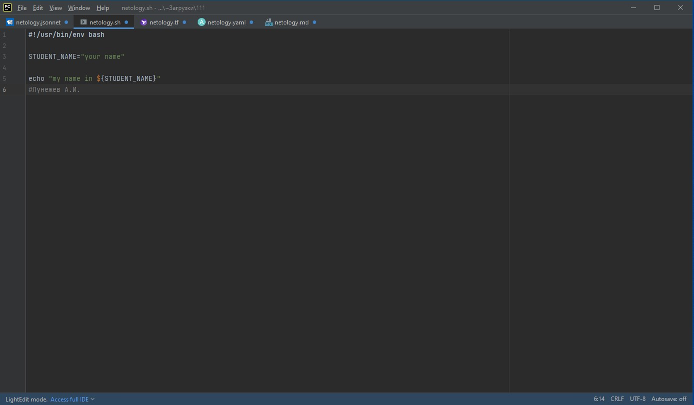
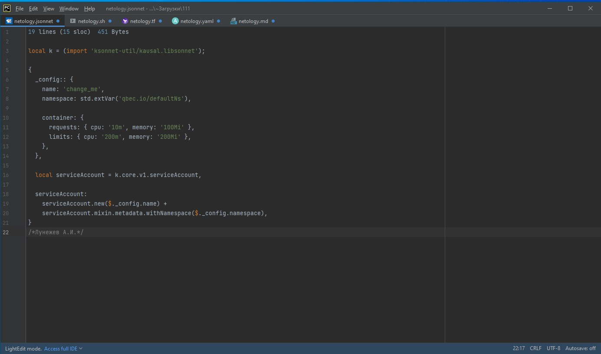
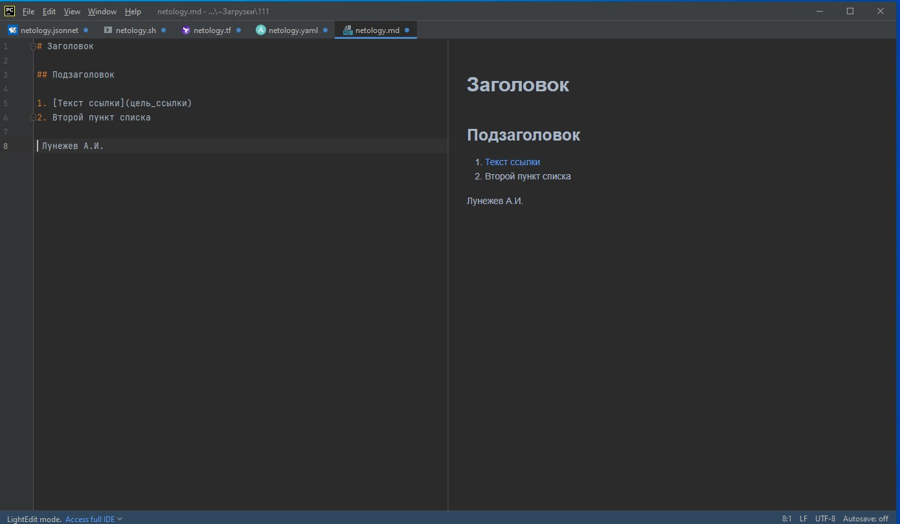
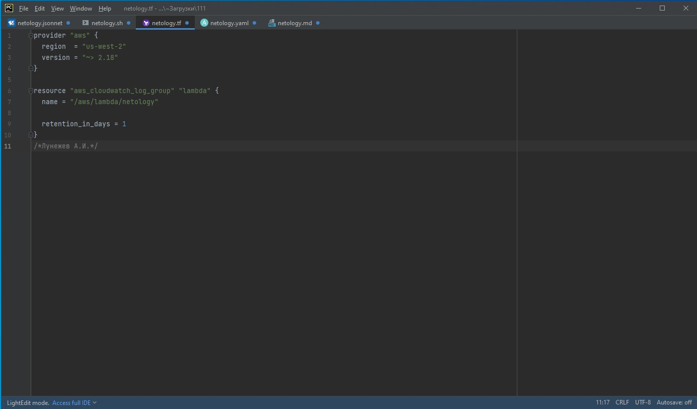
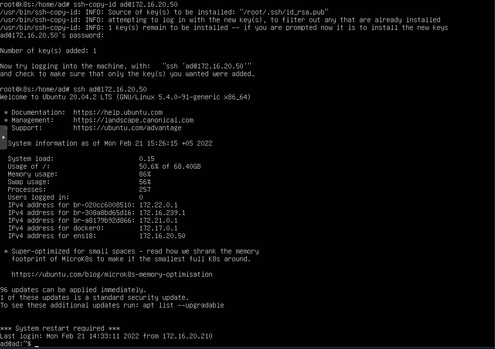
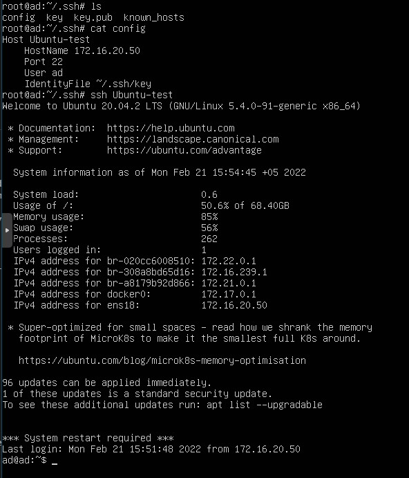
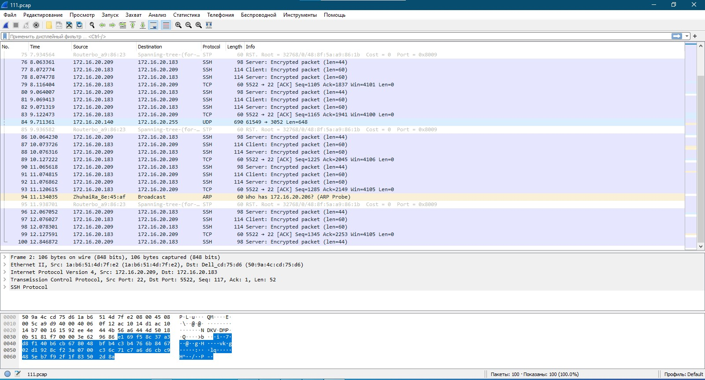

# devops-netology
## Домашнее задание к занятию «1.1. Введение в DevOps»
```

1.1. Установлено

1.2. Установлено

1.3. Создано

1.4.

bash
```


```
jsonnet
```


```
MD
```


```
terraform
```


```
yaml
```


```
2. Менеджер проекта формирует и описывает техническое задание (ТЗ) с учетом требования заказчика, требований и спецификаций используемого ПО, возможностей инфраструктуры, а также полностью сопровождает процесс на всех стадиях. Команда разработчиков готовит проект к релизу на тестовый контур. После завершении разработки DevOps выполняет выкладку продукта на тестовый стенд. Тестировщики проверяют проект, оформляют задания на доработку(при необходимости), также могут выполнять дополнительное покрытие тестами продукта. Далее Devops выполняет релиз на предпродакшн, который идентичен продакшн-стенду, (также продукт покрывается тестами). Далее DevOps-ом осуществляется релиз в продакшн. В случае необходимости внесения внерелизных изменений, Devops также участвует в процессе исправления ошибок в связке с командой разработки. Далее продукт передается на сопровождение, DevOps может входить и в команду сопровождения, а также сопровождать продукт.

```
## Домашнее задание к занятию "3.9. Элементы безопасности информационных систем""
```
1. 
```


```

2. 
```


```

3. 
ad@k8s:~$ sudo apt install apache2
ad@k8s:~$ sudo a2enmod ssl
Considering dependency setenvif for ssl:
Module setenvif already enabled
Considering dependency mime for ssl:
Module mime already enabled
Considering dependency socache_shmcb for ssl:
Enabling module socache_shmcb.
Enabling module ssl.
See /usr/share/doc/apache2/README.Debian.gz on how to configure SSL and create self-signed certificates.
To activate the new configuration, you need to run:
  systemctl restart apache2
ad@k8s:~$ sudo systemctl restart apache2
ad@k8s:~$ sudo openssl req -x509 -nodes -days 365 -newkey rsa:2048 \-keyout /etc/ssl/private/apache-selfsigned.key \-out /etc/ssl/certs/apache-selfsigned.crt \-subj "/C=RU/ST=Moscow/L=Moscow/O=Company Name/OU=Org/CN=www.172.16.20.209"
Generating a RSA private key
............................+++++
.................................................................................+++++
writing new private key to '/etc/ssl/private/apache-selfsigned.key'
-----
ad@k8s:~$ sudo nano /etc/apache2/sites-available/172.16.20.209.conf
ad@k8s:~$ sudo mkdir /var/www/172.16.20.209
ad@k8s:~$ sudo nano /var/www/172.16.20.209/index.html
ad@k8s:~$ sudo a2ensite 172.16.20.209.conf
Enabling site 172.16.20.209.
To activate the new configuration, you need to run:
  systemctl reload apache2
ad@k8s:~$ sudo apache2ctl configtest
AH00558: apache2: Could not reliably determine the server's fully qualified domain name, using 127.0.1.1. Set the 'ServerName' directive globally to suppress this message
Syntax OK
ad@k8s:~$ sudo systemctl reload apache2
```


```
Для самоподписанных сертификатов это нормально. Браузер предупреждает, что не может проверить подлинность сервера, поскольку сертификат не подписан известным браузеру центром сертификации.

4. Использовал ключ -p для тестирования протоколов 
TLS/SSL (включая SPDY/HTTP2)

ad@docker:~$ docker run --rm -ti  drwetter/testssl.sh -p --parallel --sneaky https://ptspec.ru
 
###########################################################
    testssl.sh       3.1dev from https://testssl.sh/dev/
 
      This program is free software. Distribution and
             modification under GPLv2 permitted.
      USAGE w/o ANY WARRANTY. USE IT AT YOUR OWN RISK!
 
       Please file bugs @ https://testssl.sh/bugs/
 
###########################################################
 
 Using "OpenSSL 1.0.2-chacha (1.0.2k-dev)" [~183 ciphers]
 on b773a5aae90c:/home/testssl/bin/openssl.Linux.x86_64
 (built: "Jan 18 17:12:17 2019", platform: "linux-x86_64")
 
 Start 2022-02-21 06:00:07        -->> 185.215.4.16:443 (ptspec.ru) <<--
 
 rDNS (185.215.4.16):    --
 Service detected:       HTTP
 
 Testing protocols via sockets except NPN+ALPN 
 
 SSLv2      not offered (OK)
 SSLv3      not offered (OK)
 TLS 1      offered (deprecated)
 TLS 1.1    offered (deprecated)
 TLS 1.2    offered (OK)
 TLS 1.3    offered (OK): final
 NPN/SPDY   not offered
 ALPN/HTTP2 h2, http/1.1 (offered)
 
 Done 2022-02-21 06:00:14 [   9s] -->> 185.215.4.16:443 (ptspec.ru) <<--

5. 
```


```

6. 
```


```

7. 
ad@ad:~$ sudo tcpdump -c 100 -w 111.pcap -i ens18
[sudo] password for ad: 
tcpdump: listening on ens18, link-type EN10MB (Ethernet), capture size 262144 bytes
100 packets captured
104 packets received by filter
0 packets dropped by kernel

```


```
```
## Домашнее задание к занятию "4.1. Командная оболочка Bash: Практические навыки"

```
1. 
c = a+b, Это текст
d = 1+2, Значения переменных получены, но без сложения, т.к. это строка
e = 3, Сложение выполнено

2. Не хватает закрывающей скобки в конце первой строки и проверки успешности для завершения цикла. Для уменьшения размера файла можно задать тайматут выолнения проверки, например в 1 минуту.

#!/bin/bash
while (( 1 == 1 ))
  do
    curl https://localhost:4757
    if (($? != 0)) 
      then
        date >> curl.log
      else break
    fi
    sleep 1m
  done


3. 
#!/bin/bash
hosts=(192.168.0.1 173.194.222.113 87.250.250.242)
for i in 1 2 3 4 5
do
  for h in ${hosts[@]}
    do
      OUTPUT="$(curl -I -s --connect-timeout 3 $h:80)";
    	if [ -z "${OUTPUT}" ]
        then echo "IP" $h:80 unavailable >> hosts.log;
        else echo "IP" $h:80 available >> hosts.log;
      fi
      sleep 1;
    done
done

4.
#!/bin/bash
hosts=(192.168.0.1 173.194.222.113 87.250.250.242)
i=0
while [[ $i -lt 1 ]]
do
  for h in ${hosts[@]}
    do
      OUTPUT="$(curl -I -s --connect-timeout 3 $h:80)";
      ((i++));
      echo $i
    	if [ -z "${OUTPUT}" ]
        then 
          echo "IP" $h:80 unavailable >> error.log; 
          break;
        else 
          ((i--));
      fi
      sleep 1;
    done
done
```
## Домашнее задание к занятию "4.2. Использование Python для решения типовых DevOps задач"

```
1. 
 - Ошибка, т.к. разные типы операндов для сложения, 'int' и 'str'
 - c=str(a)+b
 - c=a+int(b)

2. 
 Удалил лишние переменную is_change и команду break

#!/usr/bin/env python3

import os

bash_command = ["cd ./devops-netology", "git status"]
result_os = os.popen(' && '.join(bash_command)).read()
for result in result_os.split('\n'):
    if result.find('modified') != -1:
        prepare_result = result.replace('\modified:   ', '')
        print(prepare_result)

Вывод:

PS D:\Netology> python test.py
        modified:   README.md

3. 
#!/usr/bin/env python3

import os
import sys

cmd = os.getcwd()

if len(sys.argv)>=2:
    cmd = sys.argv[1]
bash_command = ["cd "+cmd, "git status 2>&1"]

result_os = os.popen(' && '.join(bash_command)).read()

for result in result_os.split('\n'):
    if result.find('fatal') != -1:
        print(cmd+' не является GIT репозиторием')    
    if result.find('modified') != -1:
        prepare_result = result.replace('\modified: ', '')
        print(cmd+prepare_result)

Вывод:

PS D:\Netology> python test2.py D:\netology\devops-netology
D:\netology\devops-netology     modified:   README.md
PS D:\Netology> python test2.py
D:\Netology не является GIT репозиторием
PS D:\Netology> python test2.py D:\netology\123
Системе не удается найти указанный путь.

4.
##!/usr/bin/env python3

import socket
import time
import datetime

i = 1
srv = {'drive.google.com':'0.0.0.0', 'mail.google.com':'0.0.0.0', 'google.com':'0.0.0.0'}

print('*** start script ***')
print(srv)
print('********************')

while 1==1 :
    for host in srv:
        ip = socket.gethostbyname(host)
        if ip != srv[host]:
            print(str(datetime.datetime.now().strftime("%Y-%m-%d %H:%M:%S")) +' [ERROR] ' + str(host) +' IP mistmatch: '+srv[host]+' '+ip)
            srv[host]=ip
        else:
            print(host, ': ', srv[host])

#счетчик итераций для отладки, закомментировать для бесконечного цикла 3 строки
    i+=1 
    if i >= 5 : 
        break
    time.sleep(2)

Вывод:
PS D:\Netology> python test4.py
*** start script ***
{'drive.google.com': '0.0.0.0', 'mail.google.com': '0.0.0.0', 'google.com': '0.0.0.0'}
********************
2022-02-27 18:37:37 [ERROR] drive.google.com IP mistmatch: 0.0.0.0 74.125.131.194     
2022-02-27 18:37:37 [ERROR] mail.google.com IP mistmatch: 0.0.0.0 64.233.162.17       
2022-02-27 18:37:37 [ERROR] google.com IP mistmatch: 0.0.0.0 142.250.150.100
drive.google.com :  74.125.131.194
mail.google.com :  64.233.162.17
google.com :  142.250.150.100   
drive.google.com :  74.125.131.194
mail.google.com :  64.233.162.17
google.com :  142.250.150.100   
drive.google.com :  74.125.131.194
mail.google.com :  64.233.162.17
google.com :  142.250.150.100

```

##НЕ ПОЛНОСТЬЮ ГОТОВО! НЕ ПРОВЕРЯТЬ))) Домашнее задание к занятию "4.3. Языки разметки JSON и YAML"

```
1. Не хватает трех ковычек в 9 строке, после IP и вокруг 71.78.22.43

{ "info" : "Sample JSON output from our service\t",
    "elements" :[
        { "name" : "first",
        "type" : "server",
        "ip" : 7175 
        },
        { "name" : "second",
        "type" : "proxy",
        "ip" : "71.78.22.43"
        }
    ]
}

2. 
##!/usr/bin/env python3

import socket
import time
import datetime
import json
import yaml

i = 1
srv = {'drive.google.com':'0.0.0.0', 'mail.google.com':'0.0.0.0', 'google.com':'0.0.0.0'}

#fpath = "C:\\Users\\Andrew\\AppData\\Local\\Programs\\Python\\Python39\\"
fpath="./"

print('*** start script ***')
print(srv)
print('********************')


while 1 == 1 :
    print(i)
    for host in srv:
        ip = socket.gethostbyname(host)
        if ip != srv[host]:
            with open(fpath+host+".json",'w') as jsf:
                json_data=json.dumps({host:ip})
                jsf.write(json_data)
            print(str(datetime.datetime.now().strftime("%Y-%m-%d %H:%M:%S")) +' [ERROR] ' + str(host) +' IP mistmatch: '+srv[host]+' '+ip)
            srv[host]=ip
        else:
            print(host, ': ', srv[host])
            with open(fpath+host+".json",'w') as jsf:
               json_data=json.dumps({host:ip})
               jsf.write(json_data)

#счетчик итераций для отладки, закомментировать для бесконечного цикла 3 строки
    i+=1 
    if i >= 5 : 
        break
    time.sleep(2)
```