# Дипломный практикум в Yandex.Cloud

### Создание облачной инфраструктуры

Сервис-аккаунт создан:


Создаем бэкэнд - это S3-bucket, созданный [Terraform](./s3_bucket/):

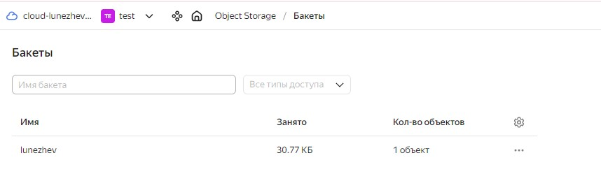

терраформом добавлем аккаунт "tf-sa" с правами редактора:

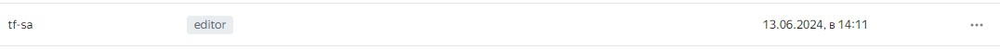

Далее создаем необходимую облачную инфраструктуру для Kubernetes и самого Kubernetes также при помощи [Terraform](./infra/), предварительно подготовив Kubespray, который будет запускаться при помощи ansible:

```bash
wget https://github.com/kubernetes-sigs/kubespray/archive/refs/tags/v2.25.0.tar.gz && tar -xvzf v2.25.0.tar.gz && mv kubespray-2.25.0 kubespray && python3 -m pip install --upgrade pip && pip3 install -r kubespray/requirements.txt
```

В данной конфигурации будет по три мастер и слэйв-ноды.

Описание одержимого папки:

| Имя файла (папки)  | Назначение |
| -----------        | ----------- |
| ./ansible          | Kubespray   |
| ./ansible-template | Шаблон создания Мастер и слэйв нод   |
| ./monitoring       | файл конфигурации доступа к системе мониторинга   |
| 0.variables.tf     | Переменные   |
| 1.providers.tf     | Описание провайдера   |
| 2.network.tf       | Создание сетей   |
| 3.K8sMasters.tf    | Создание master-нод   |
| 4.K8sWorkers.tf    | Создание slave-нод   |
| 5.ansible.tf       | Создание Kubernetes-кластера   |
| 6.monitoring.tf    | Создание системы мониторинга   |
| 7.ga.tf            | Создание gitlab-агента для Gitlab   |


terraform init:


terraform validate:


<details>

<summary>terraform plan:</summary>

and@k8s:~/Diplom/infra$ terraform plan

Terraform used the selected providers to generate the following execution plan. Resource actions are indicated with the following symbols:
  + create

Terraform will perform the following actions:

  # local_file.inventory will be created
  + resource "local_file" "inventory" {
      + content              = (known after apply)
      + content_base64sha256 = (known after apply)
      + content_base64sha512 = (known after apply)
      + content_md5          = (known after apply)
      + content_sha1         = (known after apply)
      + content_sha256       = (known after apply)
      + content_sha512       = (known after apply)
      + directory_permission = "0777"
      + file_permission      = "0777"
      + filename             = "./ansible/kubespray/inventory/mycluster/inventory.ini"
      + id                   = (known after apply)
    }

  # null_resource.ansible_provisioner will be created
  + resource "null_resource" "ansible_provisioner" {
      + id = (known after apply)
    }

  # null_resource.gitlab-agent_service will be created
  + resource "null_resource" "gitlab-agent_service" {
      + id = (known after apply)
    }

  # null_resource.grafana_service will be created
  + resource "null_resource" "grafana_service" {
      + id = (known after apply)
    }

  # null_resource.kubeconfig will be created
  + resource "null_resource" "kubeconfig" {
      + id = (known after apply)
    }

  # null_resource.kubeconfig_cp will be created
  + resource "null_resource" "kubeconfig_cp" {
      + id = (known after apply)
    }

  # null_resource.kubespray_init will be created
  + resource "null_resource" "kubespray_init" {
      + id = (known after apply)
    }

  # null_resource.monitoring_deployment will be created
  + resource "null_resource" "monitoring_deployment" {
      + id = (known after apply)
    }

  # null_resource.supplementary_addresses will be created
  + resource "null_resource" "supplementary_addresses" {
      + id = (known after apply)
    }

  # null_resource.timeout_k8s_start_masters will be created
  + resource "null_resource" "timeout_k8s_start_masters" {
      + id = (known after apply)
    }

  # null_resource.timeout_k8s_start_workers will be created
  + resource "null_resource" "timeout_k8s_start_workers" {
      + id = (known after apply)
    }

  # yandex_compute_instance_group.k8s-masters will be created
  + resource "yandex_compute_instance_group" "k8s-masters" {
      + created_at          = (known after apply)
      + deletion_protection = false
      + folder_id           = (known after apply)
      + id                  = (known after apply)
      + instances           = (known after apply)
      + name                = "k8s-masters"
      + service_account_id  = "ajekvaavu3gq4ntoqehb"
      + status              = (known after apply)

      + allocation_policy {
          + zones = [
              + "ru-central1-a",
              + "ru-central1-b",
              + "ru-central1-d",
            ]
        }

      + deploy_policy {
          + max_creating     = 3
          + max_deleting     = 3
          + max_expansion    = 3
          + max_unavailable  = 3
          + startup_duration = 0
          + strategy         = (known after apply)
        }

      + instance_template {
          + labels      = (known after apply)
          + metadata    = {
              + "ssh-keys" = <<-EOT
                    and:ssh-ed25519 AAAAC3NzaC1lZDI1NTE5AAAAIOaOiPJwi5+Bj87XxYVIFMdl3bTTmGl1qV46hin+9cn9 and@k8s
                EOT
            }
          + name        = "master-{instance.index}"
          + platform_id = "standard-v2"

          + boot_disk {
              + device_name = (known after apply)
              + mode        = "READ_WRITE"

              + initialize_params {
                  + image_id    = "fd8vmcue7aajpmeo39kk"
                  + size        = 10
                  + snapshot_id = (known after apply)
                  + type        = "network-ssd"
                }
            }

          + network_interface {
              + ip_address   = (known after apply)
              + ipv4         = true
              + ipv6         = (known after apply)
              + ipv6_address = (known after apply)
              + nat          = true
              + network_id   = (known after apply)
              + subnet_ids   = (known after apply)
            }

          + network_settings {
              + type = "STANDARD"
            }

          + resources {
              + core_fraction = 20
              + cores         = 2
              + memory        = 2
            }

          + scheduling_policy {
              + preemptible = true
            }
        }

      + scale_policy {
          + fixed_scale {
              + size = 3
            }
        }
    }

  # yandex_compute_instance_group.k8s-workers will be created
  + resource "yandex_compute_instance_group" "k8s-workers" {
      + created_at          = (known after apply)
      + deletion_protection = false
      + folder_id           = (known after apply)
      + id                  = (known after apply)
      + instances           = (known after apply)
      + name                = "k8s-workers"
      + service_account_id  = "ajekvaavu3gq4ntoqehb"
      + status              = (known after apply)

      + allocation_policy {
          + zones = [
              + "ru-central1-a",
              + "ru-central1-b",
              + "ru-central1-d",
            ]
        }

      + deploy_policy {
          + max_creating     = 3
          + max_deleting     = 3
          + max_expansion    = 3
          + max_unavailable  = 3
          + startup_duration = 0
          + strategy         = (known after apply)
        }

      + instance_template {
          + labels      = (known after apply)
          + metadata    = {
              + "ssh-keys" = <<-EOT
                    and:ssh-ed25519 AAAAC3NzaC1lZDI1NTE5AAAAIOaOiPJwi5+Bj87XxYVIFMdl3bTTmGl1qV46hin+9cn9 and@k8s
                EOT
            }
          + name        = "worker-{instance.index}"
          + platform_id = "standard-v2"

          + boot_disk {
              + device_name = (known after apply)
              + mode        = "READ_WRITE"

              + initialize_params {
                  + image_id    = "fd8vmcue7aajpmeo39kk"
                  + size        = 10
                  + snapshot_id = (known after apply)
                  + type        = "network-hdd"
                }
            }

          + network_interface {
              + ip_address   = (known after apply)
              + ipv4         = true
              + ipv6         = (known after apply)
              + ipv6_address = (known after apply)
              + nat          = true
              + network_id   = (known after apply)
              + subnet_ids   = (known after apply)
            }

          + network_settings {
              + type = "STANDARD"
            }

          + resources {
              + core_fraction = 20
              + cores         = 2
              + memory        = 2
            }

          + scheduling_policy {
              + preemptible = true
            }
        }

      + scale_policy {
          + fixed_scale {
              + size = 3
            }
        }
    }

  # yandex_vpc_network.net will be created
  + resource "yandex_vpc_network" "net" {
      + created_at                = (known after apply)
      + default_security_group_id = (known after apply)
      + folder_id                 = "b1g63r6cv324nqcitmbp"
      + id                        = (known after apply)
      + labels                    = (known after apply)
      + name                      = "net"
      + subnet_ids                = (known after apply)
    }

  # yandex_vpc_subnet.central1-a will be created
  + resource "yandex_vpc_subnet" "central1-a" {
      + created_at     = (known after apply)
      + folder_id      = (known after apply)
      + id             = (known after apply)
      + labels         = (known after apply)
      + name           = "central1-a"
      + network_id     = (known after apply)
      + v4_cidr_blocks = [
          + "10.0.10.0/24",
        ]
      + v6_cidr_blocks = (known after apply)
      + zone           = "ru-central1-a"
    }

  # yandex_vpc_subnet.central1-b will be created
  + resource "yandex_vpc_subnet" "central1-b" {
      + created_at     = (known after apply)
      + folder_id      = (known after apply)
      + id             = (known after apply)
      + labels         = (known after apply)
      + name           = "central1-b"
      + network_id     = (known after apply)
      + v4_cidr_blocks = [
          + "10.0.20.0/24",
        ]
      + v6_cidr_blocks = (known after apply)
      + zone           = "ru-central1-b"
    }

  # yandex_vpc_subnet.central1-d will be created
  + resource "yandex_vpc_subnet" "central1-d" {
      + created_at     = (known after apply)
      + folder_id      = (known after apply)
      + id             = (known after apply)
      + labels         = (known after apply)
      + name           = "central1-d"
      + network_id     = (known after apply)
      + v4_cidr_blocks = [
          + "10.0.30.0/24",
        ]
      + v6_cidr_blocks = (known after apply)
      + zone           = "ru-central1-d"
    }

Plan: 17 to add, 0 to change, 0 to destroy.

──────────────────────────────────────────────────────────────────────────────────────────────────────────────────────────────────────────────────────────────────────────────────────────────

Note: You didn't use the -out option to save this plan, so Terraform can't guarantee to take exactly these actions if you run "terraform apply" now.

</details>

terraform apply -auto-approve:


VPC с подсетями в разных зонах доступности:

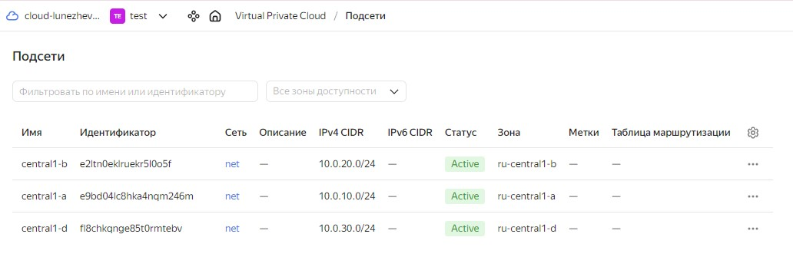

Виртуальные машины:

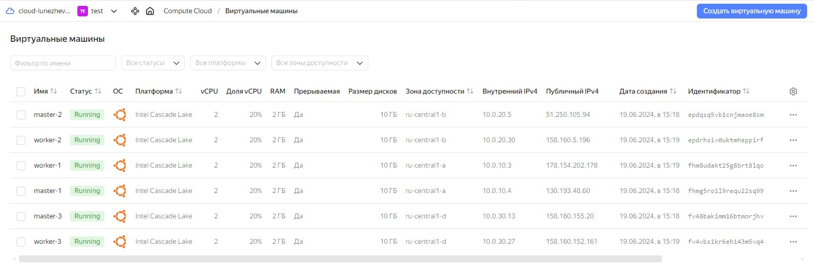

В файле ~/.kube/config находятся данные для доступа к кластеру


Команда kubectl get pods --all-namespaces отрабатывает без ошибок


Мониторинг:

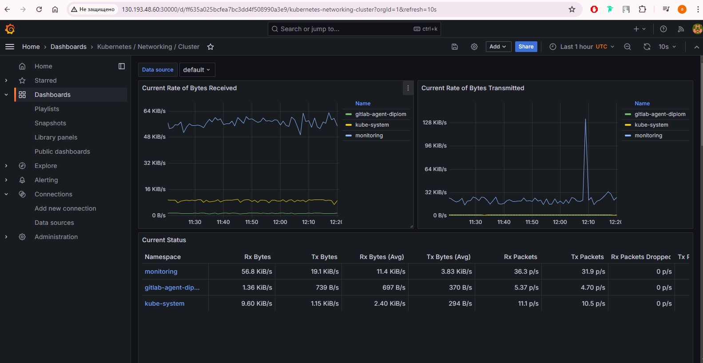

Gitlab-agint в кластере:


Параллельно был создан Managed Service for GitLab:

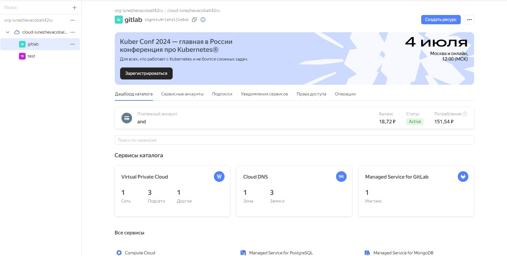

В нем создан проект [Diplom](./diplom/), который содержит Dockerfile для сборки образов docker, .gitlab-ci.yml для пайплайна,k8s.yml для разворачивания приложения в кластере и сам проект index.html, который подменяет собой аналогчный файл в образе nginx:

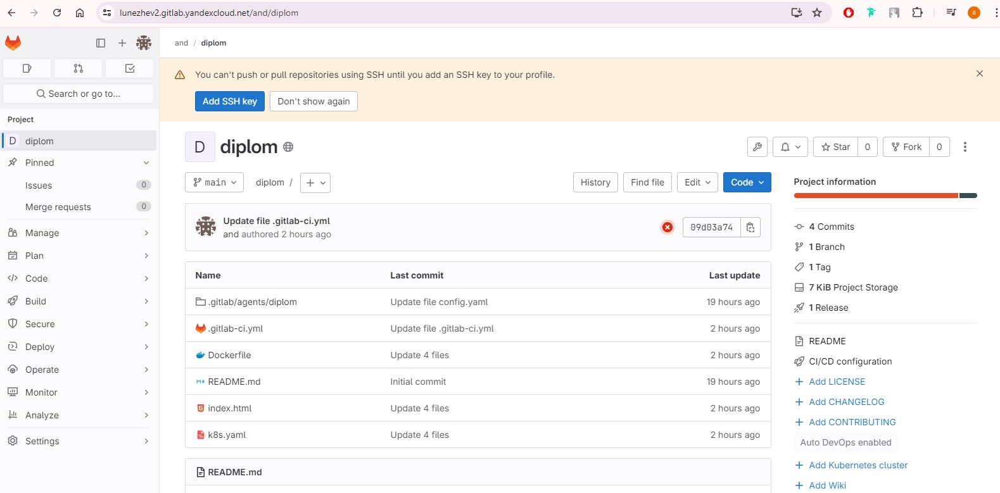

Gitlab-agent из кластера подключился (параметры подключения получены заранее и указаны в terraform):

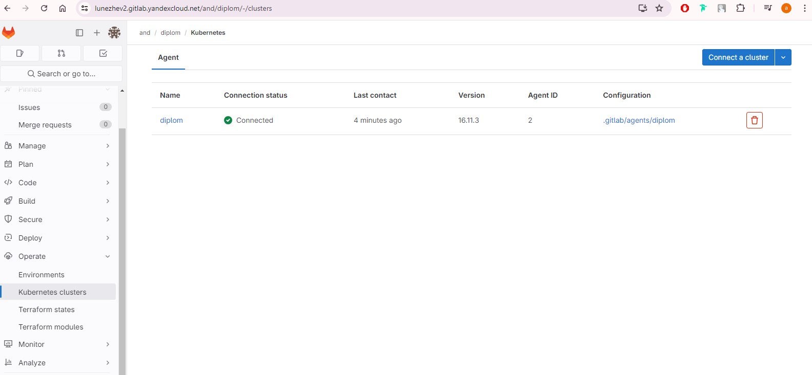

Подключаем gitlab-runner к кластеру:

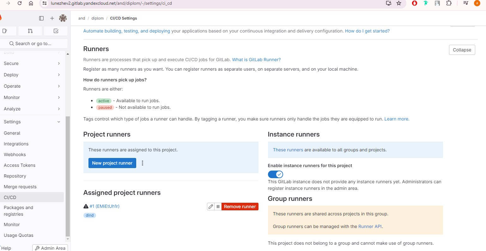

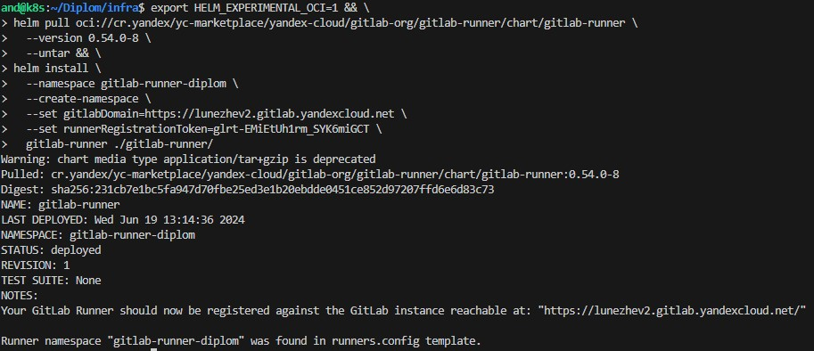

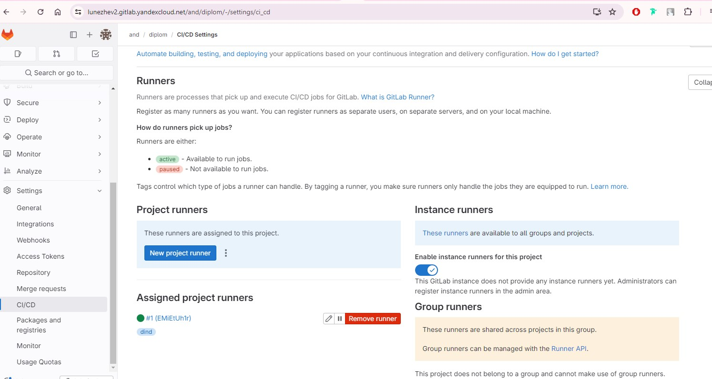

Запустим pipeline вручную:

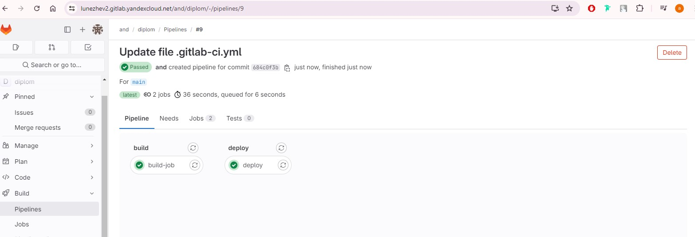

В container registry получаем:

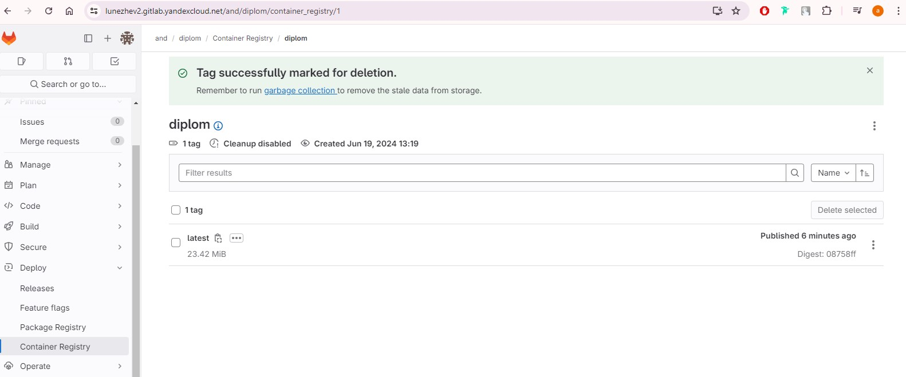

В кластере под запустился:

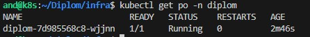

При обращении к серверу по адресу:порту видим:

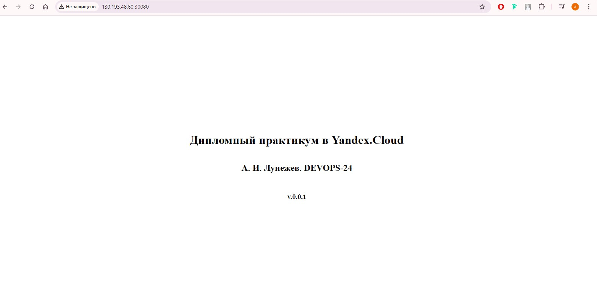

Меняем в index.html тэг:

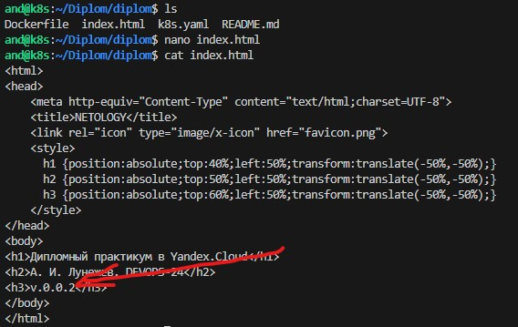

git tag && git push:

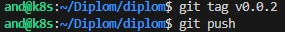

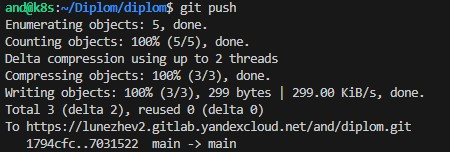

Gitlab pipeline tag v0.0.2:

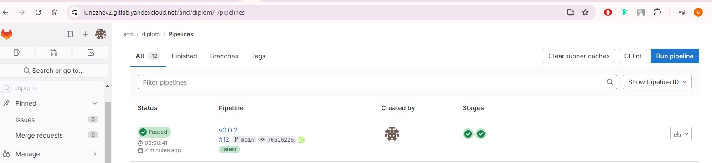

Обновляем страницу с проектом:

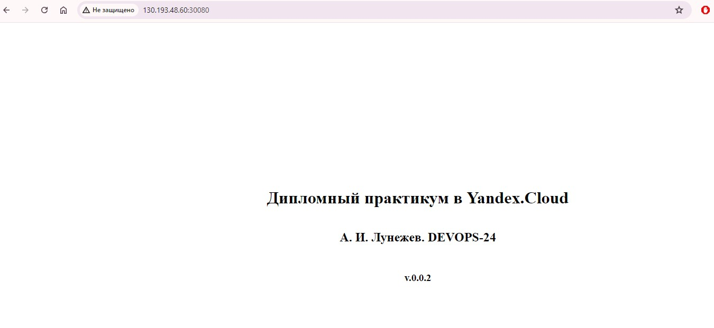

Релиз с тегом v.0.0.2:

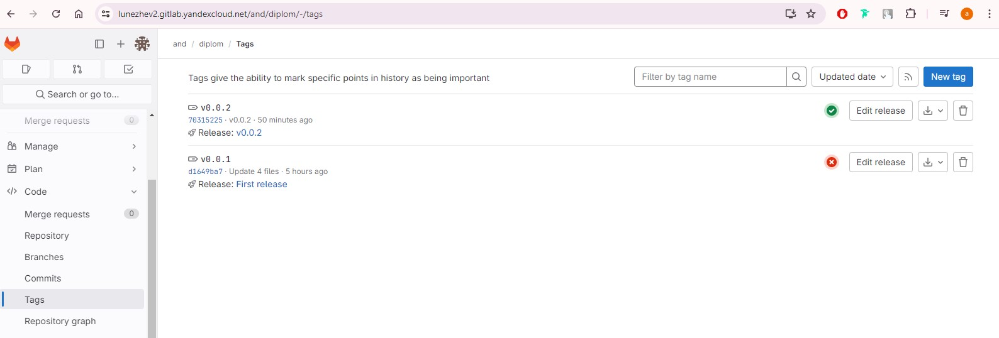


